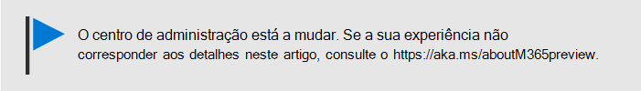
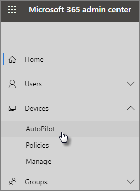

# Utilizar o guia passo a passo para adicionar perfis e dispositivos Autopilot

Pode utilizar o Windows AutoPilot para configurar **novos** dispositivos Windows 10 para o seu negócio, para que estejam prontos a ser utilizados quando os entregar aos seus colaboradores.
  
## Requisitos de dispositivo

Os dispositivos devem satisfazer estes requisitos:
  
- Windows 10, versão 1703 ou mais tarde
    
- Novos dispositivos que não passaram pela experiência do Windows fora da caixa
    
## Utilizar o guia de configuração para criar dispositivos e perfis

Se ainda não criou grupos de dispositivos ou perfis, a melhor maneira de começar é utilizando o guia passo a passo. Também pode [adicionar dispositivos](create-and-edit-autopilot-devices.md) e [atribuir-lhes perfis](create-and-edit-autopilot-profiles.md) sem utilizar o guia. 
  
1. Vá ao centro de <a href="https://go.microsoft.com/fwlink/p/?linkid=837890" target="_blank">https://admin.microsoft.com</a>administração em .

2. No painel de navegação à esquerda, escolha **Dispositivos** \> **AutoPilot**.

    
  
2. Na página **AutoPilot,** clique ou toque no **guia Iniciar**.
    
    
  
3. No **ficheiro Upload .csv com página de dispositivos,** navegue para um local onde tenha o preparado . Ficheiro CSV, em **seguida, Abrir** \> **Seguinte**. O ficheiro deve ter três cabeçalhos:
    
    - Coluna A: Número de Série do Dispositivo
    
    - Coluna B: ID do Produto Windows
    
    - Coluna C: Hash do Hardware
    
    Pode obter esta informação do seu fornecedor de hardware, ou pode utilizar o [script Get-WindowsAutoPilotInfo PowerShell](https://www.powershellgallery.com/packages/Get-WindowsAutoPilotInfo) para gerar um ficheiro CSV. 
    
    Para obter mais informações, consulte [Ficheiro CSV da lista de dispositivos](https://support.office.com/article/932e3676-2491-49f0-9177-d893d2f5276e). Também pode transferir um ficheiro de exemplo na página **Carregar um ficheiro .csv com a lista de dispositivos**. 
    
4. Na página de atribuir uma página de **perfil,** pode escolher um perfil existente ou criar um novo. Se ainda não tiver um, será solicitado a criar um. 
    
    Um perfil é uma coleção de definições que podem ser aplicadas a um único dispositivo ou a um grupo de dispositivos.
    
    As funcionalidades predefinidas são necessárias e são definidas automaticamente. As funcionalidades predefinidas são:
    
    - Skip Cortana, OneDrive e registo OEM.
    
    - Crie uma experiência de início de sessão com a identidade corporativa da sua empresa.
    
    - Ligue os seus dispositivos às contas do Diretório Ativo Do Azure e inscreva-os automaticamente para serem geridos pelo Microsoft 365 Business.
    
    Para mais informações, consulte as definições de [Perfil AutoPilot](autopilot-profile-settings.md). 
    
5. As outras definições são **Ignorar definições de privacidade** e **Não permitir que o utilizador se torne o administrador local**. Ambas estão configuradas como **Desativado** por predefinição. 
    
    Selecione **Seguinte**.
    
6. **Está feito** indica que o perfil que criou (ou escolheu) será aplicado ao grupo de dispositivos que criou através do upload da lista de dispositivos. As definições estarão em vigor quando os utilizadores do dispositivo iniciarem o seu inicio. Selecione **Fechar**.
    
