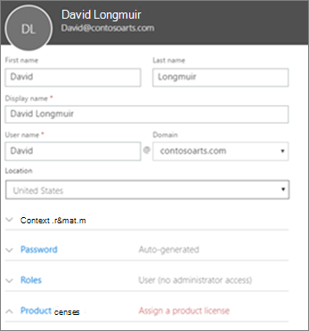
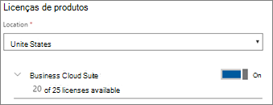

# Adicione mais utilizadores ao Microsoft 365 BusinessAdd more users to Microsoft 365 Business

## Adicionar novos utilizadoresAdd new users

Veja um pequeno vídeo sobre a adição de um utilizador.Watch a short video about adding a user.   

> [!VIDEO https://www.microsoft.com/videoplayer/embed/RE1FOfN] 

Caso tenha considerado este vídeo útil, consulte a [série de formação completa para pequenas empresas e as novidades do Microsoft 365](https://support.office.com/article/6ab4bbcd-79cf-4000-a0bd-d42ce4d12816).If you found this video helpful, check out the [complete training series for small businesses and those new to Microsoft 365](https://support.office.com/article/6ab4bbcd-79cf-4000-a0bd-d42ce4d12816).

Para adicionar um utilizador:To add a user:

1. Vá ao centro de <a href="https://go.microsoft.com/fwlink/p/?linkid=837890" target="_blank">https://admin.microsoft.com</a>administração em .Go to the admin center at <a href="https://go.microsoft.com/fwlink/p/?linkid=837890" target="_blank">https://admin.microsoft.com</a>. 
2. No painel de navegação à esquerda, escolha **utilizadores Ativos** **de Utilizadores** \> .In the left navigation pane, choose **Users** \> **Active users**.
3. Na página **de utilizadores Ativos,** escolha **Adicionar um utilizador**.On the **Active users** page, choose **Add a user**.
4. No novo painel de **utilizadores,** digite as informações necessárias.In the **New user** panel, type the required information. 
  
    Pode introduzir mais informações em informações de **contacto,** escolher como definir a palavra-passe sob a definição de **Palavra-passe** e atribuir funções em **Funções**.You can enter more information under **Contact information**, choose how you set the password under **Password** setting, and assign roles under **Roles**.
      
    
      
    Na secção de licenças do Produto, defina a definição da licença de produto **empresarial Microsoft 365** para **On**.In the Product licenses section, set the **Microsoft 365 Business** product license setting to **On**.
      
    
  
Para obter mais informações sobre a adição de utilizadores, consulte [Adicionar utilizadores individualmente ou a granel](https://docs.microsoft.com/office365/admin/add-users/add-users).For  more information about adding users, see [Add users individually or in bulk](https://docs.microsoft.com/office365/admin/add-users/add-users).
  
