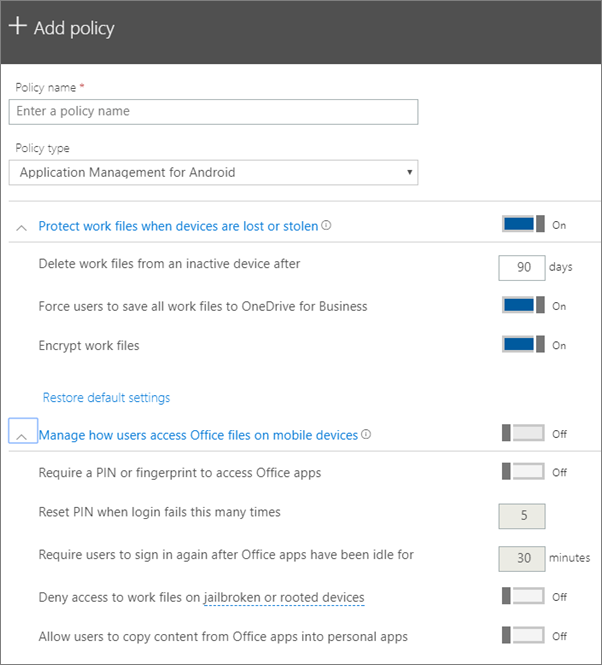

# Configurar as definições de proteção de aplicações para dispositivos Android ou iOS

Este artigo aplica-se a Microsoft 365 Empresas Premium.

## Criar uma política de gestão de aplicações

1. Vá para o centro de administração em <a href="https://go.microsoft.com/fwlink/p/?linkid=837890" target="_blank">https://admin.microsoft.com</a> . 
    
2. No navegador esquerdo, selecionar Adicionar **Políticas** \> **de** \> **Dispositivos.**
  
3. No painel **Adicionar política**, introduza um nome exclusivo para esta política. 
    
4. Em **Tipo de política,** escolha Gestão de **Aplicações** para Android ou Gestão de Aplicações para **iOS,** consoante o conjunto de políticas que pretende criar. 
    
5. Expanda **as secções Proteger os ficheiros de trabalho se os dispositivos for** perdidos ou roubados e Gerir a forma como os **utilizadores Office ficheiros em dispositivos móveis**. Configure as definições da forma que quiser. **Faça a gestão** da forma como  os utilizadores acedem a ficheiros Office em dispositivos móveis está Desligado por predefinição, mas recomendamos que a deslige e aceite os valores predefinido.  Para obter mais informações, consulte [Definições disponíveis.](#available-settings) 
    
    Pode sempre utilizar a ligação **Repor predefinições** para regressar à predefinição. 
    
    
  
6. Em seguida, decida **Quem irá ver estas definições?** Se não quiser utilizar o grupo de segurança predefinido **Todos** os Utilizadores, selecione **Alterar**, selecione os grupos de segurança que têm estas definições \> **Selecione**.
    
7. Por fim, selecione **Concluído** para guardar a política e atribuí-la aos dispositivos. 
    
## Editar uma política de gestão de aplicações

1. No cartão **Políticas,** selecionar **Editar política.**
    
2. No painel **Editar política**, selecione a política que pretende alterar 
    
3. Selecione **Editar** junto a cada definição para alterar os valores na política. Quando altera um valor, este é automaticamente guardado na política.
    
4. Quando terminar, feche o painel **Editar** política. 
    
## Eliminar uma política de gestão de aplicações

1. Na página **Políticas,** selecionar uma política e, em **seguida, Eliminar.**
    
2. No painel **Eliminar política,** selecionar **Confirmar para** eliminar a política ou políticas que escolheu. 
    
## Definições disponíveis

As tabelas seguintes disponibilizam informações detalhadas sobre as definições disponíveis para proteger ficheiros de trabalho em dispositivos e as definições que controlam a forma como os utilizadores acedem Office dos respetivos dispositivos móveis.
  
 Para obter mais informações, consulte [Como é que as funcionalidades de proteção Microsoft 365 Empresas Premium mapeiam às definições do Intune.](map-protection-features-to-intune-settings.md) 
  
### Definições que protegem os ficheiros de trabalho

As seguintes definições para proteger ficheiros de trabalho estarão disponíveis se o dispositivo de um utilizador for perdido ou roubado:

|Definição    |Descrição    |
|:-----|:-----|
|Eliminar ficheiros de trabalho de um dispositivo inativo após este número de dias    |Se um dispositivo não for utilizado durante o número de dias que especificar aqui, todos os ficheiros de trabalho armazenados no dispositivo serão eliminados automaticamente.    |
|Forçar os utilizadores a guardar todos os ficheiros de trabalho no OneDrive para Empresas    |Se esta definição estiver **Ação,** a única localização disponível para guardar ficheiros de trabalho é OneDrive para Empresas.    |
|Encriptar ficheiros de trabalho    |Mantenha esta definição **Ativada** para que os ficheiros de trabalho sejam protegidos por encriptação. Mesmo que o dispositivo seja perdido ou roubado, ninguém pode ler os dados da sua empresa.    |
   
### Definições que controlam a forma como os utilizadores acedem a ficheiros do Office em dispositivos móveis

As seguintes definições estão disponíveis para gerir como os utilizadores acedem a ficheiros de trabalho do Office:

|Definição    |Descrição    |
|:-----|:-----|
|Exigir um PIN ou uma impressão digital para aceder às aplicações do Office    |Se esta  definição estiver Ativada, os utilizadores têm de fornecer outra forma de autenticação, para além do nome de utilizador e palavra-passe, antes de poderem utilizar aplicações Office nos respetivos dispositivos móveis.  |
|Repor o PIN quando o início de sessão falha este número de vezes    |Para impedir um utilizador não autorizado de adivinhar um PIN aleatoriamente, o PIN será reposto após o número de tentativas incorretas que especificar.    |
|Exigir que o utilizador inicie a sessão novamente após as aplicações do Office estarem inativas durante    |Esta definição determina durante quanto tempo um utilizador pode estar indisque antes de lhe ser pedido para voltar a entrar.    |
|Negar o acesso a ficheiros de trabalho em dispositivos desbloqueados por jailbreak ou rooting    |Alguns utilizadores podem ter um dispositivo desbloqueado através de jailbreak ou rooting. Isto significa que o utilizador pode modificar o sistema operativo, o que pode tornar o dispositivo mais suscetível a software maligno. Estes dispositivos são bloqueados quando esta definição se encontra **Ativada**.    |
|Não permitir que os utilizadores copiem conteúdos de aplicações Office para aplicações pessoais    |Por predefinição, permitimos esta opção. No entanto, se a definição estiver **Aada,** o utilizador pode copiar informações de um ficheiro de trabalho para um ficheiro pessoal. Se a definição estiver **Des desligada,** o utilizador não poderá copiar informações de uma conta pessoal para uma aplicação ou conta pessoal.    |
