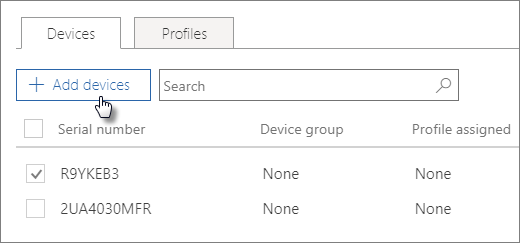

# Criar e editar dispositivos AutoPilotCreate and edit AutoPilot devices

## Carregar uma lista de dispositivosUpload a list of devices

Pode utilizar o [guia passo a passo](add-autopilot-devices-and-profile.md) para carregar dispositivos, mas também pode carregar dispositivos no separador **Dispositivos.**You can use the [Step-by-step guide](add-autopilot-devices-and-profile.md) to upload devices, but you can also upload devices in the **Devices** tab. 
  
Os dispositivos devem satisfazer estes requisitos:Devices must meet these requirements:
  
- Windows 10, versão 1703 ou mais tardeWindows 10, version 1703 or later
    
- Novos dispositivos que não passaram pela experiência fora de caixa do WindowsNew devices that haven't been through Windows out-of-box experience

1. No centro de administração Microsoft 365, escolha **Dispositivos** \> **AutoPilot**.In the Microsoft 365 admin center, choose **Devices** \> **AutoPilot**.
  
2. Na página **AutoPilot,** escolha o separador **Dispositivos** \> **Adicionar dispositivos**.On the **AutoPilot** page, choose the **Devices** tab \> **Add devices**.
    
    
  
3. No painel **de dispositivos Adicionar,** navegue num [ficheiro CSV da lista de dispositivos](../admin/misc/device-list.md) que preparou \> **Save** \> **Close**.On the **Add devices** panel, browse to a [Device list CSV file](../admin/misc/device-list.md) that you prepared \> **Save** \> **Close**.
    
    Pode obter estas informações do seu fornecedor de hardware ou pode utilizar o [script Get-WindowsAutoPilotInfo PowerShell](https://www.powershellgallery.com/packages/Get-WindowsAutoPilotInfo) para gerar um ficheiro CSV.You can get this information from your hardware vendor, or you can use the [Get-WindowsAutoPilotInfo PowerShell script](https://www.powershellgallery.com/packages/Get-WindowsAutoPilotInfo) to generate a CSV file. 
    
## Atribuir um perfil a um dispositivo ou a um grupo de dispositivosAssign a profile to a device or a group of devices

1. Na página Preparar o **Windows,** escolha o separador **Dispositivos** e selecione a caixa de verificação ao lado de um ou mais dispositivos.On the **Prepare Windows** page, choose the **Devices** tab, and select the check box next to one or more devices. 
    
2. No painel **Dispositivo**, selecione um perfil a partir do menu pendente **Perfil atribuído**.On the **Device** panel, select a profile from the **Assigned profile** drop-down. 
    
    Se ainda não tiver perfis, consulte a secção [Criar e editar perfis AutoPilot](create-and-edit-autopilot-profiles.md) para obter instruções.If you don't have any profiles yet, see [Create and edit AutoPilot profiles](create-and-edit-autopilot-profiles.md) for instructions. 
