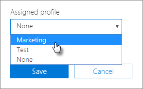

# Criar e editar perfis AutoPilot

## Criar um perfil

Um perfil aplica-se a um dispositivo ou grupo de dispositivos.
  
1. Na seta centro de administração do Microsoft 365, **selecionar Dispositivos** \> **AutoPilot**.
  
2. Na página **AutoPilot,** selecionar o **separador Perfis** \> **Criar perfil.**
    
3. Na página **Criar perfil,** introduza um nome para o perfil que o ajude a identificá-lo, por exemplo Marketing. A turn on the setting you want, and then choose **Save**. Para obter mais informações sobre as definições de perfil AutoPilot, consulte [Acerca das definições do Perfil AutoPilot.](autopilot-profile-settings.md)
    
    
  
### Aplicar o perfil a um dispositivo

Depois de criar um perfil, pode aplicá-lo a um dispositivo ou grupo de dispositivos. Pode escolher um perfil existente no guia passo a passo e [aplicá-lo](add-autopilot-devices-and-profile.md) a novos dispositivos ou substituir um perfil existente por um dispositivo ou grupo de dispositivos. 
  
1. Na página **Preparar Windows**, selecione o separador **Dispositivos**. 
    
2. Selecione a caixa de verificação junto  ao nome de um  dispositivo e, no painel Dispositivo, selecione um perfil a partir da lista de listas de perfil atribuído \> **Guardar.**
    
    
  
## Editar, eliminar ou remover um perfil

Depois de atribuir um perfil a um dispositivo, pode atualizá-lo, mesmo se já tiver atribuído o dispositivo a um utilizador. Quando o dispositivo for ligado à Internet, irá transferir a versão mais recente do seu perfil durante o processo de configuração. Se o utilizador restaurar o respetivo dispositivo para as predefinições de fábrica, o dispositivo irá transferir novamente as atualizações mais recentes para o seu perfil. 
  
### Editar um perfil

1. Na página **Preparar Windows**, selecione o separador **Perfis**. 
    
2. Selecione a caixa de verificação junto ao nome do dispositivo e, no **painel Perfil,** atualize qualquer uma das definições \> **disponíveis Guardar.**
    
    Se o fizer antes de um utilizador ligar o dispositivo à Internet, o perfil será aplicado no processo de configuração.
    
### Eliminar um perfil

1. Na página **Preparar Windows**, selecione o separador **Perfis**. 
    
2. Selecione a caixa de verificação junto ao nome de um dispositivo e, no **painel Perfil,** selecione **Eliminar perfil** \> **Guardar**.
    
    Quando eliminar um perfil, o mesmo será removido do dispositivo ou grupo de dispositivos ao qual estava atribuído.
    
### Remover um perfil

1. Na página **Preparar Windows**, selecione o separador **Dispositivos**. 
    
2. Selecione a caixa de verificação ao  lado do nome de um dispositivo e, no painel Dispositivo, selecione **Nenhum** na lista de listas drop-down **perfil** atribuído \> **Guardar.**
    
