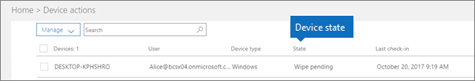

# Estados do dispositivo

Os dispositivos na lista **Ações de dispositivos** (Página principal de administração \> **Ações de dispositivos**) podem ter os seguintes estados.
  

  
|**Estado**|**Descrição**|
|:-----|:-----|
|Gerido pelo Intune    |Gerido pelo Microsoft 365 Business Premium.    |
|Extinção pendente    |O Microsoft 365 Business Premium está a preparar-se para remover os dados da empresa do dispositivo.    |
|Extinção em curso    |O Microsoft 365 Business Premium está neste momento a remover os dados da empresa do dispositivo.    |
|Falha na extinção    | A ação de remoção de dados empresariais falhou.    |
|Aposentadoria cancelada    |A ação de reforma foi cancelada.    |
|Eliminação dos dados pendente    |A aguardar o início da reposição de fábrica.    |
|Eliminação dos dados em curso    |A reposição de fábrica foi emitida.    |
|Falha ao limpar    |Não podia fazer o reset da fábrica.    |
|Limpeza cancelada    |A limpeza da fábrica foi cancelada.    |
|Mau Estado de Funcionamento    |Está pendente uma ação (ou em curso), mas o dispositivo não faz o check-in há mais de 30 dias.    |
|Eliminação pendente    |A ação de eliminação está pendente.    |
|Detetado    |O Microsoft 365 Business Premium detetou o dispositivo.    |
   
