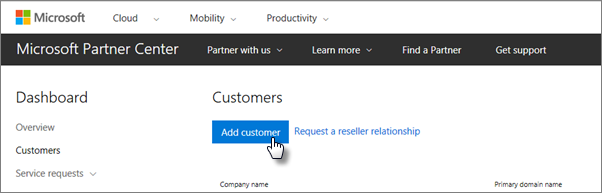
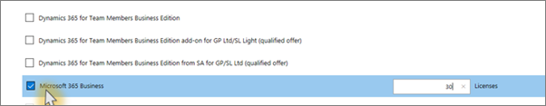

# Obter o Microsoft 365 EmpresasGet Microsoft 365 Business

## Obter o Microsoft 365 Empresas da MicrosoftGet Microsoft 365 Business from Microsoft

Se não tiver um parceiro e quiser obter o Microsoft 365 Business, pode [comprá-lo aqui](https://www.microsoft.com/en-US/microsoft-365/business).If you don't have a partner and want to get Microsoft 365 Business, you can [buy it here](https://www.microsoft.com/en-US/microsoft-365/business).

Consulte [o microsoft 365 Business](sign-up.md) para obter instruções detalhadas.See [sign up for Microsoft 365 Business](sign-up.md) for detailed instructions.

Também pode dirigir-se a uma [Microsoft Store](https://www.microsoft.com/en-us/store/locations/find-a-store?icid=en_US_Store_UH_FAS) para comprar o Microsoft 365 Business e obter ajuda de configuração.You can also head over to a [Microsoft Store](https://www.microsoft.com/en-us/store/locations/find-a-store?icid=en_US_Store_UH_FAS) to buy Microsoft 365 Business and get setup help.
  
## Obter o Microsoft 365 Business a partir do Centro de Parceiros da MicrosoftGet Microsoft 365 Business from Microsoft Partner Center

1. Inicie sessão no [Centro de Parceiros da Microsoft](https://go.microsoft.com/fwlink/p/?linkid=849910) com as credenciais que criou quando se inscreveu no programa de Fornecedores de Serviços em Nuvem (CSP).Sign in at [Microsoft Partner Center](https://go.microsoft.com/fwlink/p/?linkid=849910) by using the credentials you created when you enrolled to the Cloud Service Provider (CSP) program. 
    
2. No Partner Dashboard, escolha **Clientes,** edepois selecione o seu cliente ou adicione um novo cliente antes de obter o Microsoft 365 Business.On the Partner Dashboard, choose **Customers**, then select your customer or add a new customer before you get Microsoft 365 Business.
    
    
  
3. Na página de **Subscrição** do cliente, selecione **Adicionar subscrição,** escolha a opção Small business no Catálogo e, em seguida, escolha o **Microsoft 365 Business**.On the customer's **Subscription** page, select **Add subscription**, choose the Small business option under Catalog, and then choose **Microsoft 365 Business**.
    
    Selecione o número de licenças de que necessita (até 300).Select the number of licenses you need (up to 300). Se tiver mais de 300 utilizadores, consulte antes o artigo [Microsoft 365 Enterprise](https://go.microsoft.com/fwlink/p/?linkid=862316).If you have more than 300 users, see [Microsoft 365 Enterprise](https://go.microsoft.com/fwlink/p/?linkid=862316) instead. 
    
    
  
    Complete o resto dos passos para adicionar um novo cliente, incluindo o nome do negócio.Complete the rest of the steps for adding a new customer, including the business name.
    

