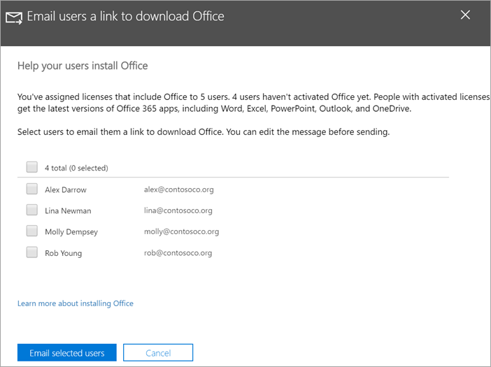

# Ajude os seus utilizadores a instalar Office em Windows 10 dispositivosHelp your users install Office on Windows 10 devices

Pode instalar o seu Office em PCs Windows 10 rápido a partir do Microsoft 365 de administração.You can quickly and easily install Office on Windows 10 PCs from the Microsoft 365 admin center.
  
Para compreender como este processo funciona em aplicações do Office instaladas anteriormente, leia o artigo [Prepare for Office client installation (Preparar a instalação do cliente do Office)](prepare-for-office-client-deployment.md) antes de começar.To understand how this works with previously installed Office apps, read [Prepare for Office client installation](prepare-for-office-client-deployment.md) before you get started.

Veja um breve vídeo sobre como instalar Office aplicações.Watch a short video about installing Office apps.  

> [!VIDEO https://www.microsoft.com/videoplayer/embed/acce002c-0756-4b64-ac5d-2198ee96a9b1] 

Caso tenha considerado este vídeo útil, veja a [série de formação completa para pequenas empresas e as novidades do Microsoft 365](../business-video/index.yml).If you found this video helpful, check out the [complete training series for small businesses and those new to Microsoft 365](../business-video/index.yml).

## Gerir as implementações do OfficeManage Office deployments

1. Vá para o centro de administração em <a href="https://go.microsoft.com/fwlink/p/?linkid=2024339" target="_blank">https://admin.microsoft.com</a> e inscreva-se com as credenciais de administrador global.Go to the admin center at <a href="https://go.microsoft.com/fwlink/p/?linkid=2024339" target="_blank">https://admin.microsoft.com</a>, and sign in with global admin credentials. 

2. Vá para **Configuração** no painel de navegação  esquerdo e, na página Configuração, desloque até **Aplicações e atualizações.**Go to **Setup** in the left navigation pane, and on the **Setup** page, scroll to **Apps and updates**.
    > [!NOTE]
    > Poderá não ver este cartão se todos os seus utilizadores tiver instalado aplicações Office dados.You might not see this card if all of your  users have installed Office apps.
  
3. No cartão **Ajudar os utilizadores a instalar o Office de aplicações,** selecionar Ver **e,** em **seguida, Começar.**On the **Help users install their Office apps** card, choose **View**, and then **Get started**.
    
4. No painel de transferência enviar aos utilizadores por **e-mail Office,** selecione os utilizadores que pretende enviar por e-mail e, em seguida, Enviar e-mail aos **utilizadores selecionados**.On the **Email users a link to download Office** panel, select the users you want to email, and then **Email selected users**.

   

## Para mais informações sobre como configurar e utilizar o Microsoft 365 Empresas PremiumFor more on setting up and using Microsoft 365 Business Premium

[Microsoft 365 vídeos de formação para empresasMicrosoft 365 for business training videos](../business-video/index.yml)