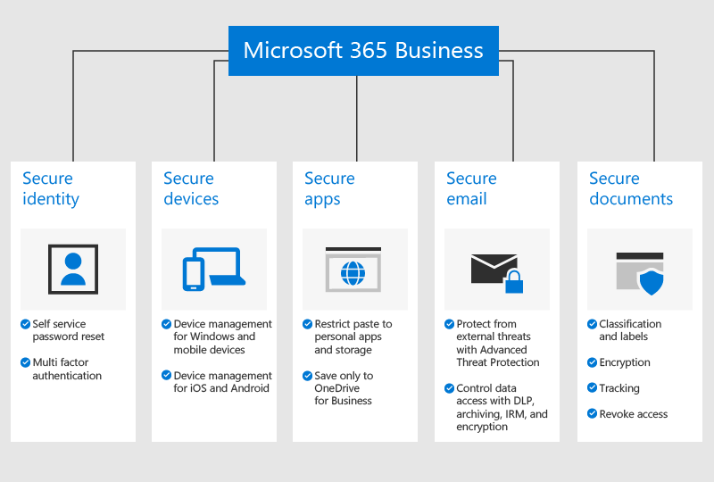

# Descrição geral do Microsoft 365 Empresas Premium

## O que é o Microsoft 365 Empresas Premium

O Microsoft 365 Empresas Premium (anteriormente designado Microsoft 365 Empresas) é um serviço de subscrição abrangente para empresas com menos de 300 colaboradores. Integra os seus serviços e aplicações de produtividade do Office favoritos e ferramentas de colaboração como o Microsoft Teams, com segurança avançada e funcionalidades de gestão de dispositivos.

## Ver: O que é o Microsoft 365 Empresas Premium

> [!VIDEO https://www.microsoft.com/videoplayer/embed/RE2mhaA]

Caso tenha considerado este vídeo útil, veja a [série de formação completa para pequenas empresas e as novidades do Microsoft 365](../business-video/index.yml).

O Microsoft 365 Empresas Premium foi concebido para um máximo de 300 licenças. Caso necessite de mais licenças, consulte a documentação sobre o [Microsoft 365 Enterprise](../enterprise/index.yml) para obter mais informações.

Consulte a [descrição de serviço do Microsoft 365 Empresas Premium](/office365/servicedescriptions/microsoft-365-service-descriptions/microsoft-365-business-service-description) para obter a lista completa de funcionalidades.

## Necessidades de segurança de pequenas empresas

Os seus dados empresariais podem ser comprometidos de muitas formas. Você e os restantes utilizadores podem comprometer a segurança da organização ao iniciar sessão com credenciais comprometidas ou ver dados da organização em diferentes dispositivos e aplicações. Mais especificamente, a segurança da organização pode estar em risco devido a:

- Credenciais de início de sessão comprometidas ou fracas.
- Dispositivos comprometidos com pins fracos ou dispositivos pertencentes aos utilizadores.
- Utilizadores que podem copiar/colar/guardar os dados da organização para aplicações pessoais.
- Utilizadores que instalam e utilizam aplicações de terceiros com segurança fraca.
- Vulnerabilidades de e-mail, incluindo partilha de dados confidenciais, tentativas de phishing, malware e outras.
- Acesso a documentos com informações confidenciais por parte de pessoas que não o deviam ter.

O Microsoft 365 Empresas Premium ajuda a proteger os dados em todas estas situações. As funcionalidades de segurança que protegem os dados empresariais estão descritas na seguinte imagem.

## Como os dados e serviços são protegidos

O Microsoft 365 Empresas Premium fornece **proteção contra ameaças** ao:

- Analisar ligações em e-mails e documentos em tempo real para bloquear sites inseguros (Ligações Seguras).

- Realizar uma análise avançada de anexos de e-mail num ambiente de sandbox para detetar malware criado recentemente (Anexos Seguros).

- Ativar políticas de anti-phishing que utilizam modelos de aprendizagem automática e deteção de usurpação de identidade para fornecer proteção contra ataques avançados (inteligência anti-phishing no Defender para o Office 365).

- Configurar políticas avançadas que desativam o acesso a partir de localizações não fidedignas ou ignoram a autenticação multifator em localizações fidedignas, como a rede do seu escritório (MFA do Azure, incluindo IPs fidedignos e Acesso Condicional).

- Aplicar proteção contra malware em todos os dispositivos com Windows 10 da organização e proteger ficheiros em pastas importantes do sistema contra alterações feitas por ransomware (Windows Defender)

Os **dados empresariais são protegidos** ao:

- Utilizar deteção automática para ajudar a impedir a fuga de informações confidenciais como números da Segurança Social ou de cartões de crédito para fora da empresa (prevenção de perda de dados).

- Encriptar e-mails confidenciais para que possa comunicar em segurança com clientes ou outras pessoas externas à organização. Esta funcionalidade garante que apenas o destinatário pretendido pode ler a mensagem (Encriptação de Mensagens do Office 365).

- Controlar quem tem acesso a informações da empresa ao aplicar restrições como **Não Copiar** e **Não Reencaminhar** a e-mails e documentos (Azure Information Protection, Plano 1).

- Ativar o arquivo ilimitado na nuvem para que possa guardar todos os e-mails da organização, incluindo as caixas de correio de ex-colaboradores (Arquivo do Exchange Online).

Os seus **dispositivos são protegidos** ao:

- Controlar que dispositivos e utilizadores podem aceder aos dados Microsoft, com opções para impedir os utilizadores de iniciar sessão a partir de computadores domésticos e aplicações não aprovadas ou fora do horário de expediente (Acesso Condicional).

- Aplicar políticas de segurança para proteger dados empresariais nos dispositivos iOS e Android. Por exemplo, pode exigir que os utilizadores forneçam um PIN ou impressão digital para aceder a dados empresariais e pode encriptar dados em dispositivos móveis (aplicação de proteção para as aplicações do Office para dispositivos móveis).

- Manter documentos, e-mails e outros dados empresariais em aplicações do Office para dispositivos móveis aprovadas e impedir os colaboradores de os guardar em aplicações e localizações não autorizadas (Proteção de aplicações do Office para dispositivos móveis).

- Limpar remotamente os dados empresariais de dispositivos perdidos ou roubados sem afetar informações pessoais (limpeza seletiva do Intune).

- Utilizar controlos simplificados para gerir as políticas de todos os PCs com Windows 10 na empresa, impor encriptação do BitLocker e instalar automaticamente atualizações críticas do Windows (Impor políticas de atualização do Windows).

Para ver a lista completa de funcionalidades de segurança, consulte [Funcionalidades de segurança do Microsoft 365 Empresas Premium](security-features.md). Após [configurar o Microsoft 365 Empresas Premium](set-up.md), consulte [Aumentar a proteção contra ameaças](increase-threat-protection.md) e [Configurar funcionalidades de conformidade](set-up-compliance.md) para começar a utilizar as funcionalidades de segurança que não estão incluídas na configuração orientada. Consulte também o artigo [Top 10 ways to secure Office 365 and Microsoft 365 Business Premium plans](/office365/admin/security-and-compliance/secure-your-business-data) (As principais 10 formas de proteger os planos do Office 365 e Microsoft 365 Empresas Premium) para aprender a configurar as proteções contra cibercriminosos e hackers.

## Passos seguintes

- Se tiver um parceiro, este obterá o Microsoft 365 Empresas Premium: [Obter o Microsoft 365 Empresas Premium a partir do Centro de Parceiros da Microsoft](get-microsoft-365-business.md).

- Se não tiver um parceiro e quiser obter o Microsoft 365 Empresas Premium, poderá [comprá-lo aqui](https://www.microsoft.com/microsoft-365/business) e seguir as instruções de [inscrição](sign-up.md).

## Conteúdos relacionados

[Vídeos de formação do Microsoft 365 Empresas Premium](../business-video/index.yml) (ligação para a página)
