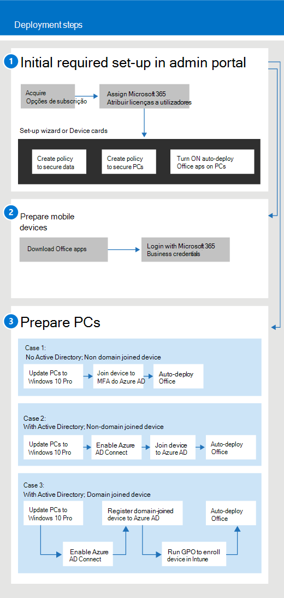

# Começa com a Microsoft 365 para negócios

## O que é a Microsoft 365 para negócios

O Microsoft 365 para negócios é um conjunto abrangente de ferramentas de produtividade e colaboração de negócios, tais como Outlook, Word, Excel e outros produtos do Office, que estão sempre atualizados. Pode proteger os seus ficheiros de trabalho em todos os seus dispositivos iOS, Android e Windows 10 com segurança de nível empresarial que é simples de gerir.

Veja este vídeo para uma visão geral rápida do Microsoft 365 para negócios.  

> [!VIDEO https://www.microsoft.com/videoplayer/embed/RE2mhaA] 
  
O Microsoft 365 para negócios destina-se a até 300 licenças. Caso necessite de mais licenças, consulte a documentação sobre o [Microsoft 365 Enterprise](../enterprise/index.yml) para obter mais informações. 
  
## Obtenha o Microsoft 365 para negócios

- Se tiver um parceiro, receberá o Microsoft 365 para negócios: [Obtenha o Microsoft 365 para negócios a partir do Microsoft Partner Center](get-microsoft-365-business.md).
    
- Se não tem um parceiro e quer comprar o Microsoft 365 para negócios, pode [comprá-lo aqui.](https://www.microsoft.com/microsoft-365/business)
    
## Configurar o Microsoft 365 para negócios

 **Visão geral do Microsoft 365 para business Suite configurado**
  
O diagrama seguinte descreve como os administradores configuram o Microsoft 365 para negócios. Também descreve os passos para preparar computadores Windows para o Microsoft 365 para negócios. Também pode adicionar novos dispositivos no centro de administração Microsoft 365 com [o Windows AutoPilot](add-autopilot-devices-and-profile.md). Pode utilizar o AutoPilot para configurar e configurar novos dispositivos para que estejam prontos para uso produtivo assim que um utilizador assinar com o Microsoft 365 para credenciais de negócio.
  

Veja este vídeo para uma visão geral do Microsoft 365 para configuração de negócios.  

> [!VIDEO https://www.microsoft.com/videoplayer/embed/RE1FYSM] 

Caso tenha considerado este vídeo útil, veja a [série de formação completa para pequenas empresas e as novidades do Microsoft 365](https://support.microsoft.com/office/6ab4bbcd-79cf-4000-a0bd-d42ce4d12816).

  
### 1: Configurar o Microsoft 365 para negócios (Administração)

Inscreva-se no [Microsoft 365 admin center](https://portal.office.com/adminportal/home) com as suas credenciais de administração global e complete os seguintes passos para configurar o Microsoft 365 para o negócio. 
  
1. [Pré-requisitos para proteger dados em dispositivos com a Microsoft 365 para negócios](pre-requisites-for-data-protection.md)
    
    Leia primeiro os pré-requisitos para se certificar de que os seus dispositivos estão prontos para o Microsoft 365 para o negócio.
    
2. [Utilize o assistente de configuração para configurar o Microsoft 365 para o negócio](set-up.md)
    
    Se estiver **a mover-se permanentemente de um Ative Directory local para a nuvem,** pode ir ao centro de administração microsoft 365 e utilizar o assistente de configuração para adicionar os seus utilizadores manualmente, ou pode fazer uma sincronização única com o Azure AD Connect. Existem duas formas de o fazer: 
    
    - Se também tiver um servidor Exchange 2010, Exchange 2013 ou Exchange 2016, pode [utilizar o Minimal Hybrid para migrar rapidamente caixas de correio de Troca para o Microsoft 365](/Exchange/mailbox-migration/use-minimal-hybrid-to-quickly-migrate). Os passos híbridos mínimos incluem uma sincronização única dos utilizadores para a Azure AD, e a migração por e-mail de instalações para a nuvem. Após a migração de e-mail estar concluída, a sincronização do diretório é automaticamente desligada quando utiliza este método.
    
    - Utilize o assistente de sincronização de diretórios para sincronizar os seus utilizadores na nuvem. Siga os passos na [sincronização de diretórios configurar para a Microsoft 365](../enterprise/set-up-directory-synchronization.md) concluir este processo. Depois de sincronizar os seus utilizadores na nuvem, terá de desligar a sincronização do [diretório para o Microsoft 365](../enterprise/turn-off-directory-synchronization.md).
    
    Também terá de dar a cada utilizador que foi adicionado desta forma uma licença para o Microsoft 365 para negócios. Pode fazê-lo no [assistente de configuração](set-up.md) ou pode [atribuir licenças aos utilizadores.](../admin/manage/assign-licenses-to-users.md)
    
### 2: Preparar dispositivos móveis

Siga os [passos em Configurar dispositivos móveis para o Microsoft 365 para os utilizadores empresariais](set-up-mobile-devices.md) instalarem aplicações do Office em dispositivos e certificarem-se de que estão protegidos pela Microsoft 365 para o negócio. 
  
### 3: Preparar computadores

Os administradores podem pré-seleccionar definições para novos PCs windows 10 utilizando [o Windows AutoPilot](add-autopilot-devices-and-profile.md). Os utilizadores podem configurar os seus dispositivos Windows 10 existentes ou novos seguindo os passos neste tópico: [Configurar PCs Windows para o Microsoft 365 para utilizadores empresariais](set-up-windows-devices.md). Para os dispositivos existentes, os utilizadores podem **opcionalmente** [mover ficheiros para o OneDrive para negócios.](move-files-to-onedrive.md) Também podem utilizar ferramentas de terceiros para mover ficheiros associados ao perfil do Windows para o OneDrive.
  
Se a sua organização utilizar o Windows Server Ative Directory no local, pode configurar o Microsoft 365 para as empresas protegerem os seus dispositivos Windows 10, mantendo ao mesmo tempo o acesso a recursos no local que requerem autenticação local. Siga os passos em [Ativar dispositivos windows 10 unidos ao domínio para serem geridos pela Microsoft 365 para que](manage-windows-devices.md) as empresas o criem. Este método é preferido, e os dispositivos neste estado são chamados **dispositivos híbridos Azure AD.** 
  
Se reter um Ative Directory local que contenha alguns recursos no local (como partilhas de ficheiros e impressoras), pode dar aos seus **dispositivos AD ad-join** a estes recursos seguindo os passos aqui: [Aceda aos recursos no local a partir de um dispositivo AD aderido ao Azure na Microsoft 365 para negócios.](access-resources.md)
  
  
## Contactar o suporte

 **Se precisar de contactar o suporte:**
  
- Contacte o seu parceiro.
    
- Como Microsoft 365 para administração de negócios, tem acesso à nossa equipa de apoio ao cliente: **[Suporte de contato para produtos empresariais - Ajuda de Administração](../admin/contact-support-for-business-products.md)**
    
## Consulte também

[Microsoft 365 para documentação e recursos de negócios](./index.yml)
  
[Gerir o Microsoft 365 para negócios](manage.md)[Migrar para a Microsoft 365 para negócios](migrate-to-microsoft-365-business.md)

[Microsoft 365 para vídeos de formação de negócios](https://support.microsoft.com/office/6ab4bbcd-79cf-4000-a0bd-d42ce4d12816)