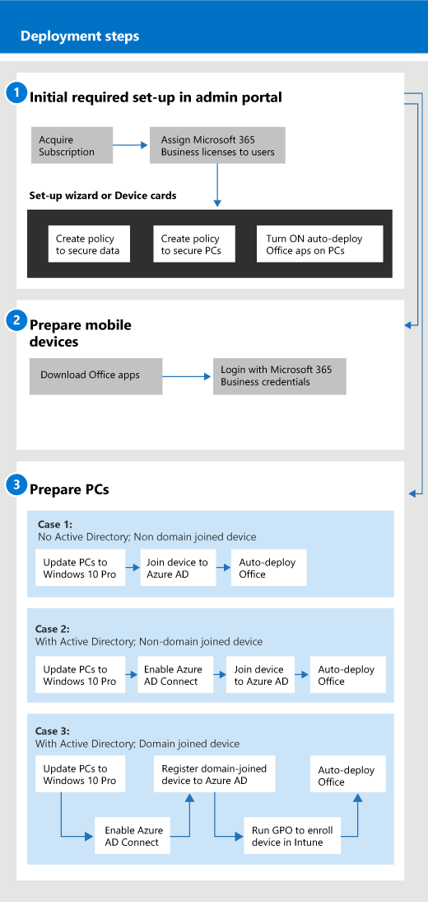

# Começar com a Microsoft 365 para negóciosGet started with Microsoft 365 for business

## O que é microsoft 365 para negóciosWhat is Microsoft 365 for business

O Microsoft 365 para negócios é um conjunto abrangente de ferramentas de produtividade e colaboração de negócios, como outlook, Word, Excel e outros produtos do Office, que estão sempre atualizados.Microsoft 365 for business is a comprehensive set of business productivity and collaboration tools, such as Outlook, Word, Excel, and other Office products, that are always up to date. Pode proteger os seus ficheiros de trabalho em todos os dispositivos iOS, Android e Windows 10 com segurança de qualidade empresarial que é simples de gerir.You can protect your work files on all your iOS, Android, and Windows 10 devices with enterprise-grade security that is simple to manage.

Veja este vídeo para uma visão geral rápida do Microsoft 365 para negócios.Watch this video for a quick overview of Microsoft 365 for business.  

> [!VIDEO https://www.microsoft.com/videoplayer/embed/RE2mhaA] 
  
O Microsoft 365 para negócios destina-se a até 300 licenças.Microsoft 365 for business is meant for up to 300 licenses. Caso necessite de mais licenças, consulte a documentação sobre o [Microsoft 365 Enterprise](https://go.microsoft.com/fwlink/p/?linkid=860986) para obter mais informações.If you need more licenses, see [Microsoft 365 Enterprise](https://go.microsoft.com/fwlink/p/?linkid=860986) documentation for more information. 
  
## Obtenha o Microsoft 365 para negóciosGet Microsoft 365 for business

- Se tiver um parceiro, eles receberão o Microsoft 365 para negócios: [Obtenha o Microsoft 365 para negócios a partir do Microsoft Partner Center](get-microsoft-365-business.md).If you have a partner, they'll get Microsoft 365 for business: [Get Microsoft 365 for business from Microsoft Partner Center](get-microsoft-365-business.md).
    
- Se não tiver um parceiro e quiser comprar o Microsoft 365 para negócios, pode [comprá-lo aqui.](https://www.microsoft.com/microsoft-365/business)If you don't have a partner and want to get Microsoft 365 for business, you can [buy it here](https://www.microsoft.com/microsoft-365/business).
    
## Configurar o Microsoft 365 para negóciosSet up Microsoft 365 for business

 **Visão geral da Microsoft 365 para business Suite configurada****Overview of Microsoft 365 for business Suite set up**
  
O diagrama seguinte descreve como os administradores configuram o Microsoft 365 para negócios.The following diagram describes how admins set up Microsoft 365 for business. Também descreve os passos para preparar os PCs do Windows para o Microsoft 365 para negócios.It also describes the steps to prepare Windows PCs for Microsoft 365 for business. Também pode adicionar novos dispositivos no centro de administração da Microsoft 365 com o [Windows AutoPilot](add-autopilot-devices-and-profile.md).You can also add new devices in the Microsoft 365 admin center with [Windows AutoPilot](add-autopilot-devices-and-profile.md). Pode utilizar o AutoPilot para configurar e configurar novos dispositivos para que estejam prontos para uso produtivo assim que um utilizador se insere com o seu Microsoft 365 para credenciais de negócio.You can use AutoPilot to set up and pre-configure new devices so that they're ready for productive use as soon as a user signs in with their Microsoft 365 for business credentials.
  

Veja este vídeo para uma visão geral do Microsoft 365 para configuração de negócios.Watch this video for an overview of Microsoft 365 for business setup.  

> [!VIDEO https://www.microsoft.com/videoplayer/embed/RE1FYSM] 

Caso tenha considerado este vídeo útil, veja a [série de formação completa para pequenas empresas e as novidades do Microsoft 365](https://support.office.com/article/6ab4bbcd-79cf-4000-a0bd-d42ce4d12816).If you found this video helpful, check out the [complete training series for small businesses and those new to Microsoft 365](https://support.office.com/article/6ab4bbcd-79cf-4000-a0bd-d42ce4d12816).

  
### 1: Configurar o Microsoft 365 para negócios (Administrador)1: Set up Microsoft 365 for business (Admin)

Inscreva-se no [Microsoft 365 admin center](https://portal.office.com/adminportal/home) com as suas credenciais de administração global e complete os seguintes passos para configurar o Microsoft 365 para negócios.Sign in to [Microsoft 365 admin center](https://portal.office.com/adminportal/home) with your global admin credentials, and complete the following steps to set up Microsoft 365 for business. 
  
1. [Pré-requisitos para proteger dados em dispositivos com microsoft 365 para negóciosPrerequisites for protecting data on devices with Microsoft 365 for business](pre-requisites-for-data-protection.md)
    
    Leia os pré-requisitos primeiro para se certificar de que os seus dispositivos estão prontos para o Microsoft 365 para negócios.Read the prerequisites first to make sure that your devices are ready for Microsoft 365 for business.
    
2. [Utilize o assistente de configuração para configurar o Microsoft 365 para negóciosUse the setup wizard to set up Microsoft 365 for business](set-up.md)
    
    Se estiver **a mover-se permanentemente de um Diretório Ativo local para a nuvem,** pode ir ao centro de administração da Microsoft 365 e utilizar o assistente de configuração para adicionar os seus utilizadores manualmente, ou pode fazer uma sincronização única com o Azure AD Connect.If you're **permanently moving from a local Active Directory to the cloud**, you can go to the Microsoft 365 admin center and use the setup wizard to add your users manually, or you can do a one-time sync with Azure AD Connect. Existem duas formas de o fazer:There are two ways to do this: 
    
    - Se também tiver um servidor Exchange 2010, Exchange 2013 ou Exchange 2016, pode utilizar o Minimal Hybrid para migrar rapidamente caixas de correio para o [Office 365](https://docs.microsoft.com/Exchange/mailbox-migration/use-minimal-hybrid-to-quickly-migrate).If you also have an Exchange 2010, Exchange 2013, or Exchange 2016 server, you can [Use Minimal Hybrid to quickly migrate Exchange mailboxes to Office 365](https://docs.microsoft.com/Exchange/mailbox-migration/use-minimal-hybrid-to-quickly-migrate). Os passos híbridos mínimos incluem uma sincronização única de utilizadores para a AD Azure, e a migração por e-mail de in-instalações para a nuvem.The minimal hybrid steps include a one-time sync of users to Azure AD, and email migration from on-premises to the cloud. Após a migração por e-mail estar completa, a sincronização do diretório é automaticamente desligada quando utiliza este método.After the email migration is complete, the directory synchronization is automatically turned off when you use this method.
    
    - Utilize o assistente de sincronização de diretório para sincronizar os seus utilizadores na nuvem.Use the directory sync wizard to synchronize your users to the cloud. Siga os passos em Configuração da sincronização do diretório para que o [Microsoft 365](https://docs.microsoft.com/office365/enterprise/set-up-directory-synchronization) complete este processo.Follow the steps in [Set up directory synchronization for Microsoft 365](https://docs.microsoft.com/office365/enterprise/set-up-directory-synchronization) to complete this process. Depois de sincronizar os seus utilizadores na nuvem, terá de desligar a sincronização do diretório para o [Office 365](https://docs.microsoft.com/office365/enterprise/turn-off-directory-synchronization).After you synchronize your users to the cloud, you'll have to [Turn off directory synchronization for Office 365](https://docs.microsoft.com/office365/enterprise/turn-off-directory-synchronization).
    
    Também terá de dar a cada utilizador que tenha sido adicionado desta forma uma licença para o Microsoft 365 para negócios.You'll also have to give each user that was added this way a license to Microsoft 365 for business. Pode fazê-lo no assistente de [configuração](set-up.md) ou pode [atribuir licenças aos utilizadores no Microsoft 365 para negócios](https://docs.microsoft.com/microsoft-365/admin/add-users/add-users).You can do this in the [setup wizard](set-up.md) or you can [Assign licenses to users in Microsoft 365 for business](https://docs.microsoft.com/microsoft-365/admin/add-users/add-users).
    
### 2: Preparar dispositivos móveis2: Prepare mobile devices

Siga as [etapas em Configurar dispositivos móveis para o Microsoft 365 para que os utilizadores empresariais](set-up-mobile-devices.md) instalem aplicações do Office em dispositivos e certifiquem-se de que estão protegidos pela Microsoft 365 para negócios.Follow the steps in [Set up mobile devices for Microsoft 365 for business users](set-up-mobile-devices.md) to install Office apps on devices and make sure they're protected by Microsoft 365 for business. 
  
### 3: Preparar computadores3: Prepare PCs

Os administradores podem pré-seleccionar as definições para novos PCs windows 10 utilizando o [Windows AutoPilot](add-autopilot-devices-and-profile.md).Admins can pre-select settings for new Windows 10 PCs by using [Windows AutoPilot](add-autopilot-devices-and-profile.md). Os utilizadores podem configurar os seus dispositivos Windows 10 existentes ou novos seguindo os passos neste tópico: [Configurar PCs Windows para o Microsoft 365 para utilizadores empresariais](set-up-windows-devices.md).Users can set up their existing or new Windows 10 devices by following the steps in this topic: [Set up Windows PCs for Microsoft 365 for business users](set-up-windows-devices.md). Para dispositivos existentes, os utilizadores podem transferir **opcionalmente** [ficheiros para oneDrive para negócios](move-files-to-onedrive.md).For existing devices, users can **optionally** [move files to OneDrive for Business](move-files-to-onedrive.md). Também podem usar ferramentas de terceiros para mover ficheiros associados ao perfil do Windows para o OneDrive.They can also use third-party tools to move files associated with Windows profile to OneDrive.
  
Se a sua organização utilizar o Diretório Ativo do Windows Server no local, pode configurar o Microsoft 365 para proteger os seus dispositivos Windows 10, mantendo ao mesmo tempo o acesso aos recursos no local que requerem autenticação local.If your organization uses Windows Server Active Directory on-premises, you can set up Microsoft 365 for business to protect your Windows 10 devices, while still maintaining access to on-premises resources that require local authentication. Siga os passos em dispositivos Enable [do Windows 10 que serão geridos pelo Microsoft 365 para que](manage-windows-devices.md) o negócio o possa configurar.Follow the steps in [Enable domain-joined Windows 10 devices to be managed by Microsoft 365 for business](manage-windows-devices.md) to set this up. Este método é preferido, e os dispositivos neste estado são chamados **dispositivos híbridos azure ad**.This method is preferred, and devices in this state are called **Hybrid Azure AD joined devices**. 
  
Se mantiver um Diretório Ativo local que contenha alguns recursos no local (como partilhas de ficheiros e impressoras), pode dar aos seus dispositivos ad-ad-ad-ad-in ad-acesso a esses recursos seguindo os passos aqui: [Aceder aos recursos no local a partir de um dispositivo azure ad-join na Microsoft 365 para negócios](access-resources.md). **Azure AD-joined devices**If you retain a local Active Directory that contains some on-premises resources (such as file shares and printers), you can give your **Azure AD-joined devices** access to these resources by following the steps here: [Access on-premises resources from an Azure AD-joined device in Microsoft 365 for business](access-resources.md).
  
  
## Contactar o suporteContact support

 **Se precisar de contactar o suporte:****If you need to contact support:**
  
- Contacte o seu parceiro.Contact your partner.
    
- Como Microsoft 365 para administração de negócios, você tem acesso à nossa equipe de apoio ao cliente: \*\* [Suporte de contato para produtos empresariais - Admin Help](https://docs.microsoft.com/microsoft-365/admin/contact-support-for-business-products)\*\*As a Microsoft 365 for business admin, you have access to our customer support team: **[Contact support for business products - Admin Help](https://docs.microsoft.com/microsoft-365/admin/contact-support-for-business-products)**
    
## Consulte tambémSee also

[Microsoft 365 para documentação e recursos empresariaisMicrosoft 365 for business documentation and resources](https://go.microsoft.com/fwlink/p/?linkid=853701)
  
Gerir o [Microsoft 365 para negócios](manage.md)[Migrar para a Microsoft 365 para negócios](migrate-to-microsoft-365-business.md)[Manage Microsoft 365 for business](manage.md)[Migrate to Microsoft 365 for business](migrate-to-microsoft-365-business.md)

[Microsoft 365 para vídeos de formação de negóciosMicrosoft 365 for business training videos](https://support.office.com/article/6ab4bbcd-79cf-4000-a0bd-d42ce4d12816) 
