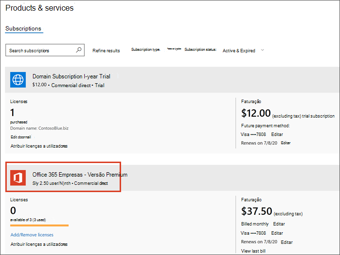
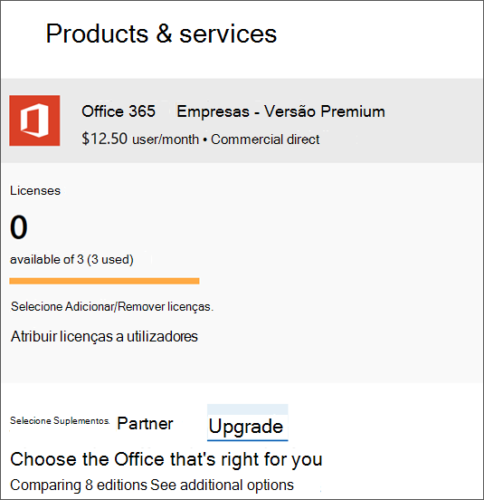

# Upgrade para Microsoft 365 Business a partir do Office 365 Business PremiumUpgrade to Microsoft 365 Business from Office 365 Business Premium

Se tiver um [Office 365 para subscrição](https://products.office.com/compare-all-microsoft-office-products-4-column?activetab=tab:primaryr2)de negócios , por exemplo, Office 365 Business Premium, pode facilmente fazer upgrade para o Microsoft 365 Business.If you have an [Office 365 for business subscription](https://products.office.com/compare-all-microsoft-office-products-4-column?activetab=tab:primaryr2), for example, Office 365 Business Premium, you can easily upgrade to Microsoft 365 Business. Upgrade para Microsoft 365 Business se quiser adicionar:Upgrade to Microsoft 365 Business if you want to add: 
- Windows 10 Pro (para PCs que executam o Windows 8 ou mais tarde)Windows 10 Pro (to PCs running Windows 8 or later)
- Controlos simples que gerem dados empresariais em dispositivosSimple controls that manage business data on devices
- Capacidades de segurança avançadas.Advanced security capabilities.
Saiba mais sobre o Microsoft 365 Business em [Microsoft.com](https://www.microsoft.com/microsoft-365/business)Find out more about Microsoft 365 Business at [Microsoft.com](https://www.microsoft.com/microsoft-365/business)

## Qual é a diferença entre o Office 365 Business Premium e o Microsoft 365 Business?What's the difference between Office 365 Business Premium and Microsoft 365 Business?
Adicionámos uma comparação lado a lado destes dois planos à Descrição do [Serviço Empresarial Microsoft 365.](https://docs.microsoft.com/office365/servicedescriptions/microsoft-365-service-descriptions/microsoft-365-business-service-description)We've added a side-by-side comparison of these two plans to the [Microsoft 365 Business Service Description](https://docs.microsoft.com/office365/servicedescriptions/microsoft-365-service-descriptions/microsoft-365-business-service-description). 

## Antes de começar.Before you get started

- **Quando devo escolher fazer upgrade?****When should I choose to upgrade?** O upgrade é a escolha certa quando pretende atualizar **todos os utilizadores atribuídos** a um único plano.Upgrade is the right choice when you want to upgrade **all users** assigned to a single plan. Ao optar pela atualização, todos os utilizadores do plano são transferidos para outro plano ao mesmo tempo.When you choose upgrade, all plan users get switched to another plan at the same time. Se não quiser atualizar todos os designados para um único plano, compre licenças para o novo plano (neste caso Microsoft 365 Business), e [atribua essas licenças individualmente](https://docs.microsoft.com/office365/admin/manage/assign-licenses-to-users) a cada utilizador que pretenda fazer upgrade.If you don't want to upgrade everyone assigned to a single plan, buy licenses for the new plan (in this case Microsoft 365 Business), and [assign those licenses individually](https://docs.microsoft.com/office365/admin/manage/assign-licenses-to-users) to each user that you want to upgrade. 
- **Alguns addons podem impedir a atualização** Se tentar iniciar uma atualização e tiver um addon que o impeça de continuar, pode remover primeiro o addon e, em seguida, adicioná-lo de volta mais tarde se ainda precisar.**Some add-ons might prevent the upgrade** If you try to start an upgrade and you have an add-on that prevents you from continuing, you can remove the add-on first, and then add it back later if you still need it. 
- **Se pagou o seu plano de pré-pagamento** Não há um caminho simples de atualização para planos pré-pagos.**If you prepaid your plan** There isn't a straightforward upgrade path for prepaid plans. Saberá se tem um plano pré-pago porque configura o seu plano usando uma identificação de produto que pode ter comprado numa loja.You'll know if you have a prepaid plan because you set up your plan using a product ID that you might have purchased in a store. Contacte um parceiro, vá à Microsoft Store ou espere até que o seu plano pré-pago expire para mudar para um novo plano.Contact a partner, go to the Microsoft Store, or wait until your prepaid plan expires to switch to a new plan.

## Upgrade para Microsoft 365 BusinessUpgrade to Microsoft 365 Business
Compre as suas licenças seguindo estes passos no [novo centro de administração:](https://docs.microsoft.com/office365/admin/microsoft-365-admin-center-preview)Buy your licenses by following these steps in the [new admin center](https://docs.microsoft.com/office365/admin/microsoft-365-admin-center-preview):
1. Assine no centro de <a href="https://go.microsoft.com/fwlink/p/?linkid=837890" target="_blank">https://admin.microsoft.com</a>administração em .Sign into the admin center at <a href="https://go.microsoft.com/fwlink/p/?linkid=837890" target="_blank">https://admin.microsoft.com</a>.
2. Vá ao painel de navegação e selecione **Produtos de Faturação** \> **& Serviços**.Go to the navigation pane and select **Billing** \> **Products & Services**. Encontre a subscrição do Office 365 e selecione-a para ver os detalhes.Find your Office 365 subscription and select it to view the details. 

    

3. Na página seguinte, selecione **Upgrade**.On the next page, select **Upgrade**. 

      

  > [!NOTE]
  > Se vir uma mensagem que diga que atualizar a **sua subscrição não é suportado com licenciamento baseado em grupo no Azure Ative Directory,** pode ignorá-lo com segurança a menos que tenha uma organização muito grande.If you see a message that says **Upgrading your subscription is not supported with group-based licensing in Azure Active Directory**, you can safely ignore this unless you have a very large organization. As organizações que escolheram esta opção estarão cientes de que estão a usar o licenciamento baseado em grupo.Organizations who have selected this option will be aware that they're using group-based licensing.

4. Em seguida, pode ver uma lista de planos do Office para os dois.Next, you can view a list of Office plans that you can upgrade to. Neste caso, encontre o plano de negócios da Microsoft 365.In this case, find the Microsoft 365 Business plan. Você pode rolar para baixo se você quiser ver todas as aplicações e serviços do Office que estão incluídos com este plano.You can scroll down if you want to see all the Office apps and services that are included with this plan. No **Microsoft 365 Business,** selecione **Upgrade** para adicionar o Microsoft 365 Business ao seu carrinho.Under **Microsoft 365 Business**, select **Upgrade** to add Microsoft 365 Business to your cart.
5. No carrinho:In the cart:
    1. Vamos automaticamente incluir licenças para todos os seus utilizadores atuais.We'll automatically include licenses for all your current users. Se precisar de mais ou menos licenças, tem de [comprar e atribuir essas licenças individualmente](https://docs.microsoft.com/office365/admin/manage/assign-licenses-to-users).If you need more or fewer licenses, you need to [buy and assign those licenses individually](https://docs.microsoft.com/office365/admin/manage/assign-licenses-to-users).  
    2. Pode ajustar a forma como gostaria de pagar: mensal ou anualmente.You can adjust how you'd like to pay: monthly or yearly. Selecione o menu suspenso para fazer a sua escolha.Select the drop-down menu to make your choice.
6. Selecione **Ir ao Checkout** onde verá um resumo da sua compra, incluindo o método de pagamento desta conta.Select **Go to Checkout** where you'll see a summary of your purchase, including the payment method for this account. Também pode adicionar um código promocional aqui se tiver um.You can also add a promo code here if you have one.
7. Selecione **O pedido de lugar** para completar a sua compra.Select **Place order** to complete your purchase.
A Microsoft leva alguns minutos para configurar os seus novos planos de serviço.It takes Microsoft a few minutes to set up your new service plans. Para verificar o progresso, selecione Verifique o estado da **atualização**.To check on progress, select **Check upgrade status**. 
1. Uma vez que o seu plano esteja pronto, você pode precisar completar alguns passos adicionais de configuração no centro de administração.Once your plan is ready, you might need to complete some additional setup steps in the admin center. No painel de navegação, selecione **Casa** para completar quaisquer passos adicionais de configuração.In the navigation pane, select **Home** to complete any additional setup steps.

> [!NOTE]
> Receberá um reembolso prostrado pelas 365 licenças do Office que já não precisa.You'll receive a prorated refund for the Office 365 licenses that you no longer need. A sua conta bancária ou cartão de crédito será cobrada cerca de dois dias após a configuração do novo plano.Your bank account or credit card will be charged about two days after you set up the new plan.
  
## Proteja os dispositivos e ficheiros do utilizadorProtect user devices and files

Agora que foram atribuídas licenças empresariais da Microsoft 365, completam as etapas para começar a proteger dispositivos e ficheiros.Now that Microsoft 365 Business licenses have been assigned, complete steps to start protecting devices and files. Você usará algumas novas opções incluídas no painel de navegação do centro de administração.You'll use some new options included in the admin center navigation pane.
  
1. No centro de administração, no painel de navegação, vá para as **Políticas**de **Dispositivos** \> .In the admin center, in the navigation pane, go to **Devices** \> **Policies**.
    
2. Na página de políticas do **Dispositivo,** selecione **Adicionar**.On the **Device policies** page, select **Add**.
    
3. No painel de **política Add** dá à política um nome (por exemplo, Proteja os ficheiros de trabalho) e, em seguida, escolha um tipo **de Política** a partir da lista de drop-down.In the **Add policy** pane give the policy a name (for example, Protect work files), and then choose a **Policy type** from the drop-down list. 
    
    Pode configurar políticas de aplicação para proteger ficheiros em dispositivos Android e iPhone, bem como windows 10, e pode configurar políticas de configuração de dispositivos de configuração de dispositivos Windows 10 da empresa.You can set up application policies for protecting files on Android and iPhone devices, as well as Windows 10, and you can set up device configuration policies for company owned Windows 10 devices. Consulte os seguintes links para mais detalhes:See the following links for details:
    
  - [Configurar as definições de proteção de aplicações para dispositivos Android ou iOSSet app protection settings for Android or iOS devices](app-protection-settings-for-android-and-ios.md)
    
  - [Configurar as definições de proteção de aplicações para dispositivos Windows 10Set application protection settings for Windows 10 devices](protection-settings-for-windows-10-devices.md)
    
  - [Definir definições de proteção do dispositivo para PCs windows 10Set device protection settings for Windows 10 PCs](protection-settings-for-windows-10-pcs.md)
    
  
4. Depois de configurar políticas, você e os seus colaboradores podem configurar dispositivos:After you set up policies, you and your employees can set up devices:
    
  - Se os dispositivos Windows ainda não estiverem a utilizar a atualização do Windows Pro Creator, terá de os atualizar para a Atualização dos [Criadores do Windows Pro](upgrade-to-windows-pro-creators-update.md).If your Windows devices aren't already using the Windows Pro Creator update, you'll need to [upgrade them to Windows Pro Creators Update](upgrade-to-windows-pro-creators-update.md).
    
  - Consulte [a configuração de dispositivos Windows para utilizadores do Microsoft 365 Business](set-up-windows-devices.md) para obter medidas para dispositivos Windows.See [Set up Windows devices for Microsoft 365 Business users](set-up-windows-devices.md) for steps for Windows devices. 
    
  - Consulte a [Configuração de dispositivos móveis para os utilizadores do Microsoft 365 Business](set-up-mobile-devices.md) para passos para telemóveis e iPhones Android.See [Set up mobile devices for Microsoft 365 Business users](set-up-mobile-devices.md) for steps for Android phones and iPhones. 
