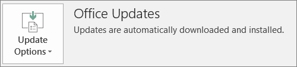

# Preparar a implementação do cliente do Office pelo Microsoft 365 para empresasPrepare for Office client deployment by Microsoft 365 for business

Este artigo aplica-se ao Microsoft 365 Empresas - Formatos Premium.This article applies to Microsoft 365 Business Premium.

## Preparar a instalação automática das aplicações do Office em computadores clientePrepare to automatically install Office apps to client computers

Pode utilizar o Microsoft 365 Empresas – Versão Premium para instalar automaticamente as aplicações do Office de 32 bits em computadores com Windows 10 e mantê-las atualizadas.You can use Microsoft 365 Business Premium to automatically install the 32-bit Office apps on Windows 10 computers and keep them current with updates.
  
A instalação automática funciona melhor se o computador do utilizador final tiver o Windows 10 Business e:Automatic installation works best if the end user's computer is on Windows 10 Business and:
  
- Não tiver aplicações de ambiente de trabalho do Office (Word, Excel, PowerPoint, Outlook, OneNote, Publisher, Access e OneDrive).Doesn't have existing Office desktop apps (Word, Excel, PowerPoint, Outlook, OneNote, Publisher, Access, and OneDrive).
    
    ouor
    
- Tiver uma versão do Office Clique-e-Use instalada.Has an existing version of Click-to-Run Office installed.
    
Para determinar se tem a versão Clique-e-Use do Office, em qualquer aplicação do Office, aceda a **Ficheiro** \> **Conta** ( **Conta do Office** no Outlook).To determine if you have the Click-to-Run version of Office, in any Office app go to **File** \> **Account** ( **Office Account** in Outlook). Se vir as **Atualizações do Office** conforme apresentado na seguinte imagem, a instalação foi e feita com a versão Clique-e-Use.If you see **Office Updates** as shown in the following figure, then the installation was done by using Click-to-Run. 
  

  
 **Quem beneficia desta funcionalidade****Who benefits from having this feature**
  
O utilizador final cujo PC:The end user whose PC:
  
- **Tem**  uma licença de utilizador do Windows 10 Business, uma licença ativa do Microsoft 365 para empresas, a Atualização para Criativos do Windows 10 e está associado ao Azure Active Directory.**Has**  a Windows 10 Business user license, an active Microsoft 365 for business license, Windows 10 Creators Update, and is joined to Azure Active Directory. 
    
- **Não tem aplicações do** Office de 64 bits (por exemplo: Word, Excel, PowerPoint).**Doesn't have** 64-bit Office apps (example: Word, Excel, PowerPoint). Se for necessário ter aplicações do Office de 64 bits, esta funcionalidade não é uma boa forma de o fazer porque não existe suporte para ativar uma versão Clique-e-Run de 64 bits do Office 2016 a partir da consola do administrador do Microsoft 365 para empresas.If 64-bit Office apps are required, then this feature isn't a good fit because there's no support for triggering a 64-bit 2016 Click-to-Run version of Office from the Microsoft 365 for business admin console. 
    
- **Não tem** quaisquer aplicações autónomas do Windows Installer (MSI) 2016 (por exemplo, o Visio ou Project).**Doesn't have** any 2016 Windows Installer (MSI) standalone apps (for example, Visio or Project). O Microsoft 365 para empresas atualiza o Office para a versão Clique-e-Run do Office 2016 e a mesma não funciona com as aplicações aplicações aleacionais do Office 2016 MSI.Microsoft 365 for business upgrades Office to the Click-to-Run version of Office 2016 and that doesn't work with Office 2016 MSI standalone apps. 
    
A seguinte tabela mostra que ação os utilizadores/administradores finais poderão ter de tomar, dependendo do respetiva estado inicial, para que a implementação do Office na versão Clique-e-Run de 32 bits do Office seja bem-sucedida a partir da consola do administrador do Microsoft 365 para empresas.The following table shows what action the end users/admins may need to take, depending on their beginning state, to have a successful 32-bit Click-to-Run version of Office deployment from the Microsoft 365 for business admin console. 

|Estado inicial da instalação do OfficeStarting Office install status|Ação a tomar antes da instalação do Office do Microsoft 365 para empresasAction to take before Microsoft 365 for business Office install|Estado finalEnd state|
|:-----|:-----|:-----|
|Nenhum conjunto de aplicações do Office instaladoNo Office suite installed    |NenhumaNone    |O Office 2016 de 32 bits é instalado com a clique-e-UseOffice 2016 32-bit is installed by using Click-to-Run    |
|Versão Clique-e-Use de 32 bits do Office (2016 ou anterior) sem aplicações autónomasExisting Click-to-Run 32-bit version of Office (2016 or earlier) and no standalone apps    |NenhumaNone    |Atualizada para a versão Clique-e-Use de 32 bits mais recente do Office 2016, conforme necessário **\***Upgraded to the latest 32-bit Click-to-Run version of Office 2016, as needed **\***   |
|Versão Clique-e-Utilize de 32 bits do Office e aplicações a mesmas do Office Clique-e-Utilize 32 bits ou 64 bits (por exemplo, o Visio, Project)Existing Click-to-Run 32-bit version of Office and Click-to-Run 32-bit or 64-bit standalone Office apps (for example, Visio, Project)    |NenhumNone    |As aplicações a standalone não são afetadas.Standalone apps aren't affected. O conjunto de aplicações é atualizado para a versão Clique-e-Use de 32 bits do Office 2016Suite is upgraded to Click-to-Run 32-bit version of Office 2016    |
|Versão Clique-e-Use de 32 bits do Office e quaisquer aplicações autónomas do Office MSI de 32 ou 64 bits (exceto o 2016)Existing Click-to-Run 32-bit version of Office and any 32-bit or 64-bit (except 2016) MSI standalone Office apps    |NenhumaNone    |As aplicações a standalone não são afetadas.Standalone apps aren't affected. O conjunto de aplicações é atualizado para a versão Clique-e-Use de 32 bits do Office 2016Suite is upgraded to Click-to-Run 32-bit version of Office 2016    |
|Qualquer versão Clique-e-Use de 64 bits do OfficeAny existing Click-to-Run 64-bit version of Office    |Desinstale as aplicações do Office de 64 bits, se não se importar de substituí-las por aplicações do Office de 32 bitsUninstall the 64-bit Office apps, if it's OK to replace them with 32-bit Office apps    |Se as aplicações do Office de 64 bits forem removidas, a versão Clique-e-Use de 32 bits do Office 2016 é instaladaIf Office 64-bit apps are removed, the Click-to-Run 32-bit version of Office 2016 is installed    |
|Uma instalação MSI do Office 2016 com ou sem aplicações autónomasAn existing MSI install of Office 2016 with or without standalone apps    |Desinstale o Office 2016 MSI.Uninstall MSI Office 2016.    |A versão Clique-e-Use de 32 bits do Office 2016 é instalada. As aplicações autónomas não são alteradasClick-to-Run 32-bit version of Office 2016 is installed. No change to standalone apps    |
|Instalação do Office 2013 MSI (ou anterior) e/ou aplicações autónomas do OfficeExisting MSI install of Office 2013 (or earlier) and/or standalone Office apps    |NenhumaNone    |A versão Clique-e-Use de 32 bits do Office 2016 e a instalação do Office MSI já existente (e aplicações autónomas) existem em simultâneoClick-to-Run 32-bit version of Office 2016 with the pre-existing MSI Office install (and standalone apps) exist side-by-side    |
||||
   
 **(\*) Nota:** não é atualizada para a versão Clique-e-Use de 32 bits do Office 2016 devido a um erro desconhecido.**(\*) Note:** Does not upgrade to Click-to-Run 32-bit version of Office 2016 due to a known bug. Está em curso uma correção.A fix is in progress. 
  
