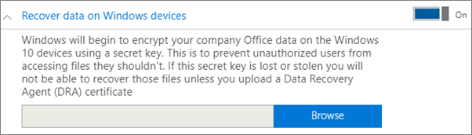
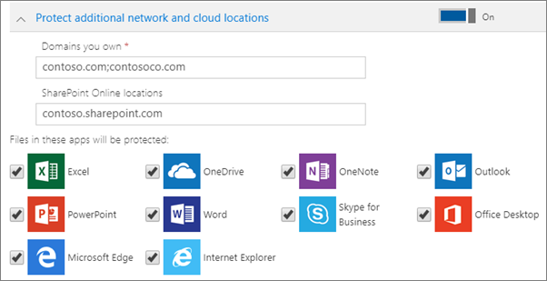

# Definir ou editar definições de proteção de aplicações para dispositivos Windows 10Set or edit application protection settings for Windows 10 devices

Este artigo aplica-se ao Microsoft 365 Business Premium.This article applies to Microsoft 365 Business Premium.

## Editar uma política de gestão de aplicações para o Windows 10Edit an app management policy for Windows 10

1. Vá ao centro de administração em <a href="https://go.microsoft.com/fwlink/p/?linkid=837890" target="_blank">https://admin.microsoft.com</a> .Go to the admin center at <a href="https://go.microsoft.com/fwlink/p/?linkid=837890" target="_blank">https://admin.microsoft.com</a>.     
2. No navegador esquerdo, escolha **Políticas de** \> **Dispositivos** .On the left nav, choose **Devices** \> **Policies** .
1. Escolha uma política de aplicações do Windows existente e, em seguida, **Edite.**Choose an existing Windows app policy and then **Edit**.
1. Escolha **Editar** ao lado de uma definição que pretende alterar e, em seguida, **Guardar**.Choose **Edit** next to a setting you want to change and then **Save**.

## Criar uma política de gestão de aplicações para Windows 10Create an app management policy for Windows 10

Se os seus utilizadores tiverem dispositivos Windows 10 pessoais, nos quais realizam tarefas profissionais, também pode proteger os seus dados nesses dispositivos.If your users have personal Windows 10 devices on which they perform work tasks, you can protect your data on those devices as well.
  
1. Vá ao centro de administração em <a href="https://go.microsoft.com/fwlink/p/?linkid=837890" target="_blank">https://admin.microsoft.com</a> .Go to the admin center at <a href="https://go.microsoft.com/fwlink/p/?linkid=837890" target="_blank">https://admin.microsoft.com</a>. 
2. No navegador esquerdo, escolha **Políticas de Dispositivos** \>  \> **Adicionar**.On the left nav, choose **Devices** \> **Policies** \> **Add**.
3. No painel **Adicionar política**, introduza um nome exclusivo para esta política.On the **Add policy** pane, enter a unique name for this policy. 
4. Em **Tipo de política**, selecione **Gestão de Aplicações para Windows 10**.Under **Policy type**, choose **Application Management for Windows 10**.
5. Sob **o tipo dispositivo**, escolha **pessoal** ou **empresa própria.**Under **Device type**, choose either **Personal** or **Company Owned**.
6. A opção **Encriptar ficheiros de trabalho** é ativada automaticamente.The **Encrypt work files** is turned on automatically. 
7. Defina **Impedir que os utilizadores copiem os dados da empresa para ficheiros pessoais e obrigá-los a guardar os ficheiros de trabalho no OneDrive para Empresas** como **Ativado** se não pretender que os utilizadores guardem ficheiros de trabalho nos respetivos PCs.Set **Prevent users from copying company data to personal files and force them to save work files to OneDrive for Business** to **On** if you don't want the users to save work files on their PC. 
9. Expandir **Recuperar dados em dispositivos Windows**.Expand **Recover data on Windows devices**. Recomendamos que **o** ligue.We recommend that you turn it **On**.
    Antes de poder aceder à localização do certificado de Agente de Recuperação de Dados, tem de criar um.Before you can browse to the location of the Data Recovery Agent certificate, you have to first create one. Para obter instruções, consulte [Criar e verificar um certificado de Agente de Recuperação de Dados (EFS) do Sistema de Recolha de Dados encriptante (EFS).](/windows/security/information-protection/windows-information-protection/create-and-verify-an-efs-dra-certificate)For instructions, see [Create and verify an Encrypting File System (EFS) Data Recovery Agent (DRA) certificate](/windows/security/information-protection/windows-information-protection/create-and-verify-an-efs-dra-certificate).
    
    Por predefinição, os ficheiros de trabalho são encriptados com uma chave secreta que é armazenada no dispositivo e é associada ao perfil do utilizador.By default, work files are encrypted using a secret key that is stored on the device and associated with the user's profile. Apenas o utilizador pode abrir e desencriptar o ficheiro.Only the user can open and decrypt the file. No entanto, se um dispositivo for perdido ou um utilizador for removido, um ficheiro pode ficar bloqueado num estado encriptado.However, if a device is lost or a user is removed, a file can be stuck in an encrypted state. Um administrador pode usar o certificado de Agente de Recuperação de Dados (DRA) para desencriptar o ficheiro.An admin can use the Data Recovery Agent (DRA) certificate to decrypt the file.
    
    
  
10. **Expanda-se Proteger localizações adicionais de rede e nuvem** se pretender adicionar domínios adicionais ou localizações online do SharePoint para garantir que os ficheiros em todas as aplicações listadas estão protegidos.Expand **Protect additional network and cloud locations** if you want to add additional domains or SharePoint Online locations to make sure that files in all the listed apps are protected. Se precisar de introduzir mais do que um item em cada campo, utilize ponto e vírgula (;) entre os itens.If you need to enter more than one item for either field, use a semicolon (;) between the items.
    
    
  
11. Em seguida, decida **Quem irá ver estas definições?** Se não quiser utilizar o grupo de segurança predefinido, **Todos os Utilizadores**, selecione **Alterar**, selecione os grupos de segurança que irão receber estas definições \> **Selecionar**.Next decide **Who will get these settings?** If you don't want to use the default **All Users** security group, choose **Change**, choose the security groups who will get these settings \> **Select**.
12. Por fim, selecione **Adicionar** para guardar a política e atribua-a a todos os dispositivos.Finally, choose **Add** to save the policy, and assign it to devices.