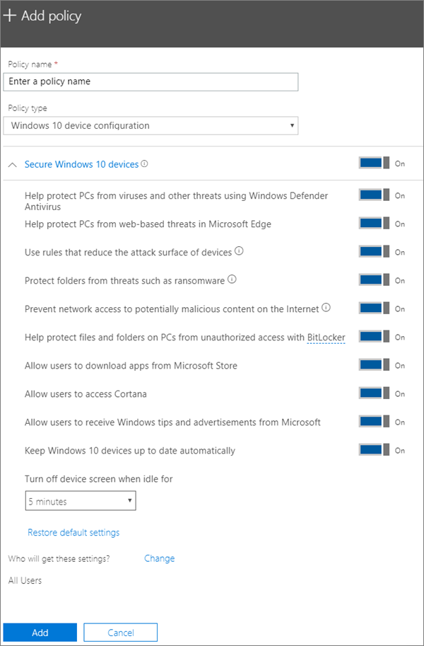

# Editar ou criar definições de proteção de dispositivos para computadores windows 10

Este artigo aplica-se ao Microsoft 365 Business Premium.

Depois de ter configurado as definições de proteção padrão do Windows na página 'Configurar', pode adicionar novas que se apliquem a todos os utilizadores ou a um conjunto de utilizadores. Também pode editar qualquer um dos que criou.

## Criar definições de proteção para dispositivos Windows 10

Veja um vídeo sobre como proteger dispositivos Windows 10 com o Microsoft 365 Business Premium:
  
> [!VIDEO https://www.microsoft.com/videoplayer/embed/a5734146-620a-4cec-8618-536b3ca37972?autoplay=false]
  
1. Vá ao centro de administração em <a href="https://go.microsoft.com/fwlink/p/?linkid=837890" target="_blank">https://admin.microsoft.com</a> . 
2. No navegador esquerdo, escolha **Políticas de Dispositivos** \>  \> **Adicionar**.
3. No painel **Adicionar política**, introduza um nome exclusivo para esta política. 
4. Em **Tipo de política**, selecione **Configuração de Dispositivos Windows 10**.
5. Expanda a janela **Proteger Dispositivos Windows 10** \> configure as definições da forma que pretende. Para mais informações, consulte [as definições disponíveis.](#available-settings) 
    
    Pode sempre utilizar a ligação **Repor predefinições** para regressar à predefinição. 
    
    
  
6. Em seguida, decida **Quem irá ver estas definições?** Se não quiser utilizar o grupo de segurança predefinido, **Todos os Utilizadores**, selecione **Alterar**, procure o grupo de segurança que irá obter essas definições \> **Selecionar**.
7. Por fim, selecione **Concluído** para guardar a política e atribuí-la aos dispositivos. 

## Editar as definições de proteção do Windows 10
 
1. Vá ao centro de administração em <a href="https://go.microsoft.com/fwlink/p/?linkid=837890" target="_blank">https://admin.microsoft.com</a> .     
2. No navegador esquerdo, escolha **Políticas de** \> **Dispositivos** .
1. Escolha uma política de dispositivos Windows existente e, em seguida, **edite**.
1. Escolha **Editar** ao lado de uma definição que pretende alterar e, em seguida, **Guardar**.

## Definições disponíveis

Por predefinição, todas as definições estão **Ativadas**. As seguintes definições estão disponíveis.
  
Para obter mais informações, consulte [como as funcionalidades de proteção no mapa Do Microsoft 365 Premium para as definições de Intune](map-protection-features-to-intune-settings.md). 
  
|||
|:-----|:-----|
|Definição    |Descrição    |
|Ajudar a proteger os PCs contra vírus e outras ameaças com o Antivírus do Windows Defender    |Exige que o Antivírus do Windows Defender esteja ativado para proteger os PCs contra os perigos que uma ligação à Internet envolve.    |
|Ajudar a proteger os PCs contra ameaças baseadas na Web no Microsoft Edge    |Ativa as definições no Microsoft Edge que ajudam a proteger os utilizadores contra transferências e sites maliciosos.    |
|Utilize regras que reduzam a superfície de ataque dos dispositivos    |Quando ativada, a redução da superfície de ataque ajuda a bloquear ações e aplicações normalmente utilizadas por software maligno para infetar dispositivos. Esta definição só está disponível se o Antivírus do Windows Defender estiver Ativado. Consulte [Reduzir superfícies de ataque](/windows/security/threat-protection/microsoft-defender-atp/exploit-protection) para saber mais.    |
|Proteger pastas contra ameaças como o ransomware    |Esta definição utiliza o acesso controlado a pastas para proteger os dados da empresa contra modificações de aplicações suspeitas e maliciosas, como o ransomware. Estes tipos de aplicações são impedidas de fazer alterações a pastas protegidas. Esta definição só está disponível se o Antivírus do Windows Defender estiver Ativado. Consulte [as pastas Protect com acesso a pastas controladas](/mem/configmgr/protect/deploy-use/create-deploy-exploit-guard-policy#bkmk_CFA) para saber mais.    |
|Impedir o acesso da rede a conteúdo potencialmente malicioso na Internet    |Utilize esta definição para bloquear ligações de utilizadores de saída a localizações de Internet de baixa reputação que possam acolher esquemas de phishing, explorações ou outros conteúdos maliciosos. Esta definição só está disponível se o Antivírus do Windows Defender estiver definido para **On**. Para mais informações, consulte [Protect your network](/windows/security/threat-protection/windows-defender-antivirus/configure-real-time-protection-windows-defender-antivirus).    |
|Ajudar a proteger ficheiros e pastas nos PCs contra acesso não autorizado com o BitLocker    |O Bitlocker protege os dados ao encriptar os discos rígidos do computador e proteger contra exposição de dados em caso de roubo ou perda do computador. Para mais informações, consulte [bitlocker FAQ](/windows/security/information-protection/bitlocker/bitlocker-frequently-asked-questions).    |
|Permitir que os utilizadores transfiram aplicações da Microsoft Store    |Permite que os utilizadores transfiram e instalem aplicações da Microsoft Store. As aplicações incluem tudo, desde jogos a ferramentas de produtividade, pelo que deixamos esta definição **Ativada**, embora a possa desativar para garantir uma segurança adicional.    |
|Permitir que os utilizadores acedam à Cortana    |A Cortana pode ser bastante útil! Cortana pode ligar ou desligar as definições para si, dar instruções e certificar-se de que está a tempo para marcações, por isso mantemos esta definição **por** predefinição.    |
|Permitir que os utilizadores recebam sugestões e anúncios da Microsoft acerca do Windows    |As sugestões do Windows podem ser úteis e ajudar a orientar os utilizadores quando são lançadas novas versões.    |
|Manter os dispositivos Windows 10 atualizados automaticamente    |Garante que os dispositivos Windows 10 recebem automaticamente as atualizações mais recentes.    |
|Desligar o ecrã do dispositivo quando estiver inativo durante este período de tempo    |Garante que os dados da empresa são protegidos se um utilizador estiver inativo. É possível que um utilizador esteja a trabalhar num local público, como um café, e se afaste ou distraia por um momento, deixando o dispositivo vulnerável a olhares alheios. Esta definição permite-lhe controlar quanto tempo um utilizador pode estar inativo antes de o ecrã se desligar.    |