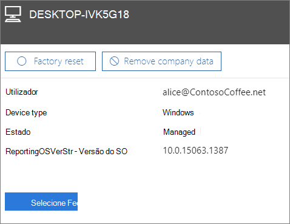

# Remover dados da empresa de dispositivos

Este artigo aplica-se ao Microsoft 365 Business Premium.

## Remover dados da empresa

Pode utilizar o Microsoft 365 para a empresa para remover os dados da empresa que os seus utilizadores têm nos seus [dispositivos](app-protection-settings-for-android-and-ios.md) ou [Computadores Windows](protection-settings-for-windows-10-devices.md) que estão protegidos pela Microsoft 365. **Se remover dados empresariais de um dispositivo, não poderá restaurá-los posteriormente**. 
  
1. Vá ao centro de administração em <a href="https://go.microsoft.com/fwlink/p/?linkid=837890" target="_blank">https://admin.microsoft.com</a> .
    
2. Na navegação à esquerda, escolha **Dispositivos** \> **Gerir**.  
  
3. Na página **'Gerir',** escolha ou procure por um utilizador que pretenda remover os dados que pretende remover e escolha o nome. 
    
4. No painel seguinte, selecione o dispositivo ou dispositivos da lista **de Dispositivos.** No painel do dispositivo que abre, pode optar por reiniciar o dispositivo para as definições de fábrica ou remover dados da empresa, dependendo do tipo de dispositivo. 
    
    
  
5. No painel de confirmação, escolha **Confirmar** \> **Fechar**.
    

