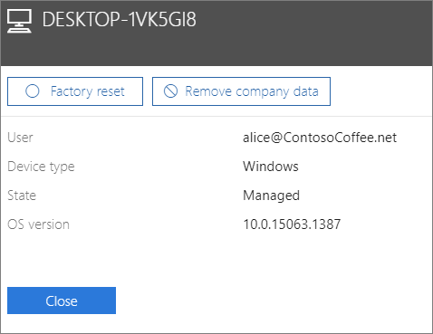

# Remover dados da empresa de dispositivos

## Remover dados da empresa

Pode utilizar o Microsoft 365 Business para remover dados empresariais que os seus utilizadores têm nos respetivos [dispositivos](app-protection-settings-for-android-and-ios.md) ou [PCs com Windows](protection-settings-for-windows-10-devices.md) protegidos pelo Microsoft 365. **Se remover dados empresariais de um dispositivo, não poderá restaurá-los posteriormente**. 
  
1. Vá ao centro de <a href="https://go.microsoft.com/fwlink/p/?linkid=837890" target="_blank">https://admin.microsoft.com</a>administração em .
    
2. No v nav esquerdo, escolha **Dispositivos** \> **Gerir**.  
  
3. Na página **'Gerir',** escolha ou procure um utilizador que queira remover e escolha o nome. 
    
4. No painel seguinte, selecione o dispositivo ou dispositivos da lista **de Dispositivos.** No painel do dispositivo que abre, pode optar por redefinir o dispositivo para as definições de fábrica ou remover os dados da empresa, dependendo do tipo de dispositivo. 
    
    
  
5. No painel de confirmação, escolha **Confirmar** \> **Perto**.
    

