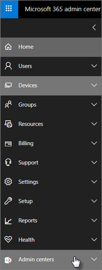

# Funcionalidades de segurança e conformidade do Microsoft 365 Business Premium

O Microsoft 365 Business Premium oferece funcionalidades de segurança simplificadas para ajudar a salvaguardar os seus dados em Computadores, telefones e tablets.
    
## Funcionalidades de segurança do centro de administração da Microsoft 365

Pode gerir muitas das funcionalidades de segurança do Microsoft 365 Business Premium no centro de administração, o que lhe dá uma forma simplificada de ligar ou desligar estas funcionalidades. No centro de administração, pode fazer o seguinte:
  
- [Definir as definições de gestão de aplicações para dispositivos Android ou iOS.](app-protection-settings-for-android-and-ios.md) 
    
    Estas definições incluem a apagar ficheiros de um dispositivo inativo após um período definido, encriptando ficheiros de trabalho, exigindo que os utilizadores detetem um PIN, e assim por diante.
    
- [Detete as definições de proteção da aplicação para dispositivos Windows 10](protection-settings-for-windows-10-devices.md) . 
    
    Estas definições podem ser aplicadas aos dados da empresa em dispositivos pertencentes à empresa ou pessoalmente.
    
- [Detete as definições de proteção do dispositivo para dispositivos Windows 10](protection-settings-for-windows-10-pcs.md) . 
    
    Pode ativar a encriptação [BitLocker](https://go.microsoft.com/fwlink/p/?linkid=871405) para ajudar a proteger os dados no caso de um dispositivo ser perdido ou roubado, e permitir que o [Windows Exploit Guard](https://docs.microsoft.com/windows/security/threat-protection/microsoft-defender-atp/enable-exploit-protection) forneça uma proteção avançada contra ransomware. 
    
- [Remover dados empresariais de dispositivos](remove-company-data.md)
    
    Pode limpar remotamente os dados da empresa se um dispositivo estiver perdido, roubado ou um empregado deixar a sua empresa.
    
- [Redefinir os dispositivos do Windows 10 nas suas definições](reset-devices-to-factory-settings.md) de fábrica . 
    
    Pode redefinir quaisquer dispositivos Do Windows 10 que tenham definições de proteção do dispositivo aplicadas aos mesmos.
    
## Funcionalidades de segurança adicionais 

Funcionalidades avançadas no Microsoft 365 Business Premium estão disponíveis para ajudá-lo a proteger o seu negócio contra ameaças cibernéticas e salvaguardar informações sensíveis.
  
- **[Escritório 365 Proteção Avançada de Ameaças](https://support.office.com/article/e100fe7c-f2a1-4b7d-9e08-622330b83653)**
    
    Advanced Threat Protection (ATP) ajuda a proteger o seu negócio contra ataques sofisticados de phishing e ransomware destinados a comprometer informações de funcionários ou clientes. As funcionalidades incluem:
    
  - Verificação sofisticada de acessórios e análises alimentadas por IA para detetar e descartar mensagens perigosas.
    
  - Verificações automáticas de links em e-mail para avaliar se fazem parte de um esquema de phishing. Isto mantém-te a salvo de aceder a websites inseguros.

- **[Todas as capacidades de Intune no portal Azure](https://go.microsoft.com/fwlink/p/?linkid=871403)**
    
    O acesso ao centro de administração Intune no portal Azure permite-lhe configurar funcionalidades de segurança adicionais, como a gestão de dispositivos MacOS, iPhone e Android, juntamente com a gestão avançada de dispositivos para windows, que não estão disponíveis através do centro de administração da Microsoft 365.
- **Mesmo [acesso condicional](https://docs.microsoft.com/azure/active-directory/conditional-access/overview) do plano Azure AD Premium P1**

    O Acesso Condicional pode ajudar a proteger a sua organização do risco de entrada, tentativas de acesso a partir de uma rede inesperada ou local, tentativas de acesso de tipos de dispositivos de risco, e assim por diante. As políticas de Acesso Condicional são aplicadas após a conclusão da primeira autenticação, e utiliza sinais do primeiro evento de autenticação para determinar se a tentativa de acesso deve ser aprovada, negada ou se é necessária mais prova (como uma segunda forma de identificação).

    As funcionalidades de acesso condicional incluídas são:

    - Acesso com base no nome de utilizador, grupo e função
    - Acesso [com base numa aplicação](https://docs.microsoft.com/azure/active-directory/conditional-access/app-based-conditional-access) 
    - [Acesso com base na localização;](https://docs.microsoft.com/azure/active-directory/authentication/howto-registration-mfa-sspr-combined#conditional-access-policies-for-combined-registration)  apenas permitir o acesso de gamas IP fidedignas ou países específicos 
    - Exigir MFA para acesso
    - Bloqueie o acesso a apps que usam [a autenticação do legado](https://docs.microsoft.com/azure/active-directory/conditional-access/block-legacy-authentication)
    - Exigir aplicações tp usar [proteção de aplicativos Intune](https://docs.microsoft.com/azure/active-directory/conditional-access/app-protection-based-conditional-access)
    - Autenticação personalizada, como MFA com fornecedores de terceiros, por exemplo DUO.
   
    Outras funcionalidades:
    - [Reset de senha de autosserviço](https://docs.microsoft.com/azure/active-directory/authentication/concept-sspr-customization) para a AD Azure híbrida
    
## Características de conformidade

A subscrição do Microsoft 365 Business Premium inclui funcionalidades que o ajudam a manter a conformidade e os padrões regulamentares.

- **[Visão geral das políticas de prevenção de perdas de dados](https://support.office.com/article/1966b2a7-d1e2-4d92-ab61-42efbb137f5e)** (DLP). 
    
    Pode configurar o DLP para detetar automaticamente informações sensíveis, como números de cartões de crédito, números de segurança social, e assim por diante, para evitar a sua partilha inadvertida fora da sua empresa.
    
- **[Arquivo do Exchange Online](https://products.office.com/exchange/microsoft-exchange-online-archiving-email)**
    
    A licença de arquivo online de troca permite que as mensagens sejam facilmente arquivadas com cópia de segurança contínua de dados. Armazena todos os e-mails de um utilizador, incluindo itens apagados, caso sejam necessários mais tarde para serem descobertos ou restaurados. Além disso, pode utilizar diferentes políticas de retenção para preservar dados de e-mail para deter litígios, eDiscovery ou para satisfazer os requisitos de conformidade.
    
- **[Etiquetas de confidencialidade](https://docs.microsoft.com/microsoft-365/compliance/sensitivity-labels)**

   O Microsoft 365 Business Premium inclui todas as funcionalidades do Plano de [Proteção de Informação Azure 1](https://go.microsoft.com/fwlink/p/?linkid=871407). Com este plano, pode criar **etiquetas de sensibilidade** que lhe permitam controlar o acesso a informações sensíveis em e-mail e documentos, com controlos como "Não encaminhar" e "Não copiar". Também pode classificar informações sensíveis como "Confidenciais" e especificar como as informações classificadas podem ser partilhadas fora e dentro do negócio. A encriptação de nível empresarial é fácil de aplicar a e-mails e documentos para manter a sua informação privada. Também pode instalar o complemento de cliente de Proteção de Informação Azure para aplicações do Office. Para mais informações, consulte [o cliente de rotulagem unificado](https://docs.microsoft.com/azure/information-protection/rms-client/unifiedlabelingclient-version-release-history)da Azure Information Protection . Para etiquetas de sensibilidade, instale o **AzInfoProtection_UL.exe**.

Pode gerir estas funcionalidades &amp; no Centro de Conformidade de Segurança e no centro de administração Intune. Com o tempo, os controlos simplificados serão adicionados ao centro de administração da Microsoft 365.
  
    
## FAQ

 ### Estas funcionalidades de segurança estão disponíveis em todos os mercados?
  
Sim, estas funcionalidades estão disponíveis em todos os mercados onde o Microsoft 365 Business Premium é vendido.
  
### Como encontro o &amp; Centro de Conformidade de Segurança?
  
1. [Inscreva-se no Microsoft 365 Business Premium](https://portal.microsoft.com/) utilizando as suas credenciais de administração. 
    
2. Na navegação à esquerda, localize os **centros de administração** e expanda-o. 
    
    
  
3. Escolha o Compliance de &amp; **Segurança &amp; ** para ir ao Centro de Conformidade de Segurança.
