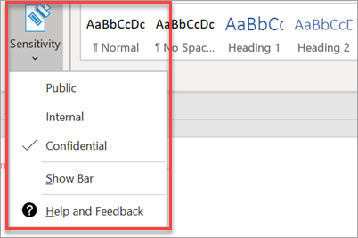

# Configurar funcionalidades de conformidade

O Microsoft 365 Business Premium vem com funcionalidades para proteger os seus dados e dispositivos e ajudá-lo a manter as informações sensíveis dos seus clientes e dos seus clientes seguras.

## Configurar funcionalidades DLP

Consulte [Criar uma política DLP a partir de um modelo](https://docs.microsoft.com/microsoft-365/compliance/create-a-dlp-policy-from-a-template) para um exemplo sobre como configurar uma política para proteger contra a perda de dados pessoais. 
  
DLP vem com muitos modelos de política prontos a usar para muitos locais diferentes. Por exemplo, Australia Financial Data, Canada Personal Information Act, U.S. Financial Data, e assim por diante. Veja [o que os modelos de política do DLP incluem](https://docs.microsoft.com/microsoft-365/compliance/what-the-dlp-policy-templates-include) para uma lista completa. Todos estes modelos podem ser ativados semelhantes ao exemplo do modelo PII. 
  
## Configurar retenção de e-mail com o Arquivo Online da Bolsa

 As funcionalidades de licença **de arquivamento online de intercâmbio** ajudam a manter os padrões de conformidade e regulamentares, preservando o conteúdo de e-mail para eDiscovery. Também ajuda a reduzir o seu risco se houver um processo judicial, e fornece uma forma de recuperar dados após uma falha de segurança ou quando precisa de recuperar itens eliminados. Pode utilizar o porão de litígios para preservar todo o conteúdo de um utilizador, ou usar políticas de retenção para personalizar o que pretende preservar.
  
**Detenção de litígios:** Pode preservar todos os conteúdos da caixa de correio, incluindo itens eliminados, colocando toda a caixa de correio de um utilizador em porão de litígio. 
    
Para colocar uma caixa de correio em porão de litígio, no centro de administração:
    
1. No navegador esquerdo, vá aos **Users** \> **utilizadores Utilizadores Ativos**.
    
2. Selecione um utilizador cuja caixa de correio pretende colocar em espera de litígio. No painel de utilizador, expanda as **definições de Correio** , e ao lado **de mais definições,** escolha **propriedades de Edit Exchange**.
    
3. Na página da caixa de correio para o utilizador, escolha as funcionalidades da caixa de correio ** na navegação esquerda e, em seguida, escolha o link **Enable** no **porão de Contencioso**.
    
4. Na caixa de diálogo **de detenção de litígios,** pode especificar a duração da duração do litígio no campo de **duração do litígio.** Deixe o campo vazio se quiser colocar um domínio infinito. Também pode adicionar notas e dirigir o proprietário da caixa de correio para um site que poderá ter de explicar mais sobre o porão de litígios. \>**Guardar.**
    
**Retenção:** Pode ativar políticas de retenção personalizadas, por exemplo, para preservar por um determinado período de tempo ou eliminar o conteúdo permanentemente no final do período de retenção. Para saber mais, consulte [a visão geral das políticas de retenção.](https://docs.microsoft.com/microsoft-365/compliance/retention-policies)

## Configurar rótulos de sensibilidade

As etiquetas de sensibilidade vêm com o Plano 1 de Proteção de Informação (AIP) do Azure, e ajudam-no a classificar e a proteger opcionalmente os seus documentos e e-mails, aplicando etiquetas. As etiquetas podem ser aplicadas automaticamente por administradores que definem regras e condições, manualmente pelos utilizadores, ou através de uma combinação em que os utilizadores recebem recomendações.

Para configurar rótulos de sensibilidade, ver [criar e gerir vídeos de etiquetas de sensibilidade.](https://support.microsoft.com/office/2fb96b54-7dd2-4f0c-ac8d-170790d4b8b9)

### Instale manualmente o cliente Azure Information Protection

Para instalar manualmente o cliente AIP:

1. Descarregue **AzinfoProtection_UL.exe** do [Microsoft download center](https://www.microsoft.com/download/details.aspx?id=53018).
 
2. Pode verificar se a instalação funcionou visualizando um documento Word e certificando-se de que a opção **Sensibilidade** está disponível no **separador 'Casa'.**
 

Para mais informações, consulte [instalar o cliente.](https://docs.microsoft.com/azure/information-protection/infoprotect-tutorial-step3)
