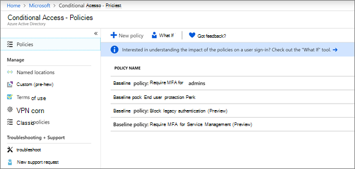

# Criar políticas de acesso condicional

[As](https://docs.microsoft.com/azure/active-directory/conditional-access/overview) políticas de acesso condicional acrescentam uma segurança adicional substancial. A Microsoft fornece um conjunto de políticas de acesso condicional de base que são recomendadas para todos os clientes. As políticas de base são um conjunto de políticas predefinidas que ajudam a proteger as organizações contra muitos ataques comuns. Estes ataques comuns podem incluir spray de senha, repetição e phishing.

Estas políticas exigem que os administradores e utilizadores introduzam uma segunda forma de autenticação (chamada autenticação multifactor, ou MFA) quando determinadas condições são satisfeitas. Por exemplo, se um utilizador estiver a iniciar sessão a partir de um país diferente, o inserido pode ser considerado arriscado e o utilizador deve fornecer uma forma adicional de autenticação. 

Atualmente, as políticas de base incluem:
- **Exigir MFA para administradores** &ndash; requer autenticação multi-factor para as funções de administrador mais privilegiada, incluindo administrador global.
- **A proteção** &ndash; final do utilizador requer a autenticação de vários fatores para os utilizadores apenas quando um inseri-lo é arriscado. 
- **Autenticação** &ndash; legado O legado das aplicações de clientes mais antigos e algumas novas aplicações não utilizam protocolos de autenticação mais recentes, mais seguros e seguros. Estas aplicações mais antigas podem contornar as políticas de acesso condicional e obter acesso não autorizado ao seu ambiente. Esta política bloqueia o acesso de clientes que não suportam acesso condicional. 
- **Exigir MFA para gestão** &ndash; de serviçorequer autenticação de vários fatores para o acesso a ferramentas de gestão, incluindo portal Azure (onde configura políticas de base). 

A Microsoft recomenda que ative todas estas políticas de base. Após a ativação destas políticas, os administradores e utilizadores serão solicitados a registar-se para autenticação Azure Multii-Factor.

Para obter mais informações sobre estas políticas, veja [quais são as políticas de base?](https://docs.microsoft.com/azure/active-directory/conditional-access/concept-baseline-protection)

## Criar políticas de base

1. Vá ao [portal Azure,](https://portal.azure.com)e depois navegue até ao **Acesso Condicional**do **Diretório** \> Ativo Azure.
    
    As políticas de base estão listadas na página.    
    
1. Consulte as seguintes instruções específicas para cada política:

  - [Exigir MFA para administradores](https://docs.microsoft.com/azure/active-directory/conditional-access/howto-baseline-protect-administrators)
- [Exigir MFA para utilizadores](https://docs.microsoft.com/azure/active-directory/conditional-access/howto-baseline-protect-end-users)  
 - [Autenticação do legado do bloco](https://docs.microsoft.com/azure/active-directory/conditional-access/howto-baseline-protect-legacy-auth)
  - [Exigir MFA para gestão de serviços](https://docs.microsoft.com/azure/active-directory/conditional-access/howto-baseline-protect-azure)

Pode configurar muitas políticas adicionais, tais como exigir aplicações de clientes aprovadas. Para mais informações, consulte a Documentação de [Acesso Condicional.](https://docs.microsoft.com/azure/active-directory/conditional-access/)
