# Configurar dispositivos móveis para Microsoft 365 para utilizadores empresariais

Siga as instruções nos separadores para instalar o Office num telemóvel Android ou iPhone. Após seguir estes passos, os seus ficheiros de trabalho criados no Office aplicações serão protegidos pelo Microsoft 365 para empresas.

O exemplo é para o Outlook, mas aplica-se a outras aplicações do Office que também pretenda instalar.
  
## Configurar dispositivos móveis

## [iPhone](#tab/iPhone)
  
Veja um breve vídeo sobre como configurar aplicações Office dispositivos iOS com o Microsoft 365 para empresas.  

> [!VIDEO https://www.microsoft.com/videoplayer/embed/RWee2n] 

Caso tenha considerado este vídeo útil, veja a [série de formação completa para pequenas empresas e as novidades do Microsoft 365](../business-video/index.yml).

Aceda à **App Store** e escreva Microsoft Outlook no campo de pesquisa.
  
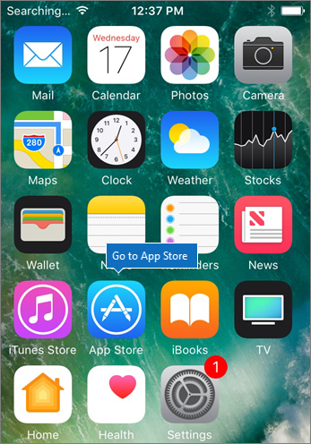
  
Toque no ícone de nuvem para instalar o Outlook.
  
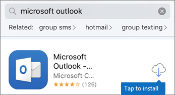
  
Quando a instalação estiver concluída, toque no botão **Abrir** para abrir o Outlook. Em seguida, toque em **Começar**.
  
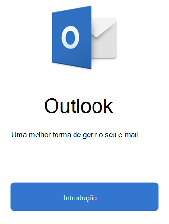
  
Introduza o seu  endereço de e-mail de trabalho no ecrã Adicionar Conta de E-mail Adicionar Conta e, em seguida, introduza \> as Microsoft 365 para empresasIntroduza a \> **sua conta**.
  
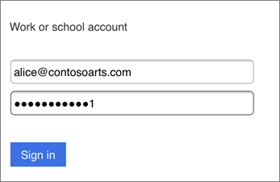
  
Se a sua organização estiver a proteger ficheiros em aplicações, verá uma caixa de diálogo a indicar que a sua organização está agora a proteger os dados na aplicação e terá de reiniciar a aplicação para continuar a usá-la. Toque em **OK** e feche o Outlook. 
  
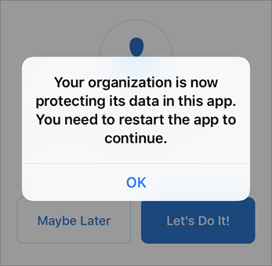
  
Localize o Outlook no iPhone e reinicie-o. Quando lhe for pedido, introduza um PIN e verifique-o. O Outlook no seu iPhone está pronto para ser utilizado.
  
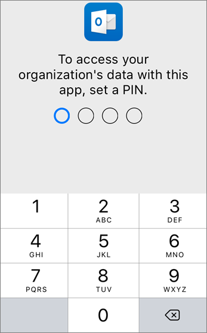
  
## [Android](#tab/Android)
  
Veja um vídeo sobre como instalar Outlook e Office em dispositivos Android.  

> [!VIDEO https://www.microsoft.com/videoplayer/embed/ecc2e9c0-bc7e-4f26-8b14-91d84dbcfef0] 

Caso tenha considerado este vídeo útil, veja a [série de formação completa para pequenas empresas e as novidades do Microsoft 365](../business-video/index.yml).

Para iniciar a configuração no seu telemóvel Android, vá para a Play Store.
  
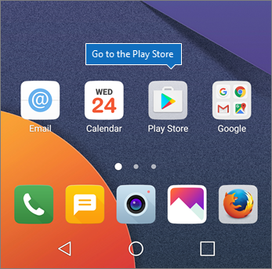
  
Introduza Microsoft Outlook na caixa de pesquisa do Google Play e toque em **Instalar**. Quando Outlook a instalação, toque em **Abrir**.
  

  
Na **aplicação** Outlook, toque em Introdução e, em seguida, adicione a sua conta de e-Microsoft 365 Para Empresas Continue e inscreva-se com as \> credenciais da sua organização.
  
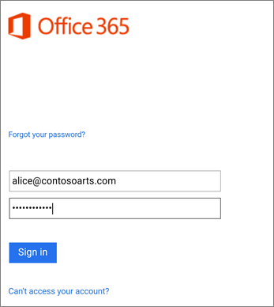
  
Na caixa de diálogo a indicar que tem de instalar a aplicação Portal da Empresa do Intune, toque em **Ir para a Loja**.
  
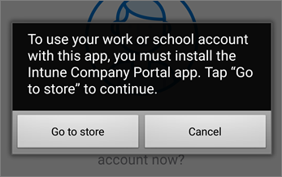
  
Na Play Store, instale o Portal da Empresa do Intune.
  
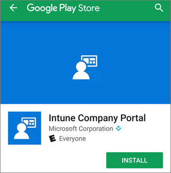
  
Abra novamente o Outlook e introduza e confirme um PIN. A sua aplicação Outlook está pronta para ser utilizada.
  
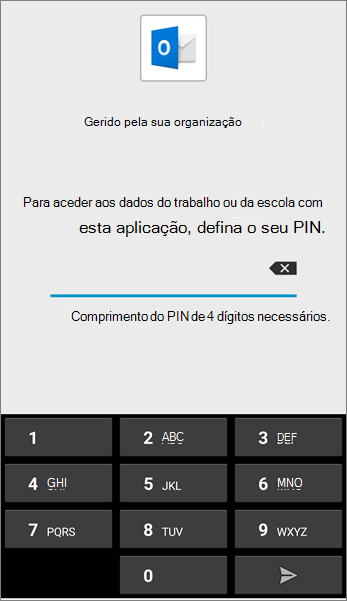

## Conteúdos relacionados

[Microsoft 365 vídeos de formação para empresas](../business-video/index.yml)

---
