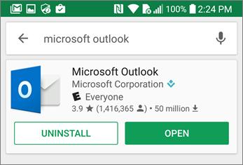

# Configurar dispositivos móveis para Microsoft 365 para utilizadores empresariaisSet up mobile devices for Microsoft 365 for business users

Siga as instruções nos separadores para instalar o Office num telemóvel Android ou iPhone.Follow the instructions in the tabs to install Office on an iPhone or an Android phone. Após seguir estes passos, os seus ficheiros de trabalho criados no Office aplicações serão protegidos pelo Microsoft 365 para empresas.After you follow these steps, your work files created in Office apps will be protected by Microsoft 365 for business.

O exemplo é para o Outlook, mas aplica-se a outras aplicações do Office que também pretenda instalar.The example is for Outlook, but applies for any other Office apps you want to install also.
  
## Configurar dispositivos móveisSet up mobile devices

## [iPhoneiPhone](#tab/iPhone)
  
Veja um breve vídeo sobre como configurar aplicações Office dispositivos iOS com o Microsoft 365 para empresas.Watch a short video on how to set up Office apps on iOS devices with Microsoft 365 for business.  

> [!VIDEO https://www.microsoft.com/videoplayer/embed/RWee2n] 

Caso tenha considerado este vídeo útil, veja a [série de formação completa para pequenas empresas e as novidades do Microsoft 365](../business-video/index.yml).If you found this video helpful, check out the [complete training series for small businesses and those new to Microsoft 365](../business-video/index.yml).

Aceda à **App Store** e escreva Microsoft Outlook no campo de pesquisa.Go to **App store**, and in the search field type in Microsoft Outlook.
  

  
Toque no ícone de nuvem para instalar o Outlook.Tap the cloud icon to install Outlook.
  

  
Quando a instalação estiver concluída, toque no botão **Abrir** para abrir o Outlook. Em seguida, toque em **Começar**.When the installation is done, tap the **Open** button to open Outlook and then tap **Get Started**.
  

  
Introduza o seu  endereço de e-mail de trabalho no ecrã Adicionar Conta de E-mail Adicionar Conta e, em seguida, introduza \> as Microsoft 365 para empresasIntroduza a \> **sua conta**.Enter your work email address on the **Add Email Account** screen \> **Add Account**, and then enter your Microsoft 365 for business credentials \> **Sign in**.
  

  
Se a sua organização estiver a proteger ficheiros em aplicações, verá uma caixa de diálogo a indicar que a sua organização está agora a proteger os dados na aplicação e terá de reiniciar a aplicação para continuar a usá-la.If your organization is protecting files in apps, you'll see a dialog stating that your organization is now protecting the data in the app and you need to restart the app to continue to use it. Toque em **OK** e feche o Outlook.Tap **OK** and close Outlook. 
  

  
Localize o Outlook no iPhone e reinicie-o.Locate Outlook on the iPhone, and restart it. Quando lhe for pedido, introduza um PIN e verifique-o.When prompted, enter a PIN and verify it. O Outlook no seu iPhone está pronto para ser utilizado.Outlook on your iPhone is now ready to be used.
  

  
## [AndroidAndroid](#tab/Android)
  
Veja um vídeo sobre como instalar Outlook e Office em dispositivos Android.Watch a video about installing Outlook and Office on Android devices.  

> [!VIDEO https://www.microsoft.com/videoplayer/embed/ecc2e9c0-bc7e-4f26-8b14-91d84dbcfef0] 

Caso tenha considerado este vídeo útil, veja a [série de formação completa para pequenas empresas e as novidades do Microsoft 365](../business-video/index.yml).If you found this video helpful, check out the [complete training series for small businesses and those new to Microsoft 365](../business-video/index.yml).

Para iniciar a configuração no seu telemóvel Android, vá para a Play Store.To begin setup on your Android phone, go to the Play Store.
  

  
Introduza Microsoft Outlook na caixa de pesquisa do Google Play e toque em **Instalar**.Enter Microsoft Outlook in the Google Play search box and tap **Install**. Quando Outlook a instalação, toque em **Abrir**.Once Outlook is done installing, tap **Open**.
  

  
Na **aplicação** Outlook, toque em Introdução e, em seguida, adicione a sua conta de e-Microsoft 365 Para Empresas Continue e inscreva-se com as \> credenciais da sua organização.In the Outlook app, tap **Get Started**, then add your Microsoft 365 for business email account \> **Continue**, and sign in with your organization credentials.
  

  
Na caixa de diálogo a indicar que tem de instalar a aplicação Portal da Empresa do Intune, toque em **Ir para a Loja**.In the dialog that states you must install the Intune Company Portal app, tap **Go to store**.
  

  
Na Play Store, instale o Portal da Empresa do Intune.In Play Store, install Intune Company Portal.
  

  
Abra novamente o Outlook e introduza e confirme um PIN. A sua aplicação Outlook está pronta para ser utilizada.Open Outlook again, and enter and confirm a PIN. Your Outlook app is now ready for use.
  

## Consulte tambémSee also

[Microsoft 365 vídeos de formação para empresasMicrosoft 365 for business training videos](../business-video/index.yml)

---
