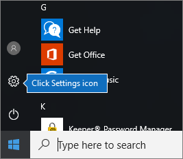

# Configurar dispositivos Windows para utilizadores Microsoft 365 Business PremiumSet up Windows devices for Microsoft 365 Business Premium users

## Pré-requisitos para a configuração de dispositivos Windows para utilizadores Microsoft 365 Business PremiumPrerequisites for setting up Windows devices for Microsoft 365 Business Premium users

Antes de configurar dispositivos Windows para utilizadores Do Microsoft 365 Business Premium, certifique-se de que todos os dispositivos Windows estão a executar o Windows 10 Pro, versão 1703 (Creators Update).Before you can set up Windows devices for Microsoft 365 Business Premium users, make sure all the Windows devices are running Windows 10 Pro, version 1703 (Creators Update). O Windows 10 Pro é um pré-requisito para a implementação do Windows 10 Business, que é um conjunto de serviços na nuvem e capacidades de gestão de dispositivos que complementam o Windows 10 Pro e permitem os controlos de gestão e segurança centralizados do Microsoft 365 Business Premium.Windows 10 Pro is a prerequisite for deploying Windows 10 Business, which is a set of cloud services and device management capabilities that complement Windows 10 Pro and enable the centralized management and security controls of Microsoft 365 Business Premium.
  
Se tiver dispositivos Windows a executar o Windows 7 Pro, Windows 8 Pro ou Windows 8.1 Pro, a subscrição do Microsoft 365 Business Premium dá-lhe direito a uma atualização do Windows 10.If you have Windows devices running Windows 7 Pro, Windows 8 Pro, or Windows 8.1 Pro, your Microsoft 365 Business Premium subscription entitles you to a Windows 10 upgrade.
  
Para obter mais informações sobre como atualizar dispositivos Windows para a Atualização para Criativos do Windows 10 Pro, siga os passos neste tópico: [Atualizar dispositivos Windows para a Atualização para Criativos do Windows Pro](upgrade-to-windows-pro-creators-update.md).For more information on how to upgrade Windows devices to Windows 10 Pro Creators Update, follow the steps in this topic: [Upgrade Windows devices to Windows Pro Creators Update](upgrade-to-windows-pro-creators-update.md).
  
Consulte [Verifique se o dispositivo está ligado à Azure AD](#verify-the-device-is-connected-to-azure-ad) para verificar se tem a atualização ou para se certificar de que a atualização funcionou.See [Verify the device is connected to Azure AD](#verify-the-device-is-connected-to-azure-ad) to verify you have the upgrade, or to make sure the upgrade worked.

Veja um pequeno vídeo sobre a ligação do Windows ao Microsoft 365.Watch a short video about connecting Windows to Microsoft 365.  

> [!VIDEO https://www.microsoft.com/videoplayer/embed/RE3yXh3] 

Caso tenha considerado este vídeo útil, veja a [série de formação completa para pequenas empresas e as novidades do Microsoft 365](https://support.microsoft.com/office/6ab4bbcd-79cf-4000-a0bd-d42ce4d12816).If you found this video helpful, check out the [complete training series for small businesses and those new to Microsoft 365](https://support.microsoft.com/office/6ab4bbcd-79cf-4000-a0bd-d42ce4d12816).
  
## Associar dispositivos Windows 10 ao Azure AD da sua organizaçãoJoin Windows 10 devices to your organization's Azure AD

Quando todos os dispositivos Windows da sua organização tiverem sido atualizados para o Windows 10 Pro Creators Update ou já estiverem a executar a Atualização de Criadores Pro Do Windows 10, pode juntar estes dispositivos ao Azure Ative Directory da sua organização.When all Windows devices in your organization have either been upgraded to Windows 10 Pro Creators Update or are already running Windows 10 Pro Creators Update, you can join these devices to your organization's Azure Active Directory. Assim que os dispositivos forem aderidos, serão automaticamente atualizados para o Windows 10 Business, que faz parte da subscrição do Microsoft 365 Business Premium.Once the devices are joined, they'll be automatically upgraded to Windows 10 Business, which is part of your Microsoft 365 Business Premium subscription.
  
### Para um dispositivo Windows 10 Pro novo ou recentemente atualizadoFor a brand new, or newly upgraded, Windows 10 Pro device

Para um novo dispositivo a executar a Atualização para Criativos do Windows 10 Pro ou para um dispositivo que foi atualizado para a Atualização para Criativos do Windows 10 Pro, mas cuja configuração do dispositivo Windows 10 não tenha sido efetuada, siga estes passos.For a brand new device running Windows 10 Pro Creators Update, or for a device that was upgraded to Windows 10 Pro Creators Update but has not gone through Windows 10 device setup, follow these steps.
  
1. Efetue a configuração do dispositivo Windows 10 até aceder à página **Como pretende configurar?**.Go through Windows 10 device setup until you get to the **How would you like to set up?** page. 
    
    
  
2. Aqui, escolha **Configurar para uma organização** e, em seguida, introduzir o seu nome de utilizador e senha para Microsoft 365 Business Premium.Here, choose **Set up for an organization** and then enter your username and password for Microsoft 365 Business Premium. 
    
3. Conclua a configuração do dispositivo Windows 10.Finish Windows 10 device setup.
    
   Quando terminar, o utilizador estará ligado ao Azure AD da sua organização. Consulte [Verificar se o dispositivo está ligado ao Azure AD](#verify-the-device-is-connected-to-azure-ad) para garantir que o dispositivo está ligado.Once you're done, the user will be connected to your organization's Azure AD. See [Verify the device is connected to Azure AD](#verify-the-device-is-connected-to-azure-ad) to make sure. 
  
### Para um dispositivo que já esteja configurado e a executar o Windows 10 ProFor a device already set up and running Windows 10 Pro

 **Ligar utilizadores ao Azure AD:****Connect users to Azure AD:**
  
1. No PC Windows do seu utilizador com o Windows 10 Pro, versão 1703 (Atualização para Criativos) (consulte os [pré-requisitos](pre-requisites-for-data-protection.md)), clique no logótipo do Windows e, em seguida, no ícone Definições.In your user's Windows PC, that is running Windows 10 Pro, version 1703 (Creators Update) (see [pre-requisites](pre-requisites-for-data-protection.md)), click the Windows logo, and then the Settings icon.
  
   
  
2. Nas **Definições**, aceda a **Contas**.In **Settings**, go to **Accounts**.
  
   
  
3. Na página **As suas informações**, clique em **Aceder a profiss./escolar** \> **Ligar**.On **Your info** page, click **Access work or school** \> **Connect**.
  
   
  
4. Na caixa de diálogo **Configurar uma conta escolar ou profissional**, em **Ações alternativas**, selecione **Adicionar este dispositivo ao Azure Active Directory**.On the **Set up a work or school account** dialog, under **Alternate actions**, choose **Join this device to Azure Active Directory**.
  
   
  
5. Na página **Vamos iniciar a sua sessão**, introduza a sua conta escolar ou profissional \> **Seguinte**.On the **Let's get you signed in** page, enter your work or school account \> **Next**.
  
   Na página **Introduzir palavra-passe**, introduza a sua palavra-passe \> **Iniciar sessão**.On the **Enter password** page, enter your password \> **Sign in**.
  
   
  
6. Na página da **organização certifique-se de que esta é** a sua página de organização, verifique se a informação está correta e escolha **'Juntar-se'.**On the **Make sure this is your organization** page, verify that the information is correct, and choose **Join**.
  
   No **You're all set!**On the **You're all set!** página, chosse **Done**.page, chosse **Done**.
  
   
  
Se tiver carregado ficheiros para o OneDrive para Empresas, sincronize-os novamente.If you uploaded files to OneDrive for Business, sync them back down. Se usou uma ferramenta de terceiros para migrar perfis e ficheiros, também os sincroniza para o novo perfil.If you used a third-party tool to migrate profile and files, also sync those to the new profile.
  
## Verificar se o dispositivo está ligado ao Azure ADVerify the device is connected to Azure AD

Para verificar o estado da sincronização, na página **de trabalho de acesso ou escola** em **Definições,** selecione a área **Ligada a** _ _ para expor \<organization name\> os botões **Informação** e **Desconexão**.To verify your sync status, on the **Access work or school** page in **Settings**, select the **Connected to** _ \<organization name\> _ area to expose the buttons **Info** and **Disconnect**. Escolha **Informação** para obter o seu estado de sincronização.Choose **Info** to get your synchronization status. 
  
Na página de estado do **Sync,** escolha **o Sync** para obter as mais recentes políticas de gestão de dispositivos móveis no PC.On the **Sync status** page, choose **Sync** to get the latest mobile device management policies onto the PC.
  
Para começar a utilizar a conta Microsoft 365 Business Premium, aceda ao **botão** Iniciar o Windows, clique com o botão correto da sua conta corrente e, em seguida, **a conta Switch**.To start using the Microsoft 365 Business Premium account, go to the Windows **Start** button, right-click your current account picture, and then **Switch account**. Inicie sessão com o endereço de e-mail e palavra-passe da sua organização.Sign in by using your organization email and password.
  

  
## Verifique se o PC está atualizado para o Windows 10 BusinessVerify the PC is upgraded to Windows 10 Business

Verifique se o seu Azure AD aderiu aos dispositivos windows 10 e está atualizado para o Windows 10 Business como parte da subscrição do Microsoft 365 Business Premium.Verify that your Azure AD joined Windows 10 devices are upgraded to Windows 10 Business as part of your Microsoft 365 Business Premium subscription.
  
1. Aceda a **Definições** \> **Sistema** \> **Acerca de**.Go to **Settings** \> **System** \> **About**.
    
2. Confirme que a **Edição** apresenta **Windows 10 Business**.Confirm that the **Edition** shows **Windows 10 Business**.
    
    
  
## Next stepsNext steps

Para configurar os seus dispositivos móveis, consulte [configurar dispositivos móveis para utilizadores Microsoft 365 Business Premium](set-up-mobile-devices.md), Para definir políticas de proteção de dispositivos ou de proteção de aplicações, consulte [Gerir o Microsoft 365 para o negócio](manage.md).To set up your mobile devices, see [Set up mobile devices for Microsoft 365 Business Premium users](set-up-mobile-devices.md), To set device protection or app protection policies, see [Manage Microsoft 365 for business](manage.md).
  
## Para mais informações sobre a configuração e utilização do Microsoft 365 Business PremiumFor more on setting up and using Microsoft 365 Business Premium

[Microsoft 365 para vídeos de formação de negóciosMicrosoft 365 for business training videos](https://support.microsoft.com/office/6ab4bbcd-79cf-4000-a0bd-d42ce4d12816)
