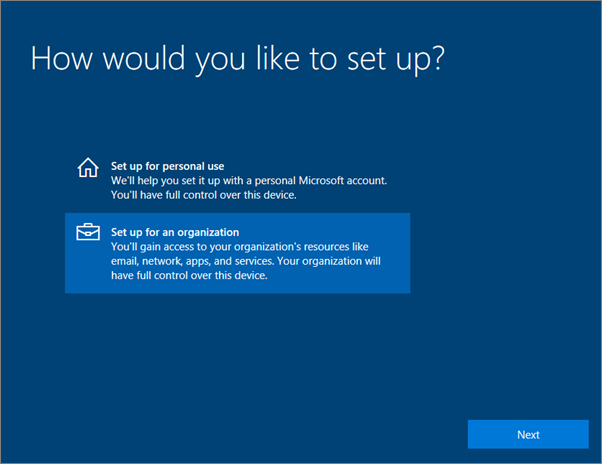

# Configurar dispositivos Windows para utilizadores Microsoft 365 Business Premium

## Pré-requisitos para a configuração de dispositivos Windows para utilizadores Microsoft 365 Business Premium

Antes de configurar dispositivos Windows para utilizadores Do Microsoft 365 Business Premium, certifique-se de que todos os dispositivos Windows estão a executar o Windows 10 Pro, versão 1703 (Creators Update). O Windows 10 Pro é um pré-requisito para a implementação do Windows 10 Business, que é um conjunto de serviços na nuvem e capacidades de gestão de dispositivos que complementam o Windows 10 Pro e permitem os controlos de gestão e segurança centralizados do Microsoft 365 Business Premium.
  
Se tiver dispositivos Windows a executar o Windows 7 Pro, Windows 8 Pro ou Windows 8.1 Pro, a subscrição do Microsoft 365 Business Premium dá-lhe direito a uma atualização do Windows 10.
  
Para obter mais informações sobre como atualizar dispositivos Windows para a Atualização para Criativos do Windows 10 Pro, siga os passos neste tópico: [Atualizar dispositivos Windows para a Atualização para Criativos do Windows Pro](upgrade-to-windows-pro-creators-update.md).
  
Consulte [Verifique se o dispositivo está ligado à Azure AD](#verify-the-device-is-connected-to-azure-ad) para verificar se tem a atualização ou para se certificar de que a atualização funcionou.

Veja um pequeno vídeo sobre a ligação do Windows ao Microsoft 365.  

> [!VIDEO https://www.microsoft.com/videoplayer/embed/RE3yXh3] 

Caso tenha considerado este vídeo útil, veja a [série de formação completa para pequenas empresas e as novidades do Microsoft 365](https://support.microsoft.com/office/6ab4bbcd-79cf-4000-a0bd-d42ce4d12816).
  
## Associar dispositivos Windows 10 ao Azure AD da sua organização

Quando todos os dispositivos Windows da sua organização tiverem sido atualizados para o Windows 10 Pro Creators Update ou já estiverem a executar a Atualização de Criadores Pro Do Windows 10, pode juntar estes dispositivos ao Azure Ative Directory da sua organização. Assim que os dispositivos forem aderidos, serão automaticamente atualizados para o Windows 10 Business, que faz parte da subscrição do Microsoft 365 Business Premium.
  
### Para um dispositivo Windows 10 Pro novo ou recentemente atualizado

Para um novo dispositivo a executar a Atualização para Criativos do Windows 10 Pro ou para um dispositivo que foi atualizado para a Atualização para Criativos do Windows 10 Pro, mas cuja configuração do dispositivo Windows 10 não tenha sido efetuada, siga estes passos.
  
1. Efetue a configuração do dispositivo Windows 10 até aceder à página **Como pretende configurar?**. 
    
    
  
2. Aqui, escolha **Configurar para uma organização** e, em seguida, introduzir o seu nome de utilizador e senha para Microsoft 365 Business Premium. 
    
3. Conclua a configuração do dispositivo Windows 10.
    
   Quando terminar, o utilizador estará ligado ao Azure AD da sua organização. Consulte [Verificar se o dispositivo está ligado ao Azure AD](#verify-the-device-is-connected-to-azure-ad) para garantir que o dispositivo está ligado. 
  
### Para um dispositivo que já esteja configurado e a executar o Windows 10 Pro

 **Ligar utilizadores ao Azure AD:**
  
1. No PC Windows do seu utilizador com o Windows 10 Pro, versão 1703 (Atualização para Criativos) (consulte os [pré-requisitos](pre-requisites-for-data-protection.md)), clique no logótipo do Windows e, em seguida, no ícone Definições.
  
   
  
2. Nas **Definições**, aceda a **Contas**.
  
   
  
3. Na página **As suas informações**, clique em **Aceder a profiss./escolar** \> **Ligar**.
  
   
  
4. Na caixa de diálogo **Configurar uma conta escolar ou profissional**, em **Ações alternativas**, selecione **Adicionar este dispositivo ao Azure Active Directory**.
  
   
  
5. Na página **Vamos iniciar a sua sessão**, introduza a sua conta escolar ou profissional \> **Seguinte**.
  
   Na página **Introduzir palavra-passe**, introduza a sua palavra-passe \> **Iniciar sessão**.
  
   
  
6. Na página da **organização certifique-se de que esta é** a sua página de organização, verifique se a informação está correta e escolha **'Juntar-se'.**
  
   No **You're all set!** página, chosse **Done**.
  
   
  
Se tiver carregado ficheiros para o OneDrive para Empresas, sincronize-os novamente. Se usou uma ferramenta de terceiros para migrar perfis e ficheiros, também os sincroniza para o novo perfil.
  
## Verificar se o dispositivo está ligado ao Azure AD

Para verificar o estado da sincronização, na página **de trabalho de acesso ou escola** em **Definições,** selecione a área **Ligada a** _ _ para expor \<organization name\> os botões **Informação** e **Desconexão**. Escolha **Informação** para obter o seu estado de sincronização. 
  
Na página de estado do **Sync,** escolha **o Sync** para obter as mais recentes políticas de gestão de dispositivos móveis no PC.
  
Para começar a utilizar a conta Microsoft 365 Business Premium, aceda ao **botão** Iniciar o Windows, clique com o botão correto da sua conta corrente e, em seguida, **a conta Switch**. Inicie sessão com o endereço de e-mail e palavra-passe da sua organização.
  

  
## Verifique se o PC está atualizado para o Windows 10 Business

Verifique se o seu Azure AD aderiu aos dispositivos windows 10 e está atualizado para o Windows 10 Business como parte da subscrição do Microsoft 365 Business Premium.
  
1. Aceda a **Definições** \> **Sistema** \> **Acerca de**.
    
2. Confirme que a **Edição** apresenta **Windows 10 Business**.
    
    
  
## Next steps

Para configurar os seus dispositivos móveis, consulte [configurar dispositivos móveis para utilizadores Microsoft 365 Business Premium](set-up-mobile-devices.md), Para definir políticas de proteção de dispositivos ou de proteção de aplicações, consulte [Gerir o Microsoft 365 para o negócio](manage.md).
  
## Para mais informações sobre a configuração e utilização do Microsoft 365 Business Premium

[Microsoft 365 para vídeos de formação de negócios](https://support.microsoft.com/office/6ab4bbcd-79cf-4000-a0bd-d42ce4d12816)
