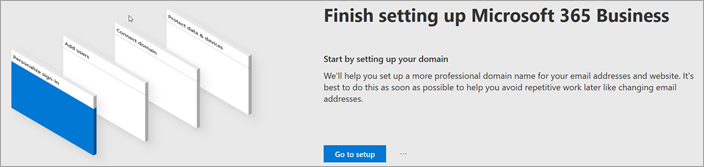
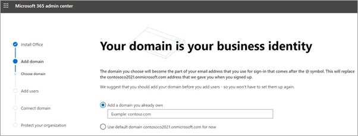
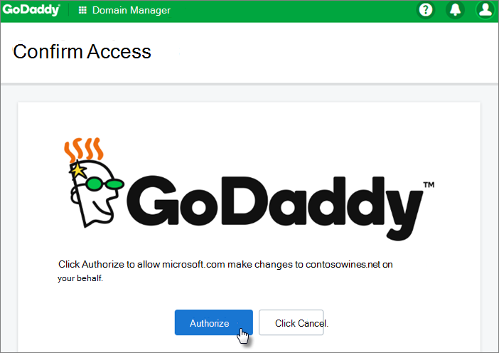
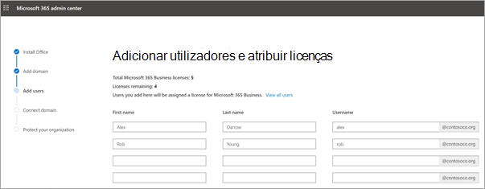
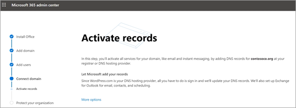
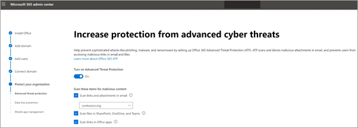
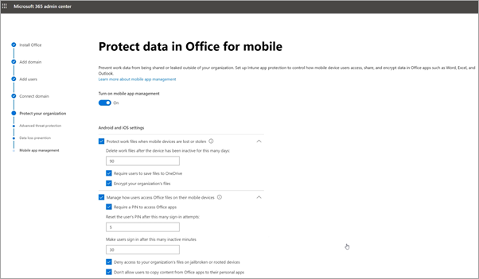

# Configurar o Microsoft 365 Business Premium no assistente de configuraçãoSet up Microsoft 365 Business Premium in the setup wizard

Veja este vídeo para uma visão geral da configuração do Microsoft 365 Business Premium.Watch this video for an overview of Microsoft 365 Business Premium setup.  

> [!VIDEO https://www.microsoft.com/videoplayer/embed/RE4jZwg] 

## Adicione o seu domínio, utilizadores e configurar políticasAdd your domain, users, and set up policies

Ao comprar o Microsoft 365 Business Premium, tem a opção de utilizar um domínio que possui ou de comprar um durante a [inscrição](sign-up.md).When you purchase Microsoft 365 Business Premium, you have the option of using a domain you own, or buying one during the [sign-up](sign-up.md).

- Se adquiriu um novo domínio quando se inscreveu, o seu domínio está todo configurado e pode mudar-se para [Adicionar utilizadores e atribuir licenças](#add-users-and-assign-licenses).If you purchased a new domain when you signed up, your domain is all set up and you can move to [Add users and assign licenses](#add-users-and-assign-licenses).

### Adicione o seu domínio para personalizar o s-inAdd your domain to personalize sign-in

1. Inscreva-se no [Microsoft 365 admin center](https://admin.microsoft.com) usando as suas credenciais de administração global.Sign in to [Microsoft 365 admin center](https://admin.microsoft.com) by using your global admin credentials. 

2. Escolha **Ir para a configuração** para iniciar o assistente.Choose **Go to setup** to start the wizard.

    

3. Na página **de aplicações do Office,** pode instalar opcionalmente as aplicações no seu próprio computador.On the **Install your Office apps** page, you can optionally install the apps on your own computer.
    
4. No passo de **domínio Adicionar,** insira o nome de domínio que pretende utilizar (como contoso.com).In the **Add domain** step, enter the domain name you want to use (like contoso.com).

    > [!IMPORTANT]
    > Se adquiriu um domínio durante a inscrição, não verá **Adicionar um** passo de domínio aqui.If you purchased a domain during the sign-up, you will not see **Add a domain** step here. Vá a [Adicionar os utilizadores](#add-users-and-assign-licenses) em vez disso.Go to [Add users](#add-users-and-assign-licenses) instead.

    

    
4. Siga os passos no assistente para [criar registos DNS em qualquer fornecedor de hospedagem DNS para o Microsoft 365](/office365/admin/get-help-with-domains/create-dns-records-at-any-dns-hosting-provider) que verifique que é dono do domínio.Follow the steps in the wizard to [Create DNS records at any DNS hosting provider for Microsoft 365](/office365/admin/get-help-with-domains/create-dns-records-at-any-dns-hosting-provider) that verifies you own the domain. Se conhecer o seu anfitrião de domínio, consulte também as [instruções específicas](/office365/admin/get-help-with-domains/set-up-your-domain-host-specific-instructions)do anfitrião .If you know your domain host, see also the [host specific instructions](/office365/admin/get-help-with-domains/set-up-your-domain-host-specific-instructions).

    Se o seu fornecedor de hospedagem for o GoDaddy ou outro anfitrião ativado com [ligação de domínio,](/office365/admin/get-help-with-domains/domain-connect)o processo é fácil e será automaticamente solicitado que faça sessão e deixe a Microsoft autenticar em seu nome.If your hosting provider is GoDaddy or another host enabled with [domain connect](/office365/admin/get-help-with-domains/domain-connect), the process is easy and you'll be automatically asked to sign in and let Microsoft authenticate on your behalf.

    

### Adicionar utilizadores e atribuir licençasAdd users and assign licenses

Pode adicionar utilizadores no assistente, mas também pode [adicionar utilizadores mais tarde](../admin/add-users/add-users.md) no centro de administração.You can add users in the wizard, but you can also [add users later](../admin/add-users/add-users.md) in the admin center. Além disso, se tiver um controlador de domínio local, pode adicionar utilizadores ao [Azure AD Connect](/azure/active-directory/hybrid/how-to-connect-install-express).Additionally, if you have a local domain controller, you can add users with [Azure AD Connect](/azure/active-directory/hybrid/how-to-connect-install-express).

#### Adicionar utilizadores no assistenteAdd users in the wizard

Qualquer utilizadores que adicione no assistente recebem automaticamente uma licença Microsoft 365 Business Premium.Any users you add in the wizard get automatically assigned a Microsoft 365 Business Premium license.

1. Se a sua subscrição Microsoft 365 Business Premium tiver utilizadores existentes (por exemplo, se usou o Azure AD Connect), terá agora a opção de lhes atribuir licenças.If your Microsoft 365 Business Premium subscription has existing users (for example, if you used Azure AD Connect), you get an option to assign licenses to them now. Continue o processo e adicione licenças aos utilizadores.Go ahead and add licenses to them as well.

2. Depois de adicionar os utilizadores, também terá a opção de partilhar credenciais com os novos utilizadores que adicionou.After you've added the users, you'll also get an option to share credentials with the new users you added. Pode optar por imprimir, transferir ou enviá-las por e-mail.You can choose to print them out, email them, or download them.

### Ligar o seu domínioConnect your domain

> [!NOTE]
> Se optar por utilizar o domínio .onmicrosoft ou utilizar o Azure AD Connect para configurar os utilizadores, não verá este passo.If you chose to use the .onmicrosoft domain, or used Azure AD Connect to set up users, you will not see this step.
  
Para configurar serviços, tem de atualizar alguns registos no seu anfitrião de DNS ou entidade de registo de domínios.To set up services, you have to update some records at your DNS host or domain registrar.
  
1. Normalmente, o assistente de configuração deteta a sua entidade de registo e fornece-lhe uma ligação para instruções passo a passo de forma a atualizar os seus registos NS no site da entidade de registo de domínios.The setup wizard typically detects your registrar and gives you a link to step-by-step instructions for updating your NS records at the registrar website. Caso não o faça, [altere os serviçais para configurar o Microsoft 365 com qualquer registo de domínio](../admin/get-help-with-domains/change-nameservers-at-any-domain-registrar.md).If it doesn't, [Change nameservers to set up Microsoft 365 with any domain registrar](../admin/get-help-with-domains/change-nameservers-at-any-domain-registrar.md). 

    - Se tiver registos DNS existentes, por exemplo, um web site existente, mas o seu anfitrião DNS está ativado para [a ligação de domínios](/office365/admin/get-help-with-domains/domain-connect), escolha **adicionar registos para mim**.If you have existing DNS records, for example an existing web site, but your DNS host is enabled for [domain connect](/office365/admin/get-help-with-domains/domain-connect), choose **Add records for me**. Na página **de serviços online,** aceite todas as predefinições e escolha **Seguinte**, e escolha **'Autorizo'** na página do seu anfitrião DNS.On the **Choose your online services** page, accept all the defaults, and choose **Next**, and choose **Authorize** on your DNS host's page.
    - Se tiver registos DNS existentes com outros anfitriões DNS (não habilitados para a ligação de domínios), irá querer gerir os seus próprios registos DNS para garantir que os serviços existentes se mantenham ligados.If you have existing DNS records with other DNS hosts (not enabled for domain connect), you'll want to manage your own DNS records to make sure the existing services stay connected. Consulte [o básico do domínio](/office365/admin/get-help-with-domains/dns-basics) para obter mais informações.See [domain basics](/office365/admin/get-help-with-domains/dns-basics) for more info.

        

2. Siga os passos no assistente e o e-mail e outros serviços serão configurado para si.Follow the steps in the wizard and email and other services will be set up for you.

### Proteja a sua organizaçãoProtect your organization 

As políticas configuradas no assistente são aplicadas automaticamente a um [grupo de Segurança](/office365/admin/create-groups/compare-groups#security-groups) chamado Todos os *Utilizadores*.The policies you set up in the wizard are applied automatically to a [Security group](/office365/admin/create-groups/compare-groups#security-groups) called *All Users*. Também pode criar grupos adicionais para atribuir políticas no centro de administração.You can also create additional groups to assign policies to in the admin center.

1. Sobre a **proteção do Aumento contra ameaças cibernéticas avançadas,** recomenda-se que aceite os padrãos para permitir que os ficheiros e links [de proteção de ameaças avançadas do Office 365](../security/office-365-security/defender-for-office-365.md) e links nas aplicações do Office.On the **Increase protection from advanced cyber threats**, it is recommended that you accept the defaults to let [Office 365 Advance Threat Protection](../security/office-365-security/defender-for-office-365.md) scan files and links in Office apps.

    

2. Na página **Prevent leaks of sensitive data** page, aceite os predefinidos para ligar o Office 365 Data Loss Prevention (DLP) para rastrear dados sensíveis em aplicações do Office e impedir a partilha acidental destes fora da sua organização.On the **Prevent leaks of sensitive data** page, accept the defaults to turn on Office 365 Data Loss Prevention (DLP) to track sensitive data in Office apps and prevent the accidental sharing of these outside your organization.

3. Nos **dados** protect in Office para página móvel, deixe a gestão de aplicações móveis, expanda as definições e reveja-as e, em seguida, **selecione Create mobile app management policy**.On the **Protect data in Office for mobile** page, leave mobile app management on, expand the settings and review them, and then select **Create mobile app management policy**.

    

## Secure Windows 10 PCsSecure Windows 10 PCs

No navegador esquerdo, selecione **Configuração** e, em seguida, **em 'Iniciar s-in e segurança',** escolha **Fixe os computadores Windows 10**.On the left nav, select **Setup** and then, under **Sign-in and security**, choose **Secure your Windows 10 computers**. Escolha **a Vista** para começar.Choose **View** to get started. Consulte [os computadores Windows 10 para](secure-win-10-pcs.md) obter instruções completas.See [secure your Windows 10 computers](secure-win-10-pcs.md) for complete instructions.

## Implementar aplicações de clientes 365Deploy Office 365 client apps

Se optar por instalar automaticamente aplicações do Office durante a configuração, as aplicações serão instaladas nos dispositivos Windows 10 assim que os utilizadores tiverem assinado no Azure AD a partir dos seus dispositivos Windows, utilizando as suas credenciais de trabalho.If you chose to automatically install Office apps during setup, the apps will install on the Windows 10 devices once the users have signed in to Azure AD from their Windows devices, using their work credentials.

Para instalar o Office em dispositivos móveis iOS ou Android, consulte [Configurar dispositivos móveis para utilizadores Do Microsoft 365 Business Premium](set-up-mobile-devices.md).To install Office on mobile iOS or Android devices, see [Set up mobile devices for Microsoft 365 Business Premium users](set-up-mobile-devices.md).

Também pode instalar o Office individualmente.You can also install Office individually. Consulte [o Escritório de Instalação num PC ou Mac](https://support.microsoft.com/office/4414eaaf-0478-48be-9c42-23adc4716658) para obter instruções.See [install Office on a PC or Mac](https://support.microsoft.com/office/4414eaaf-0478-48be-9c42-23adc4716658) for instructions.

## Consulte tambémSee also

[Microsoft 365 para vídeos de formação de negóciosMicrosoft 365 for business training videos](https://support.microsoft.com/office/6ab4bbcd-79cf-4000-a0bd-d42ce4d12816)
