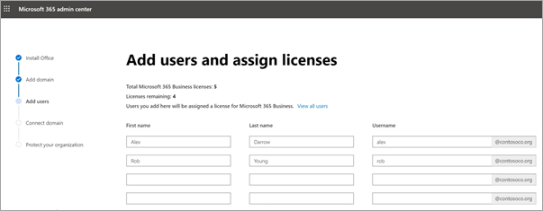

# Configurar o Microsoft 365 Business no assistente de configuração

Veja este vídeo para uma visão geral da configuração do Microsoft 365 Business.  

> [!VIDEO https://www.microsoft.com/videoplayer/embed/RE1FYSM] 

Caso tenha considerado este vídeo útil, consulte a [série de formação completa para pequenas empresas e as novidades do Microsoft 365](https://support.office.com/article/6ab4bbcd-79cf-4000-a0bd-d42ce4d12816).

## Adicione o seu domínio, utilizadores e estabeleça políticas

Ao comprar o Microsoft 365 Business, tem a opção de utilizar um domínio que possui, ou de comprar um durante a [inscrição](sign-up.md).

- Se adquiriu um novo domínio quando se inscreveu, o seu domínio está todo configurado e pode mover-se para [Adicionar utilizadores e atribuir licenças](#add-users-and-assign-licenses).

### Adicione o seu domínio para personalizar o sign-in

1. Inscreva-se no [Centro de Administração da Microsoft 365](https://admin.microsoft.com) utilizando as suas credenciais de administração globais. 

2. Escolha **ir configurar** para iniciar o assistente.

    

3. Na página de Instalação das **aplicações do Seu Office,** pode instalar opcionalmente as aplicações no seu próprio computador.
    
4. No passo de **domínio Adicionar,** introduza o nome de domínio que pretende utilizar (como contoso.com).

    > [!IMPORTANT]
    > Se adquiriu um domínio durante a inscrição, não verá **adicionar um** passo de domínio aqui. Em vez disso, vá adicionar [utilizadores.](#add-users-and-assign-licenses)

    

    
4. Siga os passos no assistente para [criar registos DNS em qualquer fornecedor de hospedagem DNS para o Office 365](https://docs.microsoft.com/office365/admin/get-help-with-domains/create-dns-records-at-any-dns-hosting-provider) que verifique que é o dono do domínio. Se conhece o seu anfitrião de domínio, consulte também as [instruções específicas](https://docs.microsoft.com/office365/admin/get-help-with-domains/set-up-your-domain-host-specific-instructions)do anfitrião .

    Se o seu fornecedor de hospedagem for goDaddy ou outro anfitrião habilitado com ligação de [domínio,](https://docs.microsoft.com/office365/admin/get-help-with-domains/domain-connect)o processo é fácil e será automaticamente solicitado que faça o início e deixe a Microsoft autenticar em seu nome.

    

### Adicionar utilizadores e atribuir licenças

Pode adicionar utilizadores no assistente, mas também pode [adicionar utilizadores mais tarde](add-users-m365b.md) no centro de administração. Além disso, se tiver um controlador de domínio local, pode adicionar utilizadores com [Azure AD Connect](https://docs.microsoft.com/azure/active-directory/hybrid/how-to-connect-install-express).

#### Adicione utilizadores no assistente

Todos os utilizadores que adicione no assistente recebem automaticamente uma licença de Negócios Microsoft 365.

1. Se a sua subscrição microsoft 365 Business tiver utilizadores existentes (por exemplo, se utilizou o Azure AD Connect), tem agora a opção de atribuir licenças aos mesmos. Continue o processo e adicione licenças aos utilizadores.

2. Depois de adicionar os utilizadores, também terá a opção de partilhar credenciais com os novos utilizadores que adicionou. Pode optar por imprimir, transferir ou enviá-las por e-mail.

### Ligar o seu domínio

> [!NOTE]
> Se optou por utilizar o domínio .onmicrosoft, ou usou o Azure AD Connect para configurar os utilizadores, não verá este passo.
  
Para configurar serviços, tem de atualizar alguns registos no seu anfitrião de DNS ou entidade de registo de domínios.
  
1. Normalmente, o assistente de configuração deteta a sua entidade de registo e fornece-lhe uma ligação para instruções passo a passo de forma a atualizar os seus registos NS no site da entidade de registo de domínios. Se não o fizer, altere os servidores de [nomes para configurar o Office 365 com qualquer registo](https://support.office.com/article/a8b487a9-2a45-4581-9dc4-5d28a47010a2)de domínio . 

    - Se tiver registos DNS existentes, por exemplo, um web site existente, mas o seu anfitrião DNS está habilitado para [a ligação](https://docs.microsoft.com/office365/admin/get-help-with-domains/domain-connect)de domínio, escolha **Adicionar registos para mim**. Na página Escolha a sua página de **serviços online,** aceite todos os predefinições e escolha **Next**, e escolha **Autorizar** na página do seu anfitrião DNS.
    - Se tiver registos DNS existentes com outros anfitriões DNS (não ativados para a ligação de domínio), irá querer gerir os seus próprios registos DNS para garantir que os serviços existentes se mantenham ligados. Consulte [o básico de domínio](https://docs.microsoft.com/office365/admin/get-help-with-domains/dns-basics) para obter mais informações.

        

2. Siga os passos no assistente e o e-mail e outros serviços serão configurados para si.

### Proteja a sua organização 

As políticas que configura no assistente são aplicadas automaticamente a um grupo de [Segurança](https://docs.microsoft.com/office365/admin/create-groups/compare-groups#security-groups) chamado *All Users*. Também pode criar grupos adicionais para atribuir políticas no centro de administração.

1. Sobre a **proteção do Aumento contra ameaças cibernéticas avançadas,** recomenda-se que aceite os incumprimentos para permitir que o [Office 365 Advance Threat Protection](https://docs.microsoft.com/microsoft-365/security/office-365-security/office-365-atp) scan files and links em aplicações do Office.

    

2. Na página **Prevent leaks de dados sensíveis,** aceite os defeitos para ligar o Office 365 Data Loss Prevention (DLP) para rastrear dados sensíveis em aplicações do Office e impedir a partilha acidental destes fora da sua organização.

3. Nos **dados Protect in Office para** página móvel, deixe a gestão de aplicações móveis, expanda as definições e reveja-as e, em seguida, selecione Criar a política de gestão de **aplicações móveis.**

    

## Computadores Seguros windows 10

No navegante esquerdo, **selecione Configuração** e, em seguida, em **sing-in e segurança,** escolha **Proteger os computadores Do Windows 10**. Escolha **a Vista** para começar. Consulte [a segurança dos computadores Windows 10](secure-win-10-pcs.md) para obter instruções completas.

## Implementação de aplicações de clientes do Office 365

Se optar por instalar automaticamente as aplicações do Office durante a configuração, as aplicações instalar-se-ão nos dispositivos Do Windows 10 assim que os utilizadores tiverem assinado o Azure AD a partir dos seus dispositivos Windows, utilizando as suas credenciais de trabalho.

Para instalar o Office em dispositivos móveis iOS ou Android, consulte [A configuração de dispositivos móveis para utilizadores do Microsoft 365 Business](set-up-mobile-devices.md).

Também pode instalar o Office individualmente. Consulte a [instalação do Office num PC ou Mac](https://support.office.com/article/4414eaaf-0478-48be-9c42-23adc4716658) para obter instruções.

## Consulte também

[Vídeos de formação do Microsoft 365 Business](https://support.office.com/article/6ab4bbcd-79cf-4000-a0bd-d42ce4d12816)
