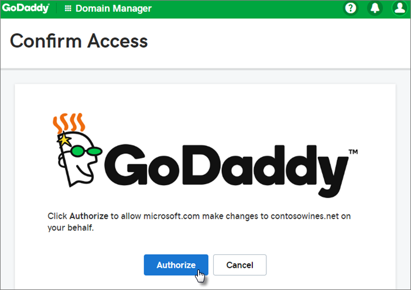

# Configurar Microsoft 365 Empresas Premium no assistente de configuraçãoSet up Microsoft 365 Business Premium in the setup wizard

Veja este vídeo para ver uma visão geral Microsoft 365 Empresas Premium configuração.Watch this video for an overview of Microsoft 365 Business Premium setup.  

> [!VIDEO https://www.microsoft.com/videoplayer/embed/RE4jZwg] 

## Adicionar o seu domínio, utilizadores e configurar políticasAdd your domain, users, and set up policies

Quando compra um Microsoft 365 Empresas Premium, tem a opção de utilizar um domínio que possui ou de comprar um durante a [registo](sign-up.md).When you purchase Microsoft 365 Business Premium, you have the option of using a domain you own, or buying one during the [sign-up](sign-up.md).

- Se comprou um novo domínio quando se inscreveu, o seu domínio está configurado e pode aceder a Adicionar utilizadores e atribuir [licenças.](#add-users-and-assign-licenses)If you purchased a new domain when you signed up, your domain is all set up and you can move to [Add users and assign licenses](#add-users-and-assign-licenses).

### Adicionar o seu domínio para personalizar o seu registoAdd your domain to personalize sign-in

1. Inscreva-se [no Microsoft 365 de administração](https://admin.microsoft.com) com as suas credenciais de administrador global.Sign in to [Microsoft 365 admin center](https://admin.microsoft.com) by using your global admin credentials. 

2. **Selecionar Ir para a configuração** para iniciar o assistente.Choose **Go to setup** to start the wizard.

    

3. Na página **Instalar as Office aplicações,** pode instalar opcionalmente as aplicações no seu computador.On the **Install your Office apps** page, you can optionally install the apps on your own computer.
    
4. No passo **Adicionar domínio,** introduza o nome de domínio que pretende utilizar (como contoso.com).In the **Add domain** step, enter the domain name you want to use (like contoso.com).

    > [!IMPORTANT]
    > Se comprou um domínio durante a inscrever-se, não verá **Adicionar um passo de** domínio aqui.If you purchased a domain during the sign-up, you will not see **Add a domain** step here. Em alternativa, [vá para Adicionar](#add-users-and-assign-licenses) utilizadores.Go to [Add users](#add-users-and-assign-licenses) instead.

    

    
4. Siga os passos no assistente para Criar registos DNS em qualquer fornecedor de anfitriões [DNS Microsoft 365](/office365/admin/get-help-with-domains/create-dns-records-at-any-dns-hosting-provider) que verifique que é o propriedade do domínio.Follow the steps in the wizard to [Create DNS records at any DNS hosting provider for Microsoft 365](/office365/admin/get-help-with-domains/create-dns-records-at-any-dns-hosting-provider) that verifies you own the domain. Se conhecer o seu anfitrião de domínio, consulte também as instruções [específicas do anfitrião.](/office365/admin/get-help-with-domains/set-up-your-domain-host-specific-instructions)If you know your domain host, see also the [host specific instructions](/office365/admin/get-help-with-domains/set-up-your-domain-host-specific-instructions).

    Se o seu fornecedor de domínios for a GoDaddy ou outro anfitrião ativado com ligação de [domínio,](/office365/admin/get-help-with-domains/domain-connect)o processo é fácil e ser-lhe-á automaticamente pedido para o fazer e permitir que a Microsoft se autentique em seu nome.If your hosting provider is GoDaddy or another host enabled with [domain connect](/office365/admin/get-help-with-domains/domain-connect), the process is easy and you'll be automatically asked to sign in and let Microsoft authenticate on your behalf.

    

### Adicionar utilizadores e atribuir licençasAdd users and assign licenses

Pode adicionar utilizadores no assistente, mas também pode adicionar [utilizadores mais tarde](../admin/add-users/add-users.md) no centro de administração.You can add users in the wizard, but you can also [add users later](../admin/add-users/add-users.md) in the admin center. Além disso, se tiver um controlador de domínio local, pode adicionar utilizadores com o [Azure AD Ligação](/azure/active-directory/hybrid/how-to-connect-install-express).Additionally, if you have a local domain controller, you can add users with [Azure AD Connect](/azure/active-directory/hybrid/how-to-connect-install-express).

#### Adicionar utilizadores no assistenteAdd users in the wizard

Todos os utilizadores que adicionar no assistente receberão automaticamente uma Microsoft 365 Empresas Premium de licenciamento.Any users you add in the wizard get automatically assigned a Microsoft 365 Business Premium license.

1. Se a sua subscrição do Microsoft 365 Empresas Premium tiver utilizadores existentes (por exemplo, se tiver utilizado o Azure AD Ligação), terá uma opção para atribuir licenças aos utilizadores agora.If your Microsoft 365 Business Premium subscription has existing users (for example, if you used Azure AD Connect), you get an option to assign licenses to them now. Continue o processo e adicione licenças aos utilizadores.Go ahead and add licenses to them as well.

2. Depois de adicionar os utilizadores, também receberá uma opção para partilhar as credenciais com os novos utilizadores que adicionou.After you've added the users, you'll also get an option to share credentials with the new users you added. Pode optar por imprimir, transferir ou enviá-las por e-mail.You can choose to print them out, email them, or download them.

### Ligar o seu domínioConnect your domain

> [!NOTE]
> Se optou por utilizar o domínio .onmicrosoft ou tiver utilizado o Azure AD Ligação para configurar utilizadores, não verá este passo.If you chose to use the .onmicrosoft domain, or used Azure AD Connect to set up users, you will not see this step.
  
Para configurar serviços, tem de atualizar alguns registos no seu anfitrião de DNS ou entidade de registo de domínios.To set up services, you have to update some records at your DNS host or domain registrar.
  
1. Normalmente, o assistente de configuração deteta a sua entidade de registo e fornece-lhe uma ligação para instruções passo a passo de forma a atualizar os seus registos NS no site da entidade de registo de domínios.The setup wizard typically detects your registrar and gives you a link to step-by-step instructions for updating your NS records at the registrar website. Se isto não acontecer, altere os servidores de nomes para [configurar o Microsoft 365 de domínios.](../admin/get-help-with-domains/change-nameservers-at-any-domain-registrar.md)If it doesn't, [Change nameservers to set up Microsoft 365 with any domain registrar](../admin/get-help-with-domains/change-nameservers-at-any-domain-registrar.md). 

    - Se tiver registos DNS existentes, por exemplo um site existente, mas o seu anfitrião DNS estiver ativado para ligar o [domínio,](/office365/admin/get-help-with-domains/domain-connect)selecionar Adicionar **registos por mim.**If you have existing DNS records, for example an existing web site, but your DNS host is enabled for [domain connect](/office365/admin/get-help-with-domains/domain-connect), choose **Add records for me**. Na página **Escolher os seus serviços online,** aceite todas as  predefinições e selecionar Seguinte e selecionar Autorizar na página do seu anfitrião de DNS.On the **Choose your online services** page, accept all the defaults, and choose **Next**, and choose **Authorize** on your DNS host's page.
    - Se tiver registos DNS existentes com outros anfitriões de DNS (não ativado para ligação de domínio), é reflegado para gerir os seus próprios registos DNS para se certificar de que os serviços existentes permanecem ligados.If you have existing DNS records with other DNS hosts (not enabled for domain connect), you'll want to manage your own DNS records to make sure the existing services stay connected. Consulte [as noções básicas de](/office365/admin/get-help-with-domains/dns-basics) domínios para mais informações.See [domain basics](/office365/admin/get-help-with-domains/dns-basics) for more info.

        

2. Siga os passos no assistente e o e-mail e outros serviços serão configurados para si.Follow the steps in the wizard and email and other services will be set up for you.

### Proteger a sua organizaçãoProtect your organization 

As políticas que configurar no assistente são aplicadas automaticamente a um Grupo [de segurança denominado](/office365/admin/create-groups/compare-groups#security-groups) *Todos os Utilizadores.*The policies you set up in the wizard are applied automatically to a [Security group](/office365/admin/create-groups/compare-groups#security-groups) called *All Users*. Também pode criar grupos adicionais para atribuir políticas no centro de administração.You can also create additional groups to assign policies to in the admin center.

1. Em Aumentar a proteção **contra ciberameaces avançadas**,  recomendamos que aceite as predefinições para permitir que Office 365 a Proteção Avançada contra Ameaças analisa ficheiros e ligações em Office aplicações.On the **Increase protection from advanced cyber threats**, it is recommended that you accept the defaults to let [Office 365 Advance Threat Protection](../security/office-365-security/defender-for-office-365.md) scan files and links in Office apps.

    

2. Na página Impedir **fugas** de dados confidenciais, aceite as predefinições para ativo o Office 365 Prevenção de Perda de Dados (DLP) para controlar dados confidenciais em aplicações do Office e impedir a partilha acidental destes dados fora da sua organização.On the **Prevent leaks of sensitive data** page, accept the defaults to turn on Office 365 Data Loss Prevention (DLP) to track sensitive data in Office apps and prevent the accidental sharing of these outside your organization.

3. Na página Proteger dados **no Office** para dispositivos móveis, deixe a gestão de aplicações móveis ativada, expanda as definições e reveja-as e, em seguida, selecione Criar política de gestão de aplicações **móveis**.On the **Protect data in Office for mobile** page, leave mobile app management on, expand the settings and review them, and then select **Create mobile app management policy**.

    

## Proteger Windows 10 PCsSecure Windows 10 PCs

No navegador esquerdo,  selecione Configurar e, em seguida, em **Sign-in and security**, selecione Secure your **Windows 10 .**On the left nav, select **Setup** and then, under **Sign-in and security**, choose **Secure your Windows 10 computers**. **Selecionar** Ver para começar.Choose **View** to get started. Consulte [Proteger os seus Windows 10 para obter](secure-win-10-pcs.md) instruções completas.See [secure your Windows 10 computers](secure-win-10-pcs.md) for complete instructions.

## Implementar aplicações Office 365 clienteDeploy Office 365 client apps

Se optou por instalar automaticamente aplicações do Office durante a configuração, as aplicações serão instaladas nos dispositivos Windows 10 assim que os utilizadores tenham feito a loteamento no Azure AD a partir dos respetivos dispositivos Windows, com as respetivos credenciais de trabalho.If you chose to automatically install Office apps during setup, the apps will install on the Windows 10 devices once the users have signed in to Azure AD from their Windows devices, using their work credentials.

Para instalar o Office dispositivos móveis iOS ou Android, consulte Configurar dispositivos [móveis para Microsoft 365 Empresas Premium utilizadores.](set-up-mobile-devices.md)To install Office on mobile iOS or Android devices, see [Set up mobile devices for Microsoft 365 Business Premium users](set-up-mobile-devices.md).

Também pode instalar o Office individualmente.You can also install Office individually. Consulte [Instalar Office num PC ou Mac para](https://support.microsoft.com/office/4414eaaf-0478-48be-9c42-23adc4716658) obter instruções.See [install Office on a PC or Mac](https://support.microsoft.com/office/4414eaaf-0478-48be-9c42-23adc4716658) for instructions.

## Consulte tambémSee also

[Microsoft 365 vídeos de formação para empresasMicrosoft 365 for business training videos](../business-video/index.yml)
