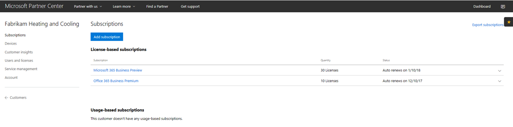
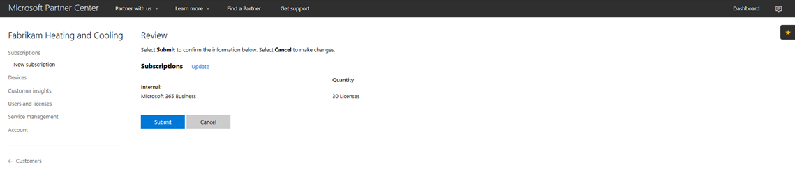
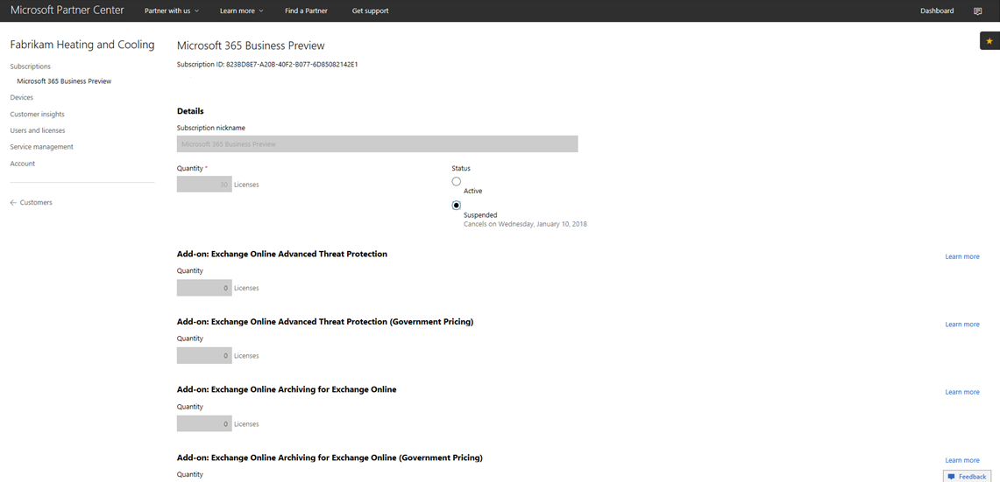
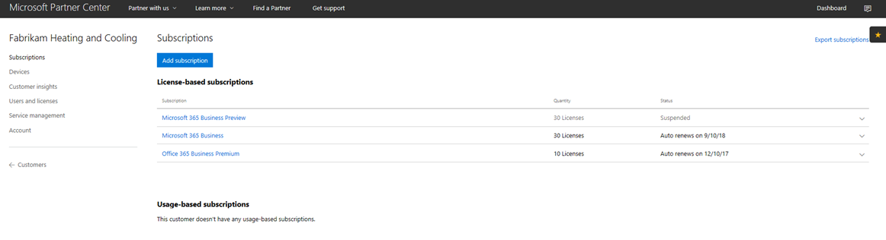
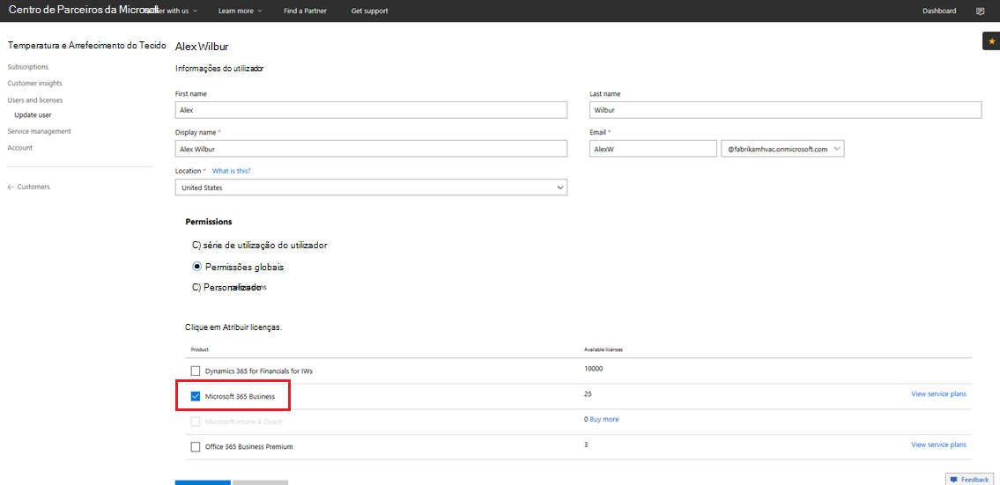

# Transição de uma subscrição do Microsoft 365 Empresas CSPTransition a Microsoft 365 Business CSP subscription

Se tiver uma subscrição do Microsoft 365 Business Preview CSP, siga este guia para saber como pode fazer a transição da sua subscrição de pré-visualização existente para a Microsoft 365 Empresas (disponibilidade geral).If you have a Microsoft 365 Business Preview CSP subscription, follow this guide to find out how you can transition your existing preview subscription to Microsoft 365 Business GA (general availability).

**Como transição de uma subscrição de pré-visualização para AG****How to transition a preview subscription to GA**

1. Inscreva-se <a href="https://partnercenter.microsoft.com" target="_blank">no Centro de Parceiros.</a>Sign in to <a href="https://partnercenter.microsoft.com" target="_blank">Partner Center</a>.
2. No dashboard, selecione **Clientes e,** em seguida, locale e selecione o nome da empresa.From the dashboard, select **Customers**, and then find and select the company name.

    As subscrições para a empresa serão listadas.The subscriptions for the company will be listed.

    
    
3. Na página Subscrições **da empresa,** **selecione Adicionar subscrição.**On the company's **Subscriptions** page, select **Add subscription**.
4. Na página **Nova subscrição, selecione** Pequenas **empresas e,** em seguida, **selecione Microsoft 365 Empresas** na lista.On the **New subscription** page, select **Small business** and then select **Microsoft 365 Business** from the list.
5. Adicione o número de licenças e, em seguida, **selecione Seguinte: Rever** para rever a subscrição e, em seguida, selecione **Submeter**.Add the number of licenses and then select **Next: Review** to review the subscription and then select **Submit**.

    

    As **subscrições baseadas em Licenças** serão Microsoft 365 **Para Empresas e Microsoft 365** **Empresas.**The **License-based subscriptions** will show **Microsoft 365 Business Preview** and **Microsoft 365 Business**. Irá suspender a subscrição de Pré-visualização a seguir.You'll suspend the Preview subscription next.

6. **Selecione Microsoft 365 Pré-visualização Empresarial**.Select **Microsoft 365 Business Preview**.
7. Na página **Microsoft 365 Business Preview,** selecione **Suspenso** para suspender a subscrição de Pré-visualização.On the **Microsoft 365 Business Preview** page, select **Suspended** to suspend the Preview subscription.

    

8. **Selecione Submeter** para confirmar.Select **Submit** to confirm.

    Na página **Subscrições, confirme** que o estado da **Pré-visualização Microsoft 365 Empresas** é **Suspenso.**On the **Subscriptions** page, confirm that the **Microsoft 365 Business Preview** status shows **Suspended**.

    

9. Opcionalmente, também pode validar o contrato de licença.Optionally, you can also validate the license agreement. Para tal, siga estes passos:To do this, follow these steps:
    1. **Selecione Utilizadores e licenças** na **página Subscrições da** empresa.Select **Users and licenses** from the company's **Subscriptions** page.
    2. Na página **Utilizadores e licenças,** selecione um utilizador.On the **Users and licenses** page, select a user.
    3. Na página do utilizador, verifique a **secção Atribuir licenças** e confirme se a mesma Microsoft 365 **Empresas.**On the user's page, check the **Assign licenses** section and confirm that it shows **Microsoft 365 Business**.

        

## Impacto nos clientes e utilizadores durante e após a transiçãoImpact to customers and users during and after transition

Os clientes e os utilizadores não serão afetados durante a transição e após a transição.There's no impact to customers and users during transition and post transition.

## Impacto para clientes que não se transimImpact to customers who don't transition

A seguinte tabela resume o impacto para os clientes que não transitam de uma subscrição de Pré-visualização Microsoft 365 Empresas para uma subscrição do Microsoft 365 Empresas.The following table summarizes the impact to customers who don't transition from a Microsoft 365 Business Preview subscription to a Microsoft 365 Business subscription.

|       | T-0 a T+30T-0 to T+30     | T+30 para T+60T+30 to T+60 | T+60 para T+120T+60 to T+120 | Além de T+120Beyond T+120  |
|-------|-----------------|--------------|---------------|---------------|
| **Estado****State** | No período de gradaçãoIn grace period | ExpirouExpired      | DesativadoDisabled      | DesaprovisionadoDeprovisioned |
| **Impactos do serviço****Service impacts**                                                        |
| **Microsoft 365 Portal de administração de empresas****Microsoft 365 Business admin portal** | Sem impacto na funcionalidadeNo impact to functionality | Sem impacto na funcionalidadeNo impact to functionality | Pode adicionar/eliminar utilizadores, comprar subscrições.Can add/delete users, purchase subscriptions.  Não é possível atribuir/revogar licenças.Can't assign/revoke licenses. | A subscrição do cliente e todos os dados são eliminados.Customer's subscription and all data is deleted. O administrador pode gerir outras subscrições pagas.Admin can manage other paid subscriptions. |
| **Office aplicações****Office apps**                         | Sem impacto nos utilizadores finaisNo end user impact | Sem impacto nos utilizadores finaisNo end user impact | Office entrar no modo de funcionalidade reduzida.Office enters reduced functionality mode.  Os utilizadores só podem ver ficheiros.Users can view files only. | Office entrar no modo de funcionalidade reduzida.Office enters reduced functionality mode.  Os utilizadores só podem ver ficheiros.Users can view files only. |
| **Serviços em nuvem (SharePoint Online, Exchange Online, Skype, Teams e muito mais)****Cloud services (SharePoint Online, Exchange Online, Skype, Teams, and more)** | Sem impacto nos utilizadores finaisNo end user impact | Sem impacto nos utilizadores finaisNo end user impact | Os utilizadores finais e os administradores não têm acesso aos dados na nuvem.End users and admins have no access to data in the cloud. | A subscrição do cliente e todos os dados são eliminados.Customer's subscription and all data are deleted. |
| **Componentes EM+S****EM+S components** | Sem impacto para administradoresNo admin impact  Sem impacto nos utilizadores finaisNo end user impact | Sem impacto para administradoresNo admin impact  Sem impacto nos utilizadores finaisNo end user impact | A capacidade já não é impoda.Capability is no longer enforced.  Consulte [Impactos no dispositivo móvel após](#mobile-device-impacts-upon-subscription-expiration) a expiração da subscrição Windows 10 pc afetados na expiração da [subscrição](#windows-10-pc-impacts-upon-subscription-expiration) para mais informações.See [Mobile device impacts upon subscription expiration](#mobile-device-impacts-upon-subscription-expiration) and [Windows 10 PC impacts upon subscription expiration](#windows-10-pc-impacts-upon-subscription-expiration) for more info. | A capacidade já não é impoda.Capability is no longer enforced.  Consulte [Impactos no dispositivo móvel após](#mobile-device-impacts-upon-subscription-expiration) a expiração da subscrição Windows 10 pc afetados na expiração da [subscrição](#windows-10-pc-impacts-upon-subscription-expiration) para mais informações.See [Mobile device impacts upon subscription expiration](#mobile-device-impacts-upon-subscription-expiration) and [Windows 10 PC impacts upon subscription expiration](#windows-10-pc-impacts-upon-subscription-expiration) for more info. |
| **Windows 10 Business****Windows 10 Business** | Sem impacto para administradoresNo admin impact  Sem impacto nos utilizadores finaisNo end user impact | Sem impacto para administradoresNo admin impact  Sem impacto nos utilizadores finaisNo end user impact | A capacidade já não é impoda.Capability is no longer enforced.  Consulte [Impactos no dispositivo móvel após](#mobile-device-impacts-upon-subscription-expiration) a expiração da subscrição Windows 10 pc afetados na expiração da [subscrição](#windows-10-pc-impacts-upon-subscription-expiration) para mais informações.See [Mobile device impacts upon subscription expiration](#mobile-device-impacts-upon-subscription-expiration) and [Windows 10 PC impacts upon subscription expiration](#windows-10-pc-impacts-upon-subscription-expiration) for more info. | A capacidade já não é impoda.Capability is no longer enforced.  Consulte [Impactos no dispositivo móvel após](#mobile-device-impacts-upon-subscription-expiration) a expiração da subscrição Windows 10 pc afetados na expiração da [subscrição](#windows-10-pc-impacts-upon-subscription-expiration) para mais informações.See [Mobile device impacts upon subscription expiration](#mobile-device-impacts-upon-subscription-expiration) and [Windows 10 PC impacts upon subscription expiration](#windows-10-pc-impacts-upon-subscription-expiration) for more info. |
| **Início de sessão do Azure AD num PC Windows 10 PC****Azure AD login to a Windows 10 PC** | Sem impacto para administradoresNo admin impact  Sem impacto nos utilizadores finaisNo end user impact | Sem impacto para administradoresNo admin impact  Sem impacto nos utilizadores finaisNo end user impact | Sem impacto para administradoresNo admin impact  Sem impacto nos utilizadores finaisNo end user impact | Assim que o inquilino for eliminado, um utilizador só pode fazê-lo com as credenciais locais.Once the tenant is deleted, a user can sign in with local credentials only. Se não houver credenciais locais, ermae o dispositivo.Re-image the device if there are no local credentials. |

## O impacto no dispositivo móvel após a expiração da subscriçãoMobile device impacts upon subscription expiration

A seguinte tabela resume o impacto nas políticas de gestão de aplicações em dispositivos móveis.The following table summarizes the impact to the app management policies on mobile devices.

|                            | Experiência totalmente licenciadaFully licensed experience                      | T+60 dias após a expiraçãoT+60 days post expiration          |
|----------------------------|------------------------------------------------|------------------------------------|
| **Eliminar ficheiros de trabalho de um dispositivo inativo****Delete work files from an inactive device** | Os ficheiros de trabalho são removidos após dias selecionadosWork files are removed after selected days | Os ficheiros de trabalho permanecem nos dispositivos pessoais do utilizadorWork files remain on the user's personal devices |
| **Forçar os utilizadores a guardar todos os ficheiros de trabalho no OneDrive para Empresas****Force users to save all work files to OneDrive for Business** | Os ficheiros de trabalho só podem ser guardados na OneDrive para EmpresasWork files can only be saved to OneDrive for Business | Os ficheiros de trabalho podem ser guardados em qualquer lugarWork files can be saved anywhere |
| **Encriptar ficheiros de trabalho****Encrypt work files** | Os ficheiros de trabalho são encriptadosWork files are encrypted | Os ficheiros de trabalho já não são encriptados.Work files are no longer encrypted.  As políticas de segurança são removidas e os dados do Office nas aplicações são removidos.Security policies are removed and Office data on apps is removed. |
| **Exigir PIN ou impressão digital para aceder às aplicações do Office****Require PIN or fingerprint to access Office apps** | Acesso restrito a aplicaçõesRestricted access to apps | Sem restrições de acesso ao nível da aplicaçãoNo app-level access restriction |
| **Repor PIN quando o início de sessão falha****Reset PIN when login fails** | Acesso restrito a aplicaçõesRestricted access to apps | Sem restrições de acesso ao nível da aplicaçãoNo app-level access restriction |
| **Exigir que os utilizadores indiquem novamente a sua aplicação após as aplicações do Office ficarem indisques****Require users to sign in again after Office apps have been idle** | Sign-in requiredSign-in required | Não é necessário um sinal de que não é necessárioNo sign-in required |
| **Negar o acesso a ficheiros de trabalho em dispositivos desbloqueados por jailbreak ou rooting****Deny access to work files on jailbroken or rooted devices** | Não é possível aceder a ficheiros de trabalho em dispositivos desbrupados por jailbro/rootedWork files can't be accessed on jailbroken/rooted devices | Pode aceder a ficheiros de trabalho em dispositivos desbrupados por jailbro/rootedWork files can be accessed on jailbroken/rooted devices |
| **Permitir que os utilizadores copiem conteúdos das aplicações do Office para aplicações pessoais****Allow users to copy content from Office apps to Personal apps** | Copiar/colar restritos a aplicações disponíveis como parte da subscrição do Microsoft 365Copy/paste restricted to apps available as part of Microsoft 365 subscription | Copiar/colar disponível para todas as aplicaçõesCopy/paste available to all apps |

## Impactos no PC com Windows 10 após a expiração da subscriçãoWindows 10 PC impacts upon subscription expiration

A seguinte tabela resume o impacto nas políticas de configuração de dispositivos Windows 10.The following table summarizes the impact to the Windows 10 device configuration policies.

|                            | Experiência totalmente licenciadaFully licensed experience                      | T+60 dias após a expiraçãoT+60 days post expiration          |
|----------------------------|------------------------------------------------|------------------------------------|
| **Ajudar a proteger os PCs contra ameaças com o Windows Defender****Help protect PCs from threats using Windows Defender** | A ação/desligá-lo está fora do controlo do utilizadorTurn on/off is outside of user control | O utilizador pode ligar/desligar o Windows Defender no PC com Windows 10User can turn on/off Windows Defender on the Windows 10 PC |
| **Ajudar a proteger os PCs contra ameaças baseadas na Web no Microsoft Edge****Help protect PCs from web-based threats in Microsoft Edge** | Proteção de PC no Microsoft EdgePC protection in Microsoft Edge | O utilizador pode ativar/destivar a proteção de PC no Microsoft EdgeUser can turn on/off PC protection in Microsoft Edge |
| **Desligar o ecrã do dispositivo quando estiver inctilizado****Turn off device screen when idle** | O administrador define a política de intervalo de tempo de tempo de ecrãAdmin defines screen timeout interval policy | O tempo de tempo de ecrã pode ser configurado pelo utilizador finalScreen timeout can be configured by end user |
| **Permitir que os utilizadores transfiram aplicações da Microsoft Store****Allow users to download apps from Microsoft Store** | O administrador define se um utilizador pode transferir aplicações da Microsoft StoreAdmin defines if a user can download apps from Microsoft Store | O utilizador pode transferir aplicações a partir da Microsoft Store em qualquer alturaUser can download apps from Microsoft Store anytime |
| **Permitir que os utilizadores acedam à Cortana****Allow users to access Cortana** | O administrador define uma política de acesso de utilizador à CortanaAdmin defines policy on user access to Cortana | Dispositivos de utilizador para a ligar/desligar a CortanaUser devices to turn on/off Cortana |
| **Permitir que os utilizadores recebam sugestões e anúncios da Microsoft****Allow users to receive tips and advertisements from Microsoft** | O administrador define uma política para o utilizador receber sugestões e anúncios da MicrosoftAdmin defines policy on user receive tips and advertisements from Microsoft | O utilizador pode ativos/desligados sugestões e anúncios da MicrosoftUser can turn on/off tips and advertisements from Microsoft |
| **Permitir que os utilizadores copiem conteúdos das aplicações do Office para aplicações pessoais****Allow users to copy content from Office apps into personal apps** | O Administrador define uma política para manter os dispositivos Windows 10 atualizadosAdmin defines policy to keep Windows 10 devices up to date | Os utilizadores podem decidir quando atualizar o WindowsUsers can decide when to update Windows |
