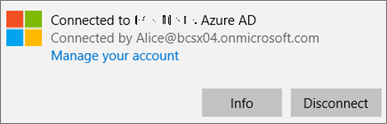
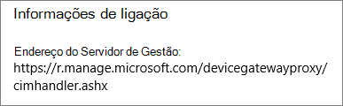
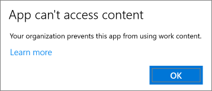
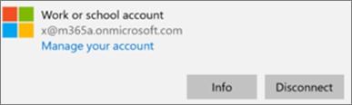
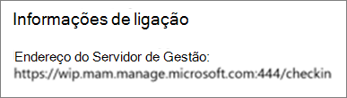

# Verificar definições de proteção de aplicações em PCs Windows 10Validate app protection settings on Windows 10 PCs

## Confirmar que os utilizadores não conseguem copiar dados da empresa para ficheiros pessoais em dispositivos da empresaVerify that users cannot copy company data to personal files on corporate devices

Depois de [configurar as políticas de proteção de aplicações](protection-settings-for-windows-10-devices.md), as mesmas poderão demorar algumas horas a entrar em vigor nos dispositivos dos utilizadores.After you [set up app protection policies](protection-settings-for-windows-10-devices.md), it may take up to a few hours for the policy to take effect on users' devices. Se **ligou** o Prevent que os utilizadores **copiassem os dados da empresa para ficheiros pessoais e os obrigasse a guardar ficheiros** de trabalho para a definição de OneDrive for Business para dispositivos da empresa, pode verificar isso no dispositivo do utilizador depois de terem ligado à Azure AD e terem assinado o seu registo.If you turned **On** the **Prevent users from copying company data to personal files and force them to save work files to OneDrive for Business** setting for company owned devices, you can check this on the user's device after they've connected to Azure AD and signed in. 
  
 **Verificar definições de ligação****Verify connection settings**
  
1. Depois de iniciar sessão com as credenciais Microsoft 365 Business e de estabelecer ligação ao Azure AD conforme descrito em [Configurar dispositivos Windows para utilizadores do Microsoft 365 Empresas](set-up-windows-devices.md), aceda a **Definições do Windows** \> **Contas** \> **Aceder a profiss./escolar**. Selecione **Ligado ao Azure AD de \<nome do inquilino\>** e, em seguida, selecione **Informações**.After you sign in with Microsoft 365 Business credentials and connect to Azure AD as described in [Set up Windows devices for Microsoft 365 Business users](set-up-windows-devices.md), go to **Windows Settings** \> **Accounts** \> **Access work or school**. Choose **Connected to \<tenant name\> Azure AD**, and then choose **Info**.
    
    
  
2. Na página de \<nome\> do inquilino **gerida,** pode ver a **informação de Ligação** que inclui um Endereço de Servidor de **Gestão** como o mostrado na figura seguinte.On the **Managed by** \<tenant name\> page, you can see the **Connection info** that includes a **Management Server Address** like the one shown in the following figure. 
    
    
  
 **Verifique se não pode colar os dados da empresa numa aplicação não gerida****Verify that you cannot paste company data in a non-managed app**
  
1. Abra a versão do Outlook 2016 que foi instalada pelo Microsoft 365 Business.Open Outlook 2016 that was installed by Microsoft 365 Business.
    
2. Abra um e-mail e copie alguns conteúdos do mesmo.Open an email and copy some content from it.
    
    Abra o Bloco de Notas e tente colar os conteúdos na aplicação.Open Notepad and attempt to paste the content in.
    
    Receberá um erro que diz que a aplicação não pode aceder a conteúdos.You'll receive an error that states the app can't access content.
    
    
  
    No entanto, poderá colar esses mesmos conteúdos no Word 2016.You can, however, paste the same content into Word 2016.
    
## Confirmar que os utilizadores não conseguem copiar dados da empresa para ficheiros em dispositivos pessoaisVerify that users cannot copy company data to personal files on personal devices

 **Verificar definições de ligação****Verify connection settings**
  
1. No seu dispositivo pessoal do Windows 10, onde está registado como utilizador local, aceda às **Definições do Windows**e clique ou toque em **Contas** \> Aceder ao **trabalho ou à escola.**On your Windows 10 personal device where you're logged in as a local user, go to **Windows Settings**, and click or tap **Accounts** \> **Access work or school**.
    
2. Em **Aceder a profiss./escolar**, selecione **Ligar**.Under the **Access work or school**, choose **Connect**.
    
3. Introduza a sua credencial Microsoft 365 Business na caixa de diálogo **Configurar uma conta escolar ou profissional** \> **Iniciar sessão**.Enter your Microsoft 365 Business credential into the **Set up a work or school account dialog** \> **Sign in**.
    
4. Na página **Aceder a profiss./escolar**, selecione a opção **Conta escolar ou profissional** e, em seguida, selecione **Informações**.On the **Access work or school** page, choose the **Work or school account**, and then choose **Info**.
    
    
  
5. No trabalho de Acesso ou na página **da escola,** pode ver a **informação de Ligação** que inclui um Endereço de Servidor de **Gestão** como o mostrado na figura seguinte, e inclui as palavras *wip* e *mam* dentro.On the **Access work or school** page, you can see the **Connection info** that includes a **Management Server Address** like the one shown in the following figure, and includes the words  *wip*  and  *mam*  within. 
    
    
  
 **Verifique se não pode colar os dados da empresa numa aplicação não gerida****Verify that you cannot paste company data in a non-managed app**
  
1. Abra o Outlook 2016, adicione a sua conta Microsoft 365 Business se necessário e inicie sessão com as suas credenciais Microsoft 365 Business.Open Outlook 2016 and add your Microsoft 365 Business account if necessary and sign in with your Microsoft 365 Business credentials.
    
2. Abra um e-mail e copie alguns conteúdos do mesmo.Open an email and copy some content from it.
    
    Abra o Bloco de Notas e tente colar os conteúdos na aplicação.Open Notepad and attempt to paste the content in.
    
    Receberá um erro que diz que a App não pode aceder a conteúdos.You'll receive an error that states App can't access content.
    
    
  
    No entanto, poderá colar esses mesmos conteúdos no Word 2016.You can, however, paste the same content into Word 2016.
    

