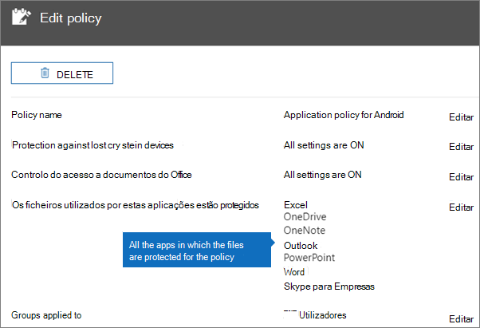
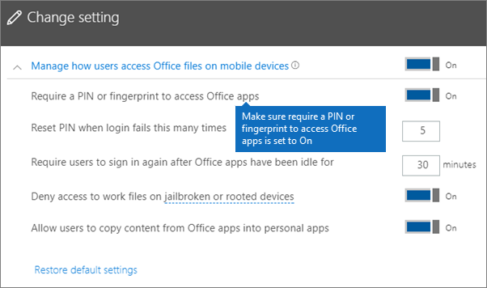
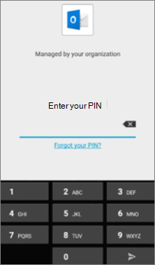
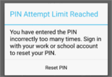
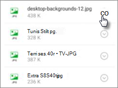
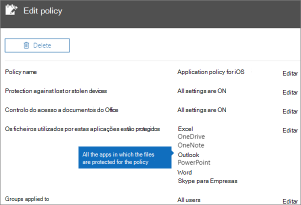
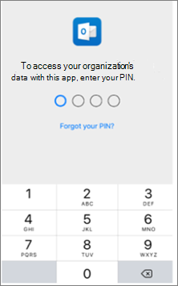
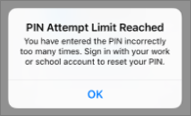

# Valide as definições de proteção de aplicativos em dispositivos Android ou iOSValidate app protection settings on Android or iOS devices

Siga as instruções nas seguintes secções para validar as definições de proteção de aplicações em dispositivos Android ou iOS.Follow the instructions in the following sections to validate app protection settings on Android or iOS devices.
  
## AndroidAndroid
  
### Verifique se as definições de proteção de aplicações estão a funcionar em dispositivos de utilizadorCheck that the app protection settings are working on user devices

Depois de [definir as configurações das aplicações para dispositivos Android](app-protection-settings-for-android-and-ios.md) para proteger as aplicações, pode seguir estes passos para verificar se as definições que escolheu estão a funcionar.After you [set app configurations for Android devices](app-protection-settings-for-android-and-ios.md) to protect the apps, you can follow these steps to validate that the settings you chose work. 
  
Em primeiro lugar, certifique-se de que a apólice se aplica à aplicação na qual a vai validar.First, make sure that the policy applies to the app in which you're going to validate it.
  
1. No [centro de administração](https://portal.office.com)Microsoft 365 Business Premium, vá para a **política de edição**de **políticas.** \>In the Microsoft 365 Business Premium [admin center](https://portal.office.com), go to **Policies** \> **Edit policy**.
    
2. Escolha **a política de Aplicação para Android** para as definições que criou na configuração, ou outra política que criou, e verifique se é aplicada para o Outlook, por exemplo.Choose **Application policy for Android** for the settings you created at setup, or another policy you created, and verify that it's enforced for Outlook, for example. 
    
    
  
### Verificar a opção para exigir um PIN ou uma impressão digital para aceder às aplicações do OfficeValidate Require a PIN or a fingerprint to access Office apps

No painel **Editar política**, selecione **Editar** junto a **Controlo do acesso a documentos do Office**. Expanda a secção **Gerir a forma como os utilizadores acedem a ficheiros do Office em dispositivos móveis** e certifique-se de que a opção **Exigir um PIN ou impressão digital para aceder às aplicações do Office** está definida como **Ativada**.In the **Edit policy** pane, choose **Edit** next to **Office documents access control**, expand **Manage how users access Office files on mobile devices**, and make sure that **Require a PIN or fingerprint to access Office apps** is set to **On**.
  

  
1. No dispositivo Android do utilizador, abra o Outlook e inscreva-se com as credenciais Microsoft 365 Business Premium do utilizador.In the user's Android device, open Outlook and sign in with the user's Microsoft 365 Business Premium credentials.
    
2. Também será solicitado a introduzir um PIN ou a utilizar uma impressão digital.You'll also be prompted to enter a PIN or use a fingerprint.
    
    
  
### Verificar a opção para repor o PIN após um número de tentativas falhadasValidate Reset PIN after number of failed attempts

No painel de **política edite,** escolha **Editar** ao lado do controlo de acesso de **documentos do Office,** expandir **Gerir a forma como os utilizadores acedem aos ficheiros do Office em dispositivos móveis,** e certifique-se de que **o Reset PIN após o número de tentativas falhadas** está definido para algum número.In the **Edit policy** pane, choose **Edit** next to **Office documents access control**, expand **Manage how users access Office files on mobile devices**, and make sure that **Reset PIN after number of failed attempts** is set to some number. Este é 5 por defeito.This is 5 by default. 
  
1. No dispositivo Android do utilizador, abra o Outlook e inscreva-se com as credenciais Microsoft 365 Business Premium do utilizador.In the user's Android device, open Outlook and sign in with the user's Microsoft 365 Business Premium credentials.
    
2. Introduza um PIN incorreto tantas vezes quanto for especificado pela política.Enter an incorrect PIN as many times as specified by the policy. Verá uma solicitação que indica **pin tente limite atingido** para redefinir o PIN.You'll see a prompt that states **PIN Attempt Limit Reached** to reset the PIN. 
    
    
  
3. Prima **Repor PIN**.Press **Reset PIN**. Será solicitado a iniciar sessão com as credenciais Microsoft 365 Business Premium do utilizador e, em seguida, obrigado a definir um novo PIN.You'll be prompted to sign in with the user's Microsoft 365 Business Premium credentials, and then required to set a new PIN.
    
### Verificar a opção para forçar os utilizadores a guardar todos os ficheiros de trabalho no OneDrive para EmpresasValidate Force users to save all work files to OneDrive for Business

No painel **Editar política**, selecione **Editar** junto a **Proteção contra dispositivos perdidos ou roubados**. Expanda a secção **Proteger os ficheiros de trabalho se os dispositivos forem perdidos ou roubados** e certifique-se de que a opção **Forçar os utilizadores a guardar todos os ficheiros de trabalho no OneDrive para Empresas** está definida como **Ativada**.In the **Edit policy** pane, choose **Edit** next to **Protection against lost or stolen devices**, expand **Protect work files when devices are lost or stolen**, and make sure that **Force users to save all work files to OneDrive for Business** is set to **On**.
  

  
1. No dispositivo Android do utilizador, abra o Outlook e inscreva-se com as credenciais Microsoft 365 Business Premium do utilizador e introduza um PIN se solicitado.In the user's Android device, open Outlook and sign in with the user's Microsoft 365 Business Premium credentials, and enter a PIN if requested.
    
2. Abra um e-mail que contenha um anexo e toque no ícone de seta para baixo junto às informações do anexo.Open an email that contains an attachment and tap the down arrow icon next to the attachment's information.
    
    
  
    Não pode **ser que se atire na** parte inferior do ecrã.You'll see **Cannot save to device** on the bottom of the screen. 
    
    
  
    > [!NOTE]
    > A opção Guardar no OneDrive para Empresas não se encontra disponível para Android neste momento, por isso, só verá a opção para guardar localmente bloqueada.Saving to OneDrive for Business is not enabled for Android at this time, so you can only see that saving locally is blocked. 
  
### Verificar a opção para exigir que o utilizador inicie sessão novamente caso as aplicações do Office estejam inativas durante um período de tempo específicoValidate Require user to sign in again if Office apps have been idle for a specified time

No painel de **política edite,** escolha **Editar** ao lado do controlo de acesso de **documentos do Office,** expandir **Gerir a forma como os utilizadores acedem aos ficheiros do Office em dispositivos móveis,** e certifique-se de que os utilizadores voltam a fazer o início depois de as aplicações do Office terem sido **inativas,** está definida para alguns minutos.In the **Edit policy** pane, choose **Edit** next to **Office documents access control**, expand **Manage how users access Office files on mobile devices**, and make sure that **Require users to sign in again after Office apps have been idle for** is set to some number of minutes. São 30 minutos por defeito.This is 30 minutes by default. 
  
1. No dispositivo Android do utilizador, abra o Outlook e inscreva-se com as credenciais Microsoft 365 Business Premium do utilizador e introduza um PIN se solicitado.In the user's Android device, open Outlook and sign in with the user's Microsoft 365 Business Premium credentials, and enter a PIN if requested.
    
2. Já deverá ver a caixa de entrada do Outlook. Não faça alterações ao dispositivo Android inativo durante, pelo menos, 30 minutos (ou outro período de tempo superior ao especificado na política). Provavelmente, o ecrã do dispositivo ficará mais escuro.You should now see Outlook's inbox. Let the Android device idle untouched for at least 30 minutes (or some other amount of time, longer than what you specified in the policy). The device will likely dim.
    
3. Access Outlook no dispositivo Android novamente.Access Outlook on the Android device again.
    
4. Será solicitado a introduzir o seu PIN antes de poder aceder novamente ao Outlook.You'll be prompted to enter your PIN before you can access Outlook again.
    
### Verificar a opção para proteger ficheiros de trabalho com encriptaçãoValidate Protect work files with encryption

No painel **Editar política**, selecione **Editar** junto a **Proteção contra dispositivos perdidos ou roubados**. Expanda a janela **Proteger os ficheiros de trabalho se os dispositivos forem perdidos ou roubados** e certifique-se de que a opção **Proteger ficheiros de trabalho com encriptação** está definida como **Ativada** e a opção **Forçar os utilizadores a guardar todos os ficheiros de trabalho no OneDrive para Empresas** está definida como **Desativada**.In the **Edit policy** pane, choose **Edit** next to **Protection against lost or stolen devices**, expand **Protect work files when devices are lost or stolen**, and make sure that **Protect work files with encryption** is set to **On**, and **Force users to save all work files to OneDrive for Business** is set to **Off**.
  
1. No dispositivo Android do utilizador, abra o Outlook e inscreva-se com as credenciais Microsoft 365 Business Premium do utilizador e introduza um PIN se solicitado.In the user's Android device, open Outlook and sign in with the user's Microsoft 365 Business Premium credentials, and enter a PIN if requested.
    
2. Abra um e-mail que contenha alguns anexos de ficheiros de imagem.Open an email that contains a few image file attachments.
    
3. Toque no ícone de seta para baixo junto às informações do anexo para guardá-lo.Tap the down arrow icon next to the attachment's info to save it.
    
    
  
4. Poderá ser-lhe pedido para permitir que o Outlook aceda às fotografias, multimédia e ficheiros no seu dispositivo. Toque em **Permitir**.You may be prompted to allow Outlook to access photos, media, and files on your device. Tap **Allow**.
    
5. Na parte inferior do ecrã, selecione **Guardar no Dispositivo** e, em seguida, abra a aplicação **Galeria**.At the bottom of the screen, choose to **Save to Device** and then open the **Gallery** app. 
    
6. Deverá ver uma fotografia encriptada (ou mais, caso tenha guardado múltiplos anexos de ficheiros de imagem) na lista. A fotografia poderá ser apresentada na Lista de imagens como um quadrado cinzento com um ponto de exclamação branco dentro de um círculo branco no centro do quadrado cinzento.You should see an encrypted photo (or more, if you saved multiple image file attachments) in the list. It may appear in the Pictures list as a gray square with a white exclamation point within a white circle in the center of the gray square.
    
    
  
## iOSiOS
  
### Verificar se as definições de proteção de aplicações estão a funcionar nos dispositivos dos utilizadoresCheck that the App protection settings are working on user devices

Depois de [definir as configurações das aplicações para dispositivos iOS](app-protection-settings-for-android-and-ios.md) para proteger as aplicações, pode seguir estes passos para verificar se as definições que escolheu estão a funcionar.After you [set app configurations for iOS devices](app-protection-settings-for-android-and-ios.md) to protect apps, you can follow these steps to validate that the settings you chose work. 
  
Em primeiro lugar, certifique-se de que a apólice se aplica à aplicação na qual a vai validar.First, make sure that the policy applies to the app in which you're going to validate it.
  
1. No [centro de administração](https://portal.office.com)Microsoft 365 Business Premium, vá para a **política de edição**de **políticas.** \>In the Microsoft 365 Business Premium [admin center](https://portal.office.com), go to **Policies** \> **Edit policy**.
    
2. Escolha a política de **Aplicação para iOS** para as definições que criou na configuração, ou outra política que criou, e verifique se é aplicada para o Outlook, por exemplo.Choose **Application policy for iOS** for the settings you created at setup, or another policy you created, and verify that it's enforced for Outlook for example. 
    
    
  
### Verificar a opção para exigir um PIN para aceder às aplicações do OfficeValidate Require a PIN to access Office apps

No painel **Editar política**, selecione **Editar** junto a **Controlo do acesso a documentos do Office**. Expanda a secção **Gerir a forma como os utilizadores acedem a ficheiros do Office em dispositivos móveis** e certifique-se de que a opção **Exigir um PIN ou impressão digital para aceder às aplicações do Office** está definida como **Ativada**.In the **Edit policy** pane, choose **Edit** next to **Office documents access control**, expand **Manage how users access Office files on mobile devices**, and make sure that **Require a PIN or fingerprint to access Office apps** is set to **On**.
  

  
1. No dispositivo iOS do utilizador, abra o Outlook e inscreva-se com as credenciais Microsoft 365 Business Premium do utilizador.In the user's iOS device, open Outlook and sign in with the user's Microsoft 365 Business Premium credentials.
    
2. Também será solicitado a introduzir um PIN ou a utilizar uma impressão digital.You'll also be prompted to enter a PIN or use a fingerprint.
    
    
  
### Verificar a opção para repor o PIN após um número de tentativas falhadasValidate Reset PIN after number of failed attempts

No painel de **política edite,** escolha **Editar** ao lado do controlo de acesso de **documentos do Office,** expandir **Gerir a forma como os utilizadores acedem aos ficheiros do Office em dispositivos móveis,** e certifique-se de que **o Reset PIN após o número de tentativas falhadas** está definido para algum número.In the **Edit policy** pane, choose **Edit** next to **Office documents access control**, expand **Manage how users access Office files on mobile devices**, and make sure that **Reset PIN after number of failed attempts** is set to some number. Este é 5 por defeito.This is 5 by default. 
  
1. No dispositivo iOS do utilizador, abra o Outlook e inscreva-se com as credenciais Microsoft 365 Business Premium do utilizador.In the user's iOS device, open Outlook and sign in with the user's Microsoft 365 Business Premium credentials.
    
2. Introduza um PIN incorreto tantas vezes quanto for especificado pela política.Enter an incorrect PIN as many times as specified by the policy. Verá uma solicitação que indica **pin tente limite atingido** para redefinir o PIN.You'll see a prompt that states **PIN Attempt Limit Reached** to reset the PIN. 
    
    
  
3. Prima **OK**.Press **OK**. Será solicitado a iniciar sessão com as credenciais Microsoft 365 Business Premium do utilizador e, em seguida, obrigado a definir um novo PIN.You'll be prompted to sign in with the user's Microsoft 365 Business Premium credentials, and then required to set a new PIN.
    
### Verificar a opção para forçar os utilizadores a guardar todos os ficheiros de trabalho no OneDrive para EmpresasValidate Force users to save all work files to OneDrive for Business

No painel **Editar política**, selecione **Editar** junto a **Proteção contra dispositivos perdidos ou roubados**. Expanda a secção **Proteger os ficheiros de trabalho se os dispositivos forem perdidos ou roubados** e certifique-se de que a opção **Forçar os utilizadores a guardar todos os ficheiros de trabalho no OneDrive para Empresas** está definida como **Ativada**.In the **Edit policy** pane, choose **Edit** next to **Protection against lost or stolen devices**, expand **Protect work files when devices are lost or stolen**, and make sure that **Force users to save all work files to OneDrive for Business** is set to **On**.
  

  
1. No dispositivo iOS do utilizador, abra o Outlook e inscreva-se com as credenciais Microsoft 365 Business Premium do utilizador e introduza um PIN se solicitado.In the user's iOS device, open Outlook and sign in with the user's Microsoft 365 Business Premium credentials, and enter a PIN if requested.
    
2. Abra um e-mail que contenha um anexo, abra o anexo e selecione **Guardar** na parte inferior do ecrã.Open an email that contains an attachment, open the attachment and choose **Save** on the bottom of the screen. 
    
    
  
3. Deverá ver apenas uma opção para o OneDrive para Empresas.You should only see an option for OneDrive for Business. Caso contrário, toque em **Adicionar Conta** e selecione **OneDrive para Negócios** a partir do ecrã **da Conta de Armazenamento Adicionar.**If not, tap **Add Account** and select **OneDrive for Business** from the **Add Storage Account** screen. Forneça ao Microsoft 365 Business Premium do utilizador final para iniciar sessão quando solicitado.Provide the end user's Microsoft 365 Business Premium to sign in when prompted. 
    
    Toque em **Guardar** e selecione **OneDrive para Empresas**.Tap **Save** and select **OneDrive for Business**.
    
### Verificar a opção para exigir que o utilizador inicie sessão novamente caso as aplicações do Office estejam inativas durante um período de tempo específicoValidate Require user to sign in again if Office apps have been idle for a specified time

No painel de **política edite,** escolha **Editar** ao lado do controlo de acesso de **documentos do Office,** expandir **Gerir a forma como os utilizadores acedem aos ficheiros do Office em dispositivos móveis,** e certifique-se de que os utilizadores voltam a fazer o início depois de as aplicações do Office terem sido **inativas,** está definida para alguns minutos.In the **Edit policy** pane, choose **Edit** next to **Office documents access control**, expand **Manage how users access Office files on mobile devices**, and make sure that **Require users to sign in again after Office apps have been idle for** is set to some number of minutes. São 30 minutos por defeito.This is 30 minutes by default. 
  
1. No dispositivo iOS do utilizador, abra o Outlook e inscreva-se com as credenciais Microsoft 365 Business Premium do utilizador e introduza um PIN se solicitado.In the user's iOS device, open Outlook and sign in with the user's Microsoft 365 Business Premium credentials, and enter a PIN if requested.
    
2. Já deverá ver a caixa de entrada do Outlook. Não faça alterações ao dispositivo iOS durante, pelo menos, 30 minutos (ou outro período de tempo superior ao especificado na política). Provavelmente, o ecrã do dispositivo ficará mais escuro.You should now see Outlook's inbox. Let the iOS device untouched for at least 30 minutes (or some other amount of time, longer than what you specified in the policy). The device will likely dim.
    
3. Acesso Outlook no dispositivo iOS novamente.Access Outlook on the iOS device again.
    
4. Será solicitado a introduzir o seu PIN antes de poder aceder novamente ao Outlook.You'll be prompted to enter your PIN before you can access Outlook again.
    
### Verificar a opção para proteger ficheiros de trabalho com encriptaçãoValidate Protect work files with encryption

No painel **Editar política**, selecione **Editar** junto a **Proteção contra dispositivos perdidos ou roubados**. Expanda a janela **Proteger os ficheiros de trabalho se os dispositivos forem perdidos ou roubados** e certifique-se de que a opção **Proteger ficheiros de trabalho com encriptação** está definida como **Ativada** e a opção **Forçar os utilizadores a guardar todos os ficheiros de trabalho no OneDrive para Empresas** está definida como **Desativada**.In the **Edit policy** pane, choose **Edit** next to **Protection against lost or stolen devices**, expand **Protect work files when devices are lost or stolen**, and make sure that **Protect work files with encryption** is set to **On**, and **Force users to save all work files to OneDrive for Business** is set to **Off**.
  
1. No dispositivo iOS do utilizador, abra o Outlook e inscreva-se com as credenciais Microsoft 365 Business Premium do utilizador e introduza um PIN se solicitado.In the user's iOS device, open Outlook and sign in with the user's Microsoft 365 Business Premium credentials, and enter a PIN if requested.
    
2. Abra um e-mail que contenha alguns anexos de ficheiros de imagem.Open an email that contains a few image file attachments.
    
3. Toque no anexo e, em seguida, toque na opção **Guardar** por baixo do mesmo.Tap the attachment and then tap the **Save** option under it. 
    
4. Abra a aplicação **Fotografias** no ecrã principal. Deverá ver uma fotografia (ou mais, se tiver guardado múltiplos anexos de ficheiros de imagem) guardada, embora esteja encriptada.Open **Photos** app from the home screen. You should see an encrypted photo (or more, if you saved multiple image file attachments) saved, but encrypted. 
    
---

