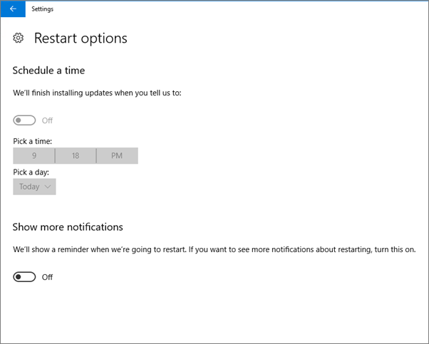
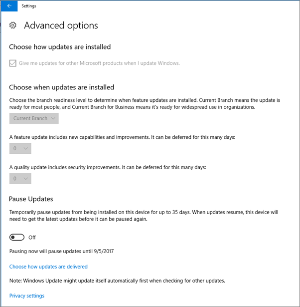
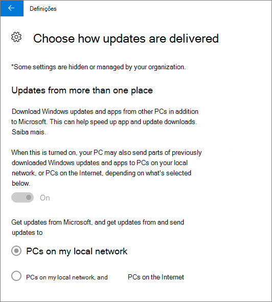
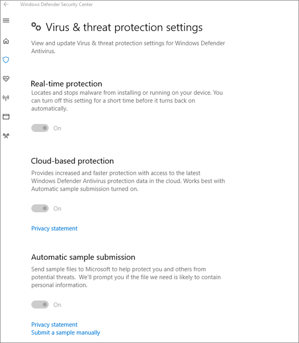

# Validar as definições de proteção do dispositivo nos PCs do Windows 10

## Verifique se as políticas de dispositivos do Windows 10 estão definidas

Depois de [configurar as políticas dos dispositivos,](protection-settings-for-windows-10-pcs.md)pode demorar até algumas horas para que a política produza efeitos nos dispositivos dos utilizadores. Pode confirmar que as políticas produziram efeito através da localização de vários ecrãs do Windows Settings nos dispositivos dos utilizadores. Uma vez que os utilizadores não poderão modificar as definições de Antivírus do Windows Update e Do Windows Defender nos seus dispositivos Windows 10, muitas opções serão acinzentadas.
  
1. Vá a **Definições** \> **Atualizar opções &amp; de** \> **arranque do Windows Update** e \>  confirme que todas as definições estão acinzentadas. 
    
    
  
2. Vá a **Definições** \> **Atualizar &amp; opções** avançadas do \> **Windows Update** e \>  confirme que todas as definições estão acinzentadas. 
    
    
  
3. Ir a **Definições** \> **Atualizar &amp; Opções** \> avançadas **de atualização do Windows Update** Escolha a forma como as \>  \> **atualizações são entregues**.
    
    Confirme que pode ver a mensagem (a vermelho) de que algumas definições são ocultadas ou geridas pela sua organização, e todas as opções estão acinzentadas.
    
    
  
4. Para abrir o Centro de Segurança do Windows Defender, vá a **Definições** \> **Atualizar &amp; Segurança** \> **Windows Defender** clique em Abrir as \> definições de proteção contra vírus **do sistema** de \> **&amp; proteção contra vírus** do Windows Defender \> **&amp;**. 
    
5. Verifique se todas as opções estão acinzentadas. 
    
    
  
## Tópicos Relacionados

[Microsoft 365 para documentação e recursos de negócios](./index.yml)
  
[Começa com a Microsoft 365 para negócios](microsoft-365-business-overview.md)
  
[Gerir a Microsoft 365 para negócios](manage.md)
  
[Definir as configurações de dispositivos para PCs Windows 10](protection-settings-for-windows-10-pcs.md)
