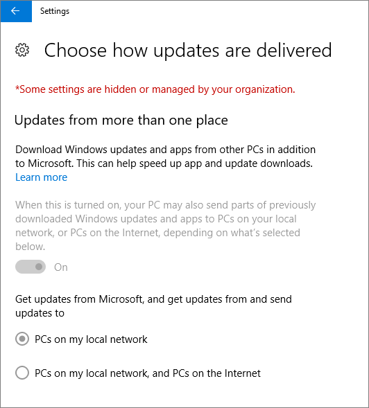

# Valide as definições de proteção do dispositivo em PCs do Windows 10Validate device protection settings on Windows 10 PCs

## Verifique se as políticas do dispositivo Windows 10 estão definidasVerify that Windows 10 device policies are set

Depois de configurar as políticas dos [dispositivos,](protection-settings-for-windows-10-pcs.md)pode demorar até algumas horas para que a política entre em vigor nos dispositivos dos utilizadores.After you [set up devices policies](protection-settings-for-windows-10-pcs.md), it may take up to a few hours for the policy to take effect on users' devices. Pode confirmar que as políticas produziram efeito ao analisar vários ecrãs de Definições do Windows nos dispositivos dos utilizadores.You can confirm that the policies took effect by looking at various Windows Settings screens on the users' devices. Uma vez que os utilizadores não conseguirão modificar as definições de Windows Update e Windows Defender Antivirus nos seus dispositivos Windows 10, muitas opções serão acinzentadas.Because the users won't be able to modify the Windows Update and Windows Defender Antivirus settings on their Windows 10 devices, many options will be grayed out.
  
1. Vá às **opções** de reinício do Windows Update \> \*\* &amp; e\*\* \> **Windows Update** \> **Restart options** confirme que todas as definições estão acinzentadas.Go to **Settings** \> **Update &amp; security** \> **Windows Update** \> **Restart options** and confirm that all settings are grayed out. 
    
    
  
2. Vá a **Definições** \> **De &amp; segurança** \> As opções avançadas **do Windows Update** e \> **Advanced options** confirme que todas as definições estão acinzentadas.Go to **Settings** \> **Update &amp; security** \> **Windows Update** \> **Advanced options** and confirm that all settings are grayed out. 
    
    
  
3. Vá a **Definições** De atualização De \> \*\* &amp; atualização\*\* \> **As** \> **opções avançadas** do Windows \> **Escolha como as atualizações são entregues**.Go to **Settings** \> **Update &amp; security** \> **Windows Update** \> **Advanced options** \> **Choose how updates are delivered**.
    
    Confirme que pode ver a mensagem (em vermelho) de que algumas configurações são ocultadas ou geridas pela sua organização, e todas as opções estão cinzentas.Confirm that you can see the message (in red) that some settings are hidden or managed by your organization, and all the options are grayed out.
    
    
  
4. Para abrir o Centro de Segurança do Windows Defender, vá a **Definições** \> **de &amp; segurança O** Windows \> **Defender** clique \> em **definições de** \> \*\* &amp; \*\* \> \*\* &amp; proteção\*\*contra vírus do Centro de Segurança do Windows Defender .To open the Windows Defender Security Center, go to **Settings** \> **Update &amp; security** \> **Windows Defender** \> click **Open Windows Defender Security Center** \> **Virus &amp; thread protection** \> **Virus &amp; threat protection settings**. 
    
5. Verifique se todas as opções estão cinzentas.Verify that all options are grayed out. 
    
    
  
## Tópicos RelacionadosRelated Topics

[Microsoft 365 para documentação e recursos empresariaisMicrosoft 365 for business documentation and resources](https://go.microsoft.com/fwlink/p/?linkid=853701)
  
[Começar com a Microsoft 365 para negóciosGet started with Microsoft 365 for business](microsoft-365-business-overview.md)
  
[Gerir o Microsoft 365 para negóciosManage Microsoft 365 for business](manage.md)
  
[Definir as configurações de dispositivos para PCs Windows 10Set device configurations for Windows 10 PCs](protection-settings-for-windows-10-pcs.md)
  

