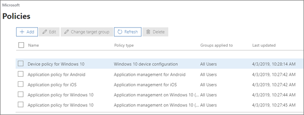
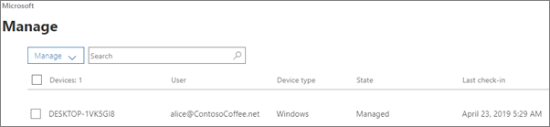

# Ver e gerir políticas e dispositivos

Este artigo aplica-se ao Microsoft 365 Business Premium.

## Ver e editar políticas de dispositivos

1.  Vá ao centro de administração em <a href="https://go.microsoft.com/fwlink/p/?linkid=837890" target="_blank">https://admin.microsoft.com</a> .
2. No navegador esquerdo, escolha **Políticas de** \> **Dispositivos**.

    Nesta página, pode criar, editar, alterar o grupo alvo ou eliminar uma política.

    
  
## Ver e gerir dispositivos

1. Na navegação à esquerda, escolha **Dispositivos** \> **Gerir**. 
    
    Nesta página, pode selecionar um ou mais dispositivos e remover os dados da empresa. Para dispositivos Windows 10 para os quais configurou definições de proteção de dispositivos, também pode optar por repor o dispositivo para as definições de fábrica.
  
   

